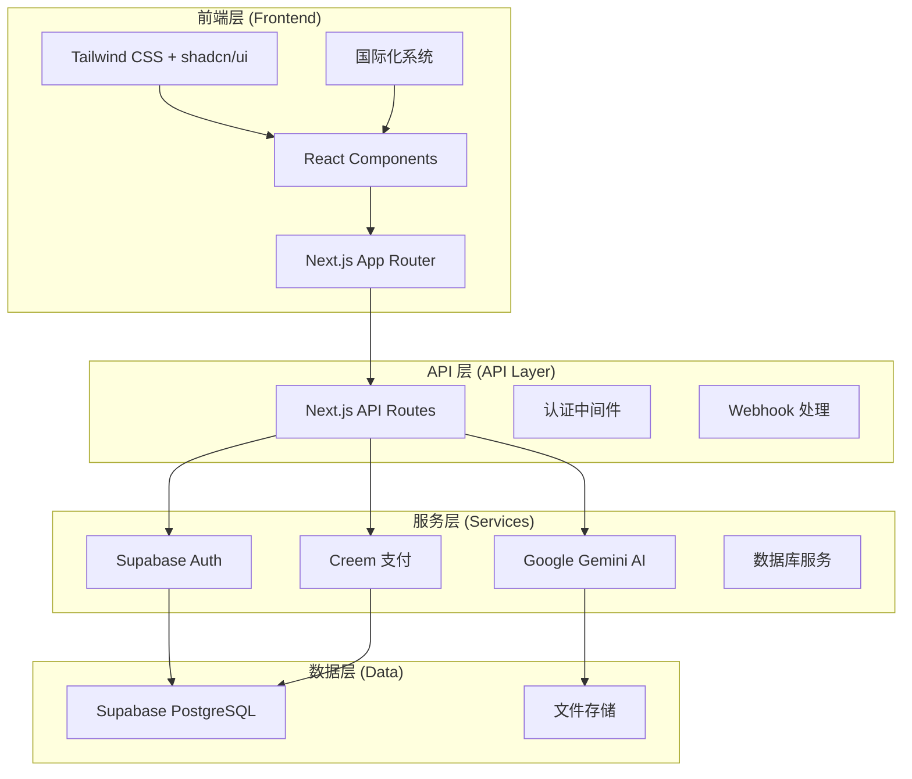
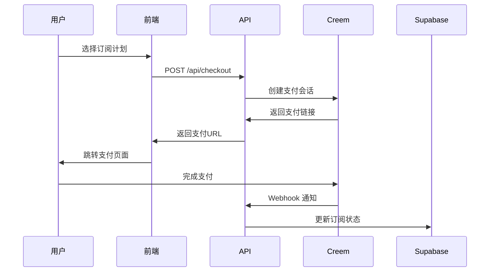

# Nano Banana 项目架构文档

## 系统架构概览



## 技术栈架构

### 前端架构

#### 1. 框架选择：Next.js 14 App Router
- **服务器组件 (SSR)**: 首次加载性能优化
- **客户端组件 (CSR)**: 交互功能实现
- **路由级布局**: 统一的页面结构
- **流式渲染**: 提升用户体验

#### 2. 状态管理策略
```typescript
// 全局状态 - React Context
const LanguageContext = createContext<LanguageState>()
const ThemeContext = createContext<ThemeState>()

// 组件级状态 - useState + useEffect
const [images, setImages] = useState<string[]>([])
const [isLoading, setIsLoading] = useState(false)
```

#### 3. 组件架构
```
components/
├── ui/                    # 基础 UI 组件 (shadcn/ui)
│   ├── button.tsx
│   ├── card.tsx
│   └── tabs.tsx
├── layout.tsx            # 布局组件
├── header.tsx            # 导航组件
├── footer.tsx            # 页脚组件
└── [feature].tsx         # 功能组件
```

### 后端架构

#### 1. API 路由设计
```
app/api/
├── generate/             # AI 图像生成
│   └── route.ts         # POST /api/generate
├── checkout/             # 支付会话
│   └── route.ts         # POST /api/checkout
├── webhooks/             # Webhook 事件
│   └── creem/           # Creem 支付回调
└── subscription/         # 订阅管理
    └── status/          # GET /api/subscription/status
```

#### 2. 认证架构
```typescript
// 多层认证策略
1. Supabase Auth (用户认证)
2. API Key 验证 (服务访问)
3. 中间件路由保护 (页面访问)

// 认证流程
用户登录 → Supabase 验证 → JWT Token → 中间件验证 → 访问授权
```

#### 3. 支付系统架构


## 数据库设计

### 核心表结构

#### 1. 用户表 (users)
```sql
CREATE TABLE users (
  id UUID PRIMARY KEY,
  email VARCHAR(255) UNIQUE NOT NULL,
  created_at TIMESTAMP DEFAULT NOW(),
  updated_at TIMESTAMP DEFAULT NOW()
);
```

#### 2. 订阅表 (subscriptions)
```sql
CREATE TABLE subscriptions (
  id UUID PRIMARY KEY,
  user_id UUID REFERENCES users(id),
  plan_id VARCHAR(50) NOT NULL,
  status VARCHAR(20) NOT NULL, -- active, cancelled, expired
  billing_period VARCHAR(10) NOT NULL, -- monthly, yearly
  creem_subscription_id VARCHAR(100),
  created_at TIMESTAMP DEFAULT NOW(),
  updated_at TIMESTAMP DEFAULT NOW()
);
```

#### 3. 积分表 (credits)
```sql
CREATE TABLE credits (
  id UUID PRIMARY KEY,
  user_id UUID REFERENCES users(id),
  amount INTEGER NOT NULL,
  type VARCHAR(20) NOT NULL, -- purchase, usage, refund
  description TEXT,
  created_at TIMESTAMP DEFAULT NOW()
);
```

#### 4. API 密钥表 (api_keys)
```sql
CREATE TABLE api_keys (
  id UUID PRIMARY KEY,
  user_id UUID REFERENCES users(id),
  name VARCHAR(100) NOT NULL,
  key_hash VARCHAR(255) NOT NULL,
  key_prefix VARCHAR(16) NOT NULL,
  status VARCHAR(20) DEFAULT 'active',
  last_used TIMESTAMP,
  created_at TIMESTAMP DEFAULT NOW()
);
```

> 字段说明
> - `key_hash`：密钥的 SHA-256 哈希结果，服务端用来比对验证
> - `key_prefix`：明文密钥前缀（默认前 8 位），供前端遮罩显示，避免泄露完整密钥
> - `last_used`：记录最近一次调用时间，后续可用于安全审计和异常检测

## 安全架构

### 1. API 密钥安全
```typescript
// Google AI API 密钥 (服务端)
const GOOGLE_AI_API_KEY = process.env.GOOGLE_AI_API_KEY
// ❌ 绝不暴露到前端

// 用户 API 密钥 (客户端可见)
const userApiKey = "nk_live_xxxxxxxxxxxx"
// ✅ 用户可管理，用于 API 调用验证
```

### 2. 认证安全
- **JWT Token**: 用户会话管理
- **API Key**: 服务访问控制
- **HTTPS**: 全站加密传输
- **CORS**: 跨域请求控制

### 3. 数据验证
```typescript
// 输入验证 - Zod Schema
const generateSchema = z.object({
  images: z.array(z.string()).min(1).max(5),
  prompt: z.string().min(1).max(1000)
})

// 文件上传安全
const MAX_FILE_SIZE = 10 * 1024 * 1024 // 10MB
const ALLOWED_MIME_TYPES = ['image/jpeg', 'image/png', 'image/webp']
```

## 性能优化

### 1. 前端优化
- **代码分割**: 动态导入大型组件
- **图片优化**: Next.js Image 组件
- **缓存策略**: SWR 数据缓存
- **懒加载**: 路由级懒加载

### 2. 后端优化
- **API 缓存**: Redis 会话缓存
- **数据库优化**: 索引优化
- **CDN**: 静态资源分发
- **压缩**: Gzip 响应压缩

### 3. AI 服务优化
```typescript
// 流式响应
const stream = await model.generateContentStream(parts)

// 错误重试
const retryCount = 3
for (let i = 0; i < retryCount; i++) {
  try {
    return await generateImage(prompt)
  } catch (error) {
    if (i === retryCount - 1) throw error
    await delay(1000 * Math.pow(2, i)) // 指数退避
  }
}
```

## 监控与日志

### 1. 错误监控
```typescript
// 全局错误处理
export function errorHandler(error: Error) {
  console.error('Application Error:', {
    name: error.name,
    message: error.message,
    stack: error.stack,
    timestamp: new Date().toISOString()
  })

  // 发送到监控服务
  if (process.env.NODE_ENV === 'production') {
    // Sentry, LogRocket 等
  }
}
```

### 2. 性能监控
- **Core Web Vitals**: LCP, FID, CLS
- **API 响应时间**: 监控接口性能
- **错误率**: 追踪系统稳定性
- **用户行为**: 功能使用统计

### 3. 业务监控
```typescript
// 关键指标追踪
const analytics = {
  userRegistration: () => gtag('event', 'sign_up'),
  apiUsage: (endpoint: string) => gtag('event', 'api_call', { endpoint }),
  subscriptionCreated: (plan: string) => gtag('event', 'purchase', { plan })
}
```

## 部署架构

### 1. 生产环境 (Vercel)
```yaml
# vercel.json
{
  "functions": {
    "app/api/**/*.ts": {
      "maxDuration": 30
    }
  },
  "env": {
    "GOOGLE_AI_API_KEY": "@google-ai-api-key",
    "SUPABASE_SERVICE_ROLE_KEY": "@supabase-service-key"
  }
}
```

### 2. 开发环境
```bash
# 本地开发
pnpm dev              # 开发服务器 (localhost:3000)
pnpm build           # 生产构建
pnpm start           # 生产服务器
```

### 3. CI/CD 流程
```yaml
# GitHub Actions
name: Deploy
on:
  push:
    branches: [main]
jobs:
  deploy:
    runs-on: ubuntu-latest
    steps:
      - uses: actions/checkout@v3
      - uses: actions/setup-node@v3
      - run: pnpm install
      - run: pnpm build
      - run: vercel --prod
```

## 扩展性设计

### 1. 微服务架构准备
```typescript
// API 网关设计
const apiGateway = {
  '/api/generate': 'ai-service',
  '/api/auth': 'auth-service',
  '/api/payment': 'payment-service'
}
```

### 2. 数据库扩展
- **读写分离**: 主从数据库配置
- **分片策略**: 按用户ID分片
- **缓存层**: Redis 分布式缓存

### 3. AI 服务扩展
```typescript
// 多 AI 提供商支持
const aiProviders = {
  gemini: GeminiProvider,
  openai: OpenAIProvider,
  claude: ClaudeProvider
}

// 负载均衡
const provider = loadBalancer.select(aiProviders)
```

---

*文档版本: v1.0*
*最后更新: 2024年*
