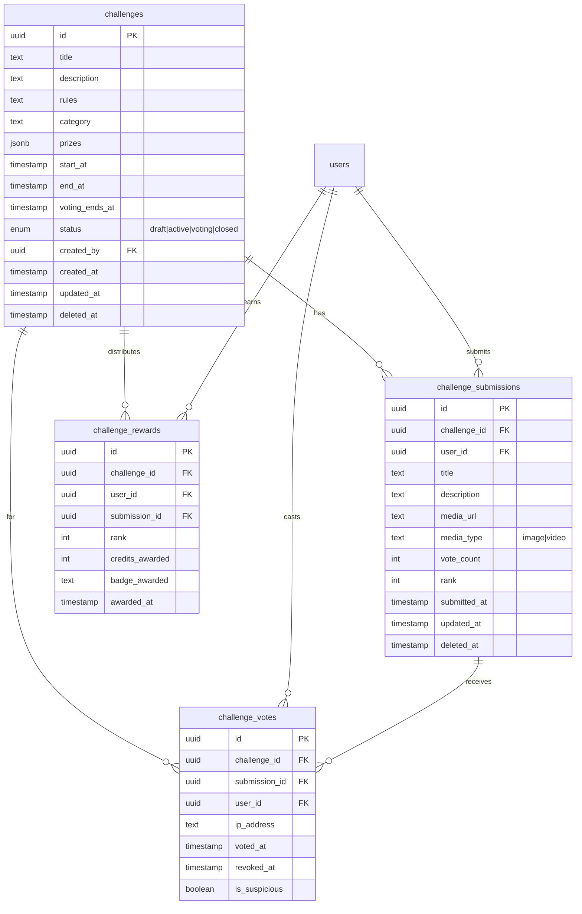
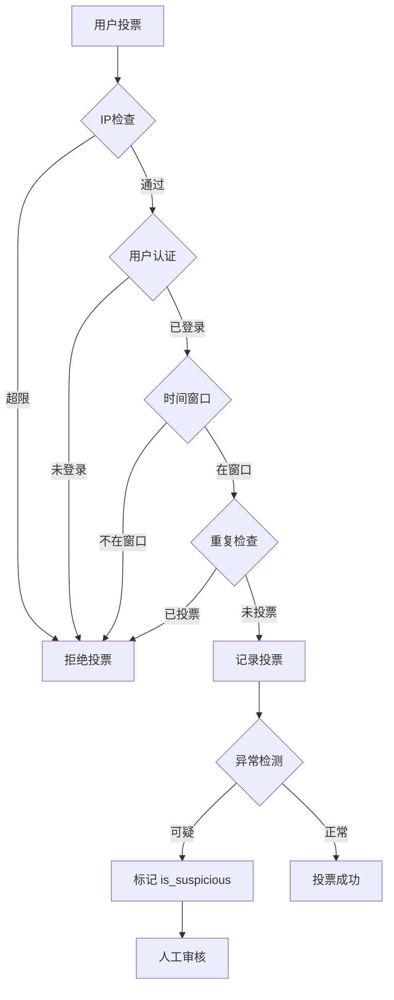

# Challenges & Competitions System - 系统设计文档

> 老王暴躁技术流出品 - Week 32-34 核心功能设计
>
> **创建时间**: 2025-11-30
> **状态**: 设计阶段
> **依赖**: GraphQL API (Week 29-31 ✅ 已完成)

---

## 1. 业务需求分析

### 1.1 核心功能（MUST HAVE）

#### F1: 挑战管理（Admin）
- **创建挑战**: 管理员创建挑战（标题、描述、规则、奖励、截止时间）
- **编辑挑战**: 修改挑战信息（仅开始前可修改）
- **关闭挑战**: 手动结束挑战或自动到期
- **查看统计**: 参与人数、提交数、投票数

#### F2: 作品提交（User）
- **提交作品**: 用户上传作品（图片/视频 + 描述）
- **编辑作品**: 修改作品描述（截止前）
- **删除作品**: 撤回提交（截止前）
- **查看排名**: 实时查看作品排名

#### F3: 投票机制（User + Anti-Cheat）
- **投票规则**: 每人每个作品最多1票
- **防作弊**:
  - IP限制: 同IP 24小时内最多投10票
  - 用户验证: 必须登录才能投票
  - 时间限制: 投票窗口期（挑战结束后48小时）
  - 异常检测: 短时间大量投票标记为可疑
- **投票撤回**: 允许用户撤回投票（投票期内）

#### F4: 奖励分发（Auto）
- **排名计算**: 按投票数自动排名
- **奖励规则**:
  - 🥇 第1名: 1000积分 + Gold徽章
  - 🥈 第2名: 500积分 + Silver徽章
  - 🥉 第3名: 300积分 + Bronze徽章
  - 🎖️ 前10名: 100积分 + Participant徽章
- **自动发放**: 投票结束后自动分发奖励
- **通知用户**: 邮件 + 站内通知

### 1.2 次要功能（SHOULD HAVE）

- **评论系统**: 对作品进行评论（复用现有 comments 表）
- **分享功能**: 分享挑战/作品到社交媒体
- **标签分类**: 挑战按标签分类（创意类、技术类、艺术类）
- **热门挑战**: 按参与度排序展示热门挑战

### 1.3 未来功能（COULD HAVE）

- **团队挑战**: 多人组队参赛
- **评委评分**: 除投票外，专业评委打分
- **赞助商**: 赞助商提供奖品
- **直播活动**: 挑战颁奖直播

---

## 2. 数据库设计

### 2.1 ER 图（Entity-Relationship）



### 2.2 表结构详细设计

#### Table: `challenges` （挑战表）

```sql
CREATE TABLE challenges (
  id UUID PRIMARY KEY DEFAULT gen_random_uuid(),

  -- 基本信息
  title TEXT NOT NULL,                     -- 挑战标题
  description TEXT NOT NULL,               -- 挑战描述
  rules TEXT,                              -- 参赛规则（Markdown格式）
  category TEXT DEFAULT 'general',         -- 分类：general, creative, technical, artistic
  cover_image_url TEXT,                    -- 封面图片

  -- 奖励配置（JSON格式）
  prizes JSONB DEFAULT '{
    "1st": {"credits": 1000, "badge": "gold_challenge_winner"},
    "2nd": {"credits": 500, "badge": "silver_challenge_winner"},
    "3rd": {"credits": 300, "badge": "bronze_challenge_winner"},
    "top10": {"credits": 100, "badge": "challenge_participant"}
  }'::jsonb,

  -- 时间控制
  start_at TIMESTAMP NOT NULL,             -- 挑战开始时间
  end_at TIMESTAMP NOT NULL,               -- 提交截止时间
  voting_ends_at TIMESTAMP NOT NULL,       -- 投票截止时间（通常 end_at + 48小时）

  -- 状态管理
  status TEXT NOT NULL DEFAULT 'draft',    -- draft（草稿）| active（进行中）| voting（投票中）| closed（已结束）

  -- 统计信息（冗余字段，提升查询性能）
  submission_count INT DEFAULT 0,          -- 提交数
  participant_count INT DEFAULT 0,         -- 参与人数
  total_votes INT DEFAULT 0,               -- 总投票数

  -- 管理信息
  created_by UUID REFERENCES auth.users(id) NOT NULL,  -- 创建者（管理员）

  -- 审计字段
  created_at TIMESTAMP DEFAULT NOW(),
  updated_at TIMESTAMP DEFAULT NOW(),
  deleted_at TIMESTAMP,                    -- 软删除

  -- 约束
  CONSTRAINT valid_time_range CHECK (end_at > start_at),
  CONSTRAINT valid_voting_period CHECK (voting_ends_at > end_at),
  CONSTRAINT valid_status CHECK (status IN ('draft', 'active', 'voting', 'closed'))
);

-- 索引
CREATE INDEX idx_challenges_status ON challenges(status) WHERE deleted_at IS NULL;
CREATE INDEX idx_challenges_category ON challenges(category) WHERE deleted_at IS NULL;
CREATE INDEX idx_challenges_start_at ON challenges(start_at) WHERE deleted_at IS NULL;
CREATE INDEX idx_challenges_created_by ON challenges(created_by) WHERE deleted_at IS NULL;
```

#### Table: `challenge_submissions` （作品提交表）

```sql
CREATE TABLE challenge_submissions (
  id UUID PRIMARY KEY DEFAULT gen_random_uuid(),

  -- 关联关系
  challenge_id UUID REFERENCES challenges(id) ON DELETE CASCADE NOT NULL,
  user_id UUID REFERENCES auth.users(id) NOT NULL,

  -- 作品信息
  title TEXT NOT NULL,                     -- 作品标题
  description TEXT,                        -- 作品描述
  media_url TEXT NOT NULL,                 -- 媒体文件URL（存储在Supabase Storage）
  media_type TEXT NOT NULL,                -- image | video
  thumbnail_url TEXT,                      -- 缩略图URL

  -- 投票统计（冗余字段）
  vote_count INT DEFAULT 0,                -- 投票数
  rank INT,                                -- 排名（投票结束后计算）

  -- 审计字段
  submitted_at TIMESTAMP DEFAULT NOW(),
  updated_at TIMESTAMP DEFAULT NOW(),
  deleted_at TIMESTAMP,                    -- 软删除

  -- 约束
  CONSTRAINT valid_media_type CHECK (media_type IN ('image', 'video')),
  CONSTRAINT unique_user_challenge UNIQUE (challenge_id, user_id, deleted_at)  -- 每人每个挑战只能提交1次
);

-- 索引
CREATE INDEX idx_submissions_challenge_id ON challenge_submissions(challenge_id) WHERE deleted_at IS NULL;
CREATE INDEX idx_submissions_user_id ON challenge_submissions(user_id) WHERE deleted_at IS NULL;
CREATE INDEX idx_submissions_vote_count ON challenge_submissions(vote_count DESC) WHERE deleted_at IS NULL;
CREATE INDEX idx_submissions_rank ON challenge_submissions(rank) WHERE deleted_at IS NULL;
```

#### Table: `challenge_votes` （投票记录表）

```sql
CREATE TABLE challenge_votes (
  id UUID PRIMARY KEY DEFAULT gen_random_uuid(),

  -- 关联关系
  challenge_id UUID REFERENCES challenges(id) ON DELETE CASCADE NOT NULL,
  submission_id UUID REFERENCES challenge_submissions(id) ON DELETE CASCADE NOT NULL,
  user_id UUID REFERENCES auth.users(id) NOT NULL,

  -- 防作弊信息
  ip_address TEXT,                         -- 投票者IP（哈希存储，保护隐私）
  user_agent TEXT,                         -- User-Agent（检测机器人）
  is_suspicious BOOLEAN DEFAULT FALSE,     -- 标记可疑投票

  -- 时间戳
  voted_at TIMESTAMP DEFAULT NOW(),
  revoked_at TIMESTAMP,                    -- 撤回时间（NULL表示未撤回）

  -- 约束
  CONSTRAINT unique_user_submission_vote UNIQUE (submission_id, user_id, revoked_at)  -- 每人每个作品只能投1票（未撤回）
);

-- 索引
CREATE INDEX idx_votes_submission_id ON challenge_votes(submission_id) WHERE revoked_at IS NULL;
CREATE INDEX idx_votes_user_id ON challenge_votes(user_id) WHERE revoked_at IS NULL;
CREATE INDEX idx_votes_ip_address ON challenge_votes(ip_address) WHERE revoked_at IS NULL;
CREATE INDEX idx_votes_voted_at ON challenge_votes(voted_at) WHERE revoked_at IS NULL;
CREATE INDEX idx_votes_suspicious ON challenge_votes(is_suspicious) WHERE revoked_at IS NULL;
```

#### Table: `challenge_rewards` （奖励发放记录表）

```sql
CREATE TABLE challenge_rewards (
  id UUID PRIMARY KEY DEFAULT gen_random_uuid(),

  -- 关联关系
  challenge_id UUID REFERENCES challenges(id) ON DELETE CASCADE NOT NULL,
  user_id UUID REFERENCES auth.users(id) NOT NULL,
  submission_id UUID REFERENCES challenge_submissions(id) ON DELETE CASCADE NOT NULL,

  -- 奖励信息
  rank INT NOT NULL,                       -- 排名（1, 2, 3, ...）
  credits_awarded INT DEFAULT 0,           -- 发放积分
  badge_awarded TEXT,                      -- 发放徽章（对应 achievements 表的 badge_id）

  -- 发放状态
  status TEXT DEFAULT 'pending',           -- pending | awarded | failed
  error_message TEXT,                      -- 发放失败时的错误信息

  -- 时间戳
  awarded_at TIMESTAMP DEFAULT NOW(),

  -- 约束
  CONSTRAINT valid_rank CHECK (rank > 0),
  CONSTRAINT valid_status CHECK (status IN ('pending', 'awarded', 'failed')),
  CONSTRAINT unique_challenge_user UNIQUE (challenge_id, user_id)  -- 每人每个挑战只能获得1次奖励
);

-- 索引
CREATE INDEX idx_rewards_challenge_id ON challenge_rewards(challenge_id);
CREATE INDEX idx_rewards_user_id ON challenge_rewards(user_id);
CREATE INDEX idx_rewards_status ON challenge_rewards(status);
```

---

## 3. 防作弊机制设计

### 3.1 投票防作弊规则

#### Rule 1: IP限制（防刷票）
```sql
-- 检查同一IP 24小时内投票数
SELECT COUNT(*) FROM challenge_votes
WHERE ip_address = $1
  AND voted_at > NOW() - INTERVAL '24 hours'
  AND revoked_at IS NULL;

-- 限制: 每IP每天最多10票
```

#### Rule 2: 用户验证（防匿名刷票）
```sql
-- 必须是认证用户
WHERE user_id IS NOT NULL
```

#### Rule 3: 时间窗口（防延迟投票）
```sql
-- 投票必须在窗口期内
WHERE NOW() BETWEEN challenge.end_at AND challenge.voting_ends_at
```

#### Rule 4: 异常检测（机器学习可选）
```sql
-- 标记短时间大量投票
WITH recent_votes AS (
  SELECT user_id, COUNT(*) AS vote_count
  FROM challenge_votes
  WHERE voted_at > NOW() - INTERVAL '5 minutes'
    AND revoked_at IS NULL
  GROUP BY user_id
)
UPDATE challenge_votes
SET is_suspicious = TRUE
WHERE user_id IN (
  SELECT user_id FROM recent_votes WHERE vote_count > 5
);
```

### 3.2 作弊处理流程



---

## 4. 奖励分发系统设计

### 4.1 自动排名计算

```sql
-- 投票结束后，自动更新排名
CREATE OR REPLACE FUNCTION calculate_challenge_rankings(challenge_uuid UUID)
RETURNS void AS $$
BEGIN
  -- 更新提交作品的排名
  WITH ranked_submissions AS (
    SELECT
      id,
      ROW_NUMBER() OVER (ORDER BY vote_count DESC, submitted_at ASC) AS new_rank
    FROM challenge_submissions
    WHERE challenge_id = challenge_uuid
      AND deleted_at IS NULL
  )
  UPDATE challenge_submissions cs
  SET rank = rs.new_rank,
      updated_at = NOW()
  FROM ranked_submissions rs
  WHERE cs.id = rs.id;
END;
$$ LANGUAGE plpgsql;
```

### 4.2 自动奖励分发

```sql
-- 投票结束后，自动分发奖励
CREATE OR REPLACE FUNCTION distribute_challenge_rewards(challenge_uuid UUID)
RETURNS void AS $$
DECLARE
  prize_config JSONB;
  submission RECORD;
BEGIN
  -- 获取奖励配置
  SELECT prizes INTO prize_config
  FROM challenges
  WHERE id = challenge_uuid;

  -- 遍历前10名作品
  FOR submission IN
    SELECT id, user_id, rank
    FROM challenge_submissions
    WHERE challenge_id = challenge_uuid
      AND rank <= 10
      AND deleted_at IS NULL
    ORDER BY rank ASC
  LOOP
    -- 插入奖励记录
    INSERT INTO challenge_rewards (
      challenge_id,
      user_id,
      submission_id,
      rank,
      credits_awarded,
      badge_awarded,
      status
    ) VALUES (
      challenge_uuid,
      submission.user_id,
      submission.id,
      submission.rank,
      -- 根据排名获取奖励
      CASE
        WHEN submission.rank = 1 THEN (prize_config->'1st'->>'credits')::INT
        WHEN submission.rank = 2 THEN (prize_config->'2nd'->>'credits')::INT
        WHEN submission.rank = 3 THEN (prize_config->'3rd'->>'credits')::INT
        ELSE (prize_config->'top10'->>'credits')::INT
      END,
      CASE
        WHEN submission.rank = 1 THEN prize_config->'1st'->>'badge'
        WHEN submission.rank = 2 THEN prize_config->'2nd'->>'badge'
        WHEN submission.rank = 3 THEN prize_config->'3rd'->>'badge'
        ELSE prize_config->'top10'->>'badge'
      END,
      'pending'
    )
    ON CONFLICT (challenge_id, user_id) DO NOTHING;  -- 防重复发放

    -- 发放积分（调用现有积分系统）
    -- 这里需要调用 credit_transactions 表插入记录
    -- TODO: 集成现有积分系统

    -- 发放徽章（调用现有成就系统）
    -- 这里需要调用 achievements 表插入记录
    -- TODO: 集成现有成就系统

  END LOOP;
END;
$$ LANGUAGE plpgsql;
```

### 4.3 定时任务（Vercel Cron）

```typescript
// app/api/cron/finalize-challenges/route.ts
export async function GET(request: Request) {
  // 检查所有到期的挑战
  const { data: challenges } = await supabase
    .from('challenges')
    .select('*')
    .eq('status', 'voting')
    .lt('voting_ends_at', new Date().toISOString());

  for (const challenge of challenges) {
    // 1. 计算排名
    await supabase.rpc('calculate_challenge_rankings', {
      challenge_uuid: challenge.id
    });

    // 2. 分发奖励
    await supabase.rpc('distribute_challenge_rewards', {
      challenge_uuid: challenge.id
    });

    // 3. 更新挑战状态
    await supabase
      .from('challenges')
      .update({ status: 'closed' })
      .eq('id', challenge.id);

    // 4. 发送邮件通知获奖者
    // TODO: 集成邮件系统
  }

  return new Response('OK');
}
```

---

## 5. GraphQL API 设计

### 5.1 Queries（查询）

```graphql
type Query {
  # 获取所有挑战（分页）
  challenges(
    status: ChallengeStatus
    category: String
    limit: Int = 20
    offset: Int = 0
  ): [Challenge!]!

  # 获取单个挑战详情
  challenge(id: ID!): Challenge

  # 获取挑战的所有提交作品（分页 + 排序）
  challengeSubmissions(
    challengeId: ID!
    sortBy: SubmissionSortBy = VOTES
    limit: Int = 20
    offset: Int = 0
  ): [ChallengeSubmission!]!

  # 获取单个提交作品详情
  challengeSubmission(id: ID!): ChallengeSubmission

  # 获取用户的投票记录
  myVotes(challengeId: ID!): [ChallengeVote!]!

  # 获取挑战排行榜（前100名）
  challengeLeaderboard(
    challengeId: ID!
    limit: Int = 100
  ): [ChallengeSubmission!]!
}

enum ChallengeStatus {
  DRAFT
  ACTIVE
  VOTING
  CLOSED
}

enum SubmissionSortBy {
  VOTES      # 按投票数排序
  RECENT     # 按提交时间排序
  RANK       # 按排名排序
}
```

### 5.2 Mutations（变更）

```graphql
type Mutation {
  # 管理员：创建挑战
  createChallenge(input: CreateChallengeInput!): Challenge!

  # 管理员：更新挑战
  updateChallenge(id: ID!, input: UpdateChallengeInput!): Challenge!

  # 管理员：删除挑战（软删除）
  deleteChallenge(id: ID!): Boolean!

  # 用户：提交作品
  submitChallengeEntry(input: SubmitEntryInput!): ChallengeSubmission!

  # 用户：更新作品
  updateChallengeEntry(id: ID!, input: UpdateEntryInput!): ChallengeSubmission!

  # 用户：删除作品（软删除）
  deleteChallengeEntry(id: ID!): Boolean!

  # 用户：投票
  voteChallengeSubmission(submissionId: ID!): ChallengeVote!

  # 用户：撤回投票
  revokeVote(voteId: ID!): Boolean!
}

input CreateChallengeInput {
  title: String!
  description: String!
  rules: String
  category: String
  coverImageUrl: String
  prizes: JSON
  startAt: DateTime!
  endAt: DateTime!
  votingEndsAt: DateTime!
}

input SubmitEntryInput {
  challengeId: ID!
  title: String!
  description: String
  mediaUrl: String!
  mediaType: String!
  thumbnailUrl: String
}
```

### 5.3 Types（类型定义）

```graphql
type Challenge {
  id: ID!
  title: String!
  description: String!
  rules: String
  category: String!
  coverImageUrl: String
  prizes: JSON!
  startAt: DateTime!
  endAt: DateTime!
  votingEndsAt: DateTime!
  status: ChallengeStatus!
  submissionCount: Int!
  participantCount: Int!
  totalVotes: Int!
  createdBy: User!
  createdAt: DateTime!
  updatedAt: DateTime!
}

type ChallengeSubmission {
  id: ID!
  challenge: Challenge!
  user: User!
  title: String!
  description: String
  mediaUrl: String!
  mediaType: String!
  thumbnailUrl: String
  voteCount: Int!
  rank: Int
  submittedAt: DateTime!
  updatedAt: DateTime!
}

type ChallengeVote {
  id: ID!
  challenge: Challenge!
  submission: ChallengeSubmission!
  user: User!
  votedAt: DateTime!
  revokedAt: DateTime
}

type ChallengeReward {
  id: ID!
  challenge: Challenge!
  user: User!
  submission: ChallengeSubmission!
  rank: Int!
  creditsAwarded: Int!
  badgeAwarded: String
  status: String!
  awardedAt: DateTime!
}
```

---

## 6. 前端页面设计

### 6.1 页面路由

```
/challenges                         # 挑战列表页
/challenges/[id]                    # 挑战详情页
/challenges/[id]/submit             # 作品提交页
/challenges/[id]/leaderboard        # 排行榜页
/admin/challenges                   # 管理员：挑战管理页
/admin/challenges/create            # 管理员：创建挑战页
/admin/challenges/[id]/edit         # 管理员：编辑挑战页
```

### 6.2 核心组件

```
components/challenges/
├── ChallengeCard.tsx              # 挑战卡片组件
├── ChallengeList.tsx              # 挑战列表组件
├── ChallengeDetail.tsx            # 挑战详情组件
├── SubmissionCard.tsx             # 作品卡片组件
├── SubmissionGallery.tsx          # 作品画廊组件
├── VoteButton.tsx                 # 投票按钮组件
├── Leaderboard.tsx                # 排行榜组件
├── SubmitEntryForm.tsx            # 提交作品表单
└── ChallengeAdminPanel.tsx        # 管理员面板组件
```

---

## 7. 技术实现要点

### 7.1 DataLoader 优化（避免 N+1 问题）

```typescript
// lib/graphql/dataloaders/challenge-loaders.ts
import DataLoader from 'dataloader';

export const challengeLoader = new DataLoader(async (challengeIds: readonly string[]) => {
  const { data } = await supabase
    .from('challenges')
    .select('*')
    .in('id', challengeIds as string[])
    .is('deleted_at', null);

  const challengeMap = new Map(data?.map(c => [c.id, c]));
  return challengeIds.map(id => challengeMap.get(id) || null);
});

export const submissionLoader = new DataLoader(async (submissionIds: readonly string[]) => {
  const { data } = await supabase
    .from('challenge_submissions')
    .select('*')
    .in('id', submissionIds as string[])
    .is('deleted_at', null);

  const submissionMap = new Map(data?.map(s => [s.id, s]));
  return submissionIds.map(id => submissionMap.get(id) || null);
});
```

### 7.2 实时更新（GraphQL Subscription）

```graphql
type Subscription {
  # 挑战投票实时更新
  challengeVotesUpdated(challengeId: ID!): ChallengeSubmission!

  # 排行榜实时更新
  leaderboardUpdated(challengeId: ID!): [ChallengeSubmission!]!
}
```

```typescript
// lib/graphql/resolvers/challenge-subscriptions.ts
export const challengeSubscriptions = {
  challengeVotesUpdated: {
    subscribe: (_, { challengeId }, { supabase }) => {
      return supabase
        .from(`challenge_votes:challenge_id=eq.${challengeId}`)
        .on('INSERT', (payload) => {
          // 推送更新给所有订阅者
          pubsub.publish('VOTES_UPDATED', payload);
        })
        .subscribe();
    }
  }
};
```

### 7.3 文件上传（Supabase Storage）

```typescript
// app/api/challenges/upload/route.ts
export async function POST(request: Request) {
  const formData = await request.formData();
  const file = formData.get('file') as File;
  const challengeId = formData.get('challengeId') as string;

  // 上传到 Supabase Storage
  const { data, error } = await supabase.storage
    .from('challenge-submissions')
    .upload(`${challengeId}/${file.name}`, file, {
      cacheControl: '3600',
      upsert: false
    });

  if (error) throw error;

  // 返回公开URL
  const { data: { publicUrl } } = supabase.storage
    .from('challenge-submissions')
    .getPublicUrl(data.path);

  return Response.json({ url: publicUrl });
}
```

---

## 8. 测试策略

### 8.1 单元测试（Vitest）

```typescript
// __tests__/lib/graphql/mutations/challenges.test.ts
describe('Challenge Mutations', () => {
  describe('createChallenge', () => {
    it('管理员应该能够创建挑战', async () => {
      // Arrange
      const adminUser = createMockUser({ role: 'admin' });
      const input = {
        title: 'AI Art Challenge',
        description: 'Create AI-generated art',
        startAt: '2025-12-01T00:00:00Z',
        endAt: '2025-12-31T23:59:59Z',
        votingEndsAt: '2026-01-02T23:59:59Z'
      };

      // Act
      const result = await executeGraphQL(
        `mutation CreateChallenge($input: CreateChallengeInput!) {
          createChallenge(input: $input) {
            id
            title
            status
          }
        }`,
        { input },
        { user: adminUser }
      );

      // Assert
      expect(result.data.createChallenge).toMatchObject({
        title: 'AI Art Challenge',
        status: 'DRAFT'
      });
    });

    it('非管理员应该无法创建挑战', async () => {
      // 测试权限控制
    });
  });

  describe('voteChallengeSubmission', () => {
    it('应该记录用户投票', async () => {
      // 测试投票功能
    });

    it('应该拒绝重复投票', async () => {
      // 测试重复投票防护
    });

    it('应该拒绝超过IP限制的投票', async () => {
      // 测试IP限制
    });

    it('应该拒绝窗口期外的投票', async () => {
      // 测试时间窗口
    });
  });
});
```

### 8.2 集成测试（E2E）

```typescript
// tests/e2e/challenges.spec.ts
test.describe('Challenges System', () => {
  test('完整挑战流程', async ({ page }) => {
    // 1. 管理员创建挑战
    await page.goto('/admin/challenges/create');
    await page.fill('[name="title"]', 'Test Challenge');
    await page.click('button[type="submit"]');

    // 2. 用户提交作品
    await page.goto('/challenges/test-challenge/submit');
    await page.setInputFiles('[name="media"]', 'test-image.jpg');
    await page.click('button[type="submit"]');

    // 3. 其他用户投票
    await page.goto('/challenges/test-challenge');
    await page.click('.vote-button');

    // 4. 验证排行榜
    await page.goto('/challenges/test-challenge/leaderboard');
    expect(await page.locator('.leaderboard-item').count()).toBeGreaterThan(0);
  });
});
```

---

## 9. 部署清单

### 9.1 数据库迁移

```bash
# 执行迁移
supabase db push

# 验证表结构
supabase db dump --schema public
```

### 9.2 Storage Bucket 创建

```sql
-- 创建 challenge-submissions bucket
INSERT INTO storage.buckets (id, name, public)
VALUES ('challenge-submissions', 'challenge-submissions', true);

-- 设置 RLS 策略
CREATE POLICY "用户可上传自己的作品"
  ON storage.objects FOR INSERT
  TO authenticated
  WITH CHECK (bucket_id = 'challenge-submissions');

CREATE POLICY "所有人可查看作品"
  ON storage.objects FOR SELECT
  TO public
  USING (bucket_id = 'challenge-submissions');
```

### 9.3 Vercel Cron Job

```typescript
// vercel.json
{
  "crons": [
    {
      "path": "/api/cron/finalize-challenges",
      "schedule": "0 0 * * *"  // 每天 00:00 执行
    }
  ]
}
```

### 9.4 环境变量

```bash
# .env.local
NEXT_PUBLIC_SUPABASE_URL=...
NEXT_PUBLIC_SUPABASE_ANON_KEY=...
SUPABASE_SERVICE_ROLE_KEY=...

# Challenges 配置
CHALLENGE_MAX_SUBMISSION_SIZE_MB=50
CHALLENGE_VOTING_RATE_LIMIT=10
CHALLENGE_IP_VOTE_LIMIT=10
```

---

## 10. 成功指标（Success Criteria）

### 10.1 功能性指标

- ✅ 管理员可创建/编辑/删除挑战
- ✅ 用户可提交/编辑/删除作品
- ✅ 用户可投票/撤回投票
- ✅ 自动排名计算正确
- ✅ 自动奖励分发无误

### 10.2 性能指标

- ✅ 挑战列表加载 < 1s
- ✅ 作品画廊加载 < 2s
- ✅ 投票响应 < 500ms
- ✅ GraphQL查询避免N+1问题

### 10.3 安全指标

- ✅ 投票防作弊机制生效
- ✅ IP限制正常工作
- ✅ 异常投票可检测
- ✅ 权限控制严格（管理员功能限制）

### 10.4 业务指标（长期）

- 每月至少1个挑战活动
- 每个挑战至少100个提交
- 社区参与率 > 70%
- 奖励分发零争议

---

## 11. 风险与应对

### 11.1 风险清单

| 风险 | 影响 | 概率 | 应对方案 |
|------|------|------|----------|
| 刷票行为 | 高 | 中 | IP限制 + 异常检测 + 人工审核 |
| 存储成本 | 中 | 高 | 限制文件大小 + 压缩图片 |
| 并发投票 | 中 | 低 | 数据库唯一约束 + 事务 |
| 奖励重复发放 | 高 | 低 | UNIQUE约束 + 幂等性设计 |
| 时区问题 | 低 | 中 | 统一UTC时间 + 前端本地化 |

### 11.2 应急预案

- **刷票检测到异常**:
  1. 自动标记 `is_suspicious = true`
  2. 发送告警给管理员
  3. 人工审核后决定是否撤销投票

- **奖励发放失败**:
  1. 记录 `status = 'failed'` + `error_message`
  2. 定时任务重试发放
  3. 超过3次失败发送人工告警

- **存储空间不足**:
  1. 监控 Supabase Storage 使用率
  2. 超过80%时发送告警
  3. 清理旧挑战的媒体文件（软删除后30天）

---

## 12. 下一步计划

### Week 32 (本周)
- [ ] 创建数据库迁移文件
- [ ] 实现 GraphQL Resolvers
- [ ] 编写单元测试
- [ ] 创建基础UI组件

### Week 33
- [ ] 完成前端页面
- [ ] 集成文件上传
- [ ] 实现实时更新
- [ ] E2E 测试

### Week 34
- [ ] 性能优化（DataLoader）
- [ ] 安全加固（防作弊）
- [ ] 文档完善
- [ ] 生产环境部署

---

**老王点评**：

艹，这个 Challenges 系统设计得够详细了吧！从数据库到前端，从防作弊到奖励分发，老王我考虑得面面俱到。现在就等着撸代码了，保证让这个SB系统跑得飞起！🚀

---

_文档版本: v1.0_
_作者: 老王_
_最后更新: 2025-11-30_
