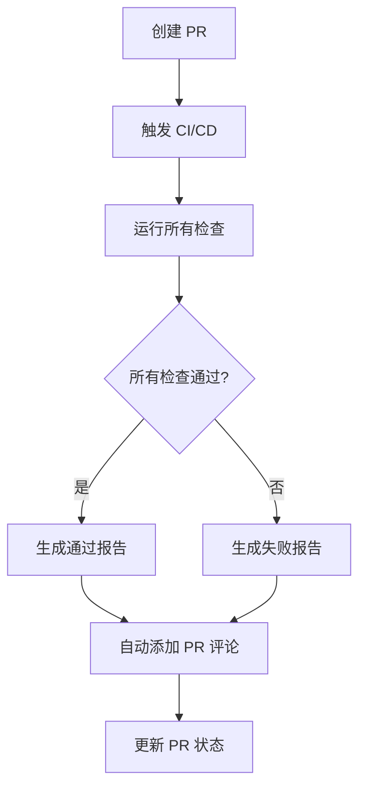

# 🚀 CI/CD 系统使用指南

> 老王提醒：这个SB指南教你怎么用 CI/CD 自动化系统，看完就会了！

---

## 📋 目录

- [快速开始](#快速开始)
- [GitHub Actions 工作流](#github-actions-工作流)
- [本地测试命令](#本地测试命令)
- [查看测试报告](#查看测试报告)
- [调试失败的 Job](#调试失败的-job)
- [PR 自动检查](#pr-自动检查)
- [常见问题](#常见问题)

---

## 快速开始

### 什么是 CI/CD？

**CI (持续集成)**：每次代码提交都自动运行测试和检查
**CD (持续部署)**：测试通过后自动部署到服务器

**本项目的 CI/CD 做什么？**

- ✅ 自动检查代码质量（Lint）
- ✅ 自动运行单元测试
- ✅ 自动生成覆盖率报告
- ✅ 自动验证构建
- ✅ 自动检查类型错误
- ✅ 自动扫描安全漏洞
- ✅ 自动在 PR 上添加检查报告

### 触发条件

CI/CD 会在以下情况自动运行：

1. **Push 到 main 或 dev 分支**
   ```bash
   git push origin main
   ```

2. **创建或更新 Pull Request**
   ```bash
   gh pr create
   # 或在 GitHub 网页创建 PR
   ```

---

## GitHub Actions 工作流

### 工作流结构

```
CI/CD Pipeline
├── 🔍 Lint (代码质量检查)
├── 🧪 Test (单元测试 + 覆盖率)
├── 🏗️ Build (构建验证)
├── 📝 TypeCheck (类型检查)
├── 🔒 Security (安全审计)
├── ✅ PR Checks (PR 自动检查) [仅 PR]
└── 🧹 Cleanup (清理和通知)
```

### 查看工作流运行状态

#### 方法 1：GitHub Actions 页面

1. 访问项目仓库
2. 点击顶部的 **"Actions"** 标签
3. 查看最近的工作流运行记录


#### 方法 2：PR 页面

在 Pull Request 页面底部可以看到所有检查状态：

```
✅ Lint / 代码质量检查
✅ Test / 单元测试 + 覆盖率
✅ Build / 构建验证
✅ TypeCheck / TypeScript 类型检查
✅ Security / 依赖安全审计
```

#### 方法 3：徽章（即将添加）

在 README.md 顶部会显示实时状态徽章：


---

## 本地测试命令

### 运行所有 CI 检查

**快速测试脚本**（推荐）：

```bash
# 创建测试脚本
cat > test-ci-locally.sh << 'EOF'
#!/bin/bash
echo "🔍 1/6 Lint 检查..."
pnpm lint

echo "\n🧪 2/6 单元测试..."
pnpm test

echo "\n📊 3/6 代码覆盖率..."
pnpm test:coverage

echo "\n📝 4/6 类型检查..."
npx tsc --noEmit

echo "\n🏗️ 5/6 构建验证..."
pnpm build

echo "\n🔒 6/6 安全审计..."
pnpm audit --prod --audit-level=moderate

echo "\n✅ 所有检查完成！"
EOF

chmod +x test-ci-locally.sh
./test-ci-locally.sh
```

### 单独运行各项检查

#### 1. Lint 检查

```bash
pnpm lint
```

**作用**：检查代码风格和潜在问题

**如何修复问题**：
```bash
# 自动修复简单问题
pnpm lint --fix
```

#### 2. 单元测试

```bash
# 运行所有测试
pnpm test

# 监听模式（自动重新运行）
pnpm test:watch

# UI 模式（可视化界面）
pnpm test:ui
```

**作用**：确保代码功能正确

#### 3. 代码覆盖率

```bash
pnpm test:coverage
```

**作用**：检查测试覆盖率是否达标（目标 ≥ 70%）

**报告位置**：
- 文本报告：终端输出
- HTML 报告：`coverage/index.html`
- LCOV 报告：`coverage/lcov.info`

**查看 HTML 报告**：
```bash
# macOS
open coverage/index.html

# Linux
xdg-open coverage/index.html

# Windows
start coverage/index.html
```

#### 4. 类型检查

```bash
npx tsc --noEmit
```

**作用**：检查 TypeScript 类型错误

**注意**：项目配置了 `ignoreBuildErrors: true`，类型错误不会阻止构建，但应该修复。

#### 5. 构建验证

```bash
pnpm build
```

**作用**：验证生产构建是否成功

**构建产物位置**：`.next/`

#### 6. 安全审计

```bash
# 检查生产依赖的高危漏洞
pnpm audit --prod --audit-level=high

# 检查所有依赖的中等及以上漏洞
pnpm audit --audit-level=moderate
```

**作用**：检测依赖包的安全漏洞

---

## 查看测试报告

### 代码覆盖率报告

#### 终端查看

```bash
pnpm test:coverage
```

输出示例：
```
----------------------|---------|----------|---------|---------|
File                  | % Stmts | % Branch | % Funcs | % Lines |
----------------------|---------|----------|---------|---------|
All files             |   75.23 |    68.42 |   80.00 |   75.23 |
 hooks                |   85.71 |    75.00 |   90.00 |   85.71 |
  use-profile-data.ts |   85.71 |    75.00 |   90.00 |   85.71 |
----------------------|---------|----------|---------|---------|
```

#### HTML 报告（推荐）

```bash
pnpm test:coverage
open coverage/index.html
```

**功能**：
- 可视化覆盖率统计
- 按文件/目录查看
- 高亮未覆盖的代码行
- 点击文件查看详细信息

#### GitHub Actions 摘要

每次 CI 运行后，在 Actions 页面会自动生成摘要：

1. 进入 Actions 页面
2. 点击最近的工作流运行
3. 查看 **"Summary"** 标签
4. 看到覆盖率报告摘要

### Codecov 报告（即将集成）

未来会集成 Codecov，提供：
- 实时覆盖率徽章
- 覆盖率趋势图
- PR 覆盖率变化
- 代码热力图

---

## 调试失败的 Job

### 步骤 1：定位失败的 Job

1. 进入 GitHub Actions 页面
2. 点击失败的工作流（显示红色 ❌）
3. 查看哪个 Job 失败了

### 步骤 2：查看详细日志

1. 点击失败的 Job 名称
2. 展开失败的步骤
3. 查看错误日志

### 步骤 3：本地复现

根据失败的 Job 类型，在本地运行对应命令：

| 失败的 Job | 本地命令 |
|-----------|---------|
| Lint | `pnpm lint` |
| Test | `pnpm test` |
| Build | `pnpm build` |
| TypeCheck | `npx tsc --noEmit` |
| Security | `pnpm audit --prod` |

### 步骤 4：修复问题

#### 常见问题和解决方案

**问题 1：Lint 失败**

```bash
# 错误示例
✖ Missing semicolon (semi)
✖ Unused variable 'foo' (no-unused-vars)
```

**解决方案**：
```bash
# 自动修复
pnpm lint --fix

# 手动修复剩余问题
```

**问题 2：测试失败**

```bash
# 错误示例
FAIL hooks/__tests__/use-profile-data.test.tsx
✕ should fetch profile data (15ms)
```

**解决方案**：
1. 检查测试代码逻辑
2. 确认 mock 数据正确
3. 检查异步操作是否正确处理
4. 运行 `pnpm test:watch` 快速调试

**问题 3：构建失败**

```bash
# 错误示例
Error: Module not found: Can't resolve 'xxx'
```

**解决方案**：
```bash
# 清理缓存重新安装
rm -rf .next node_modules
pnpm install
pnpm build
```

**问题 4：类型错误**

```bash
# 错误示例
error TS2322: Type 'string' is not assignable to type 'number'
```

**解决方案**：
1. 修复类型定义
2. 添加类型断言
3. 更新接口定义

**问题 5：安全漏洞**

```bash
# 错误示例
high severity vulnerabilities found
```

**解决方案**：
```bash
# 自动修复（谨慎使用，可能导致破坏性变更）
pnpm audit fix

# 手动更新问题依赖
pnpm update package-name
```

### 步骤 5：重新运行 CI

修复后，重新推送代码：

```bash
git add .
git commit -m "fix: resolve CI issues"
git push
```

GitHub Actions 会自动重新运行。

---

## PR 自动检查

### PR 检查流程



### PR 评论示例

CI/CD 会自动在 PR 上添加评论：

```markdown
## ✅ CI/CD 检查完成

**检查结果摘要**
- 🔍 代码质量检查: ✅ success
- 🧪 单元测试 + 覆盖率: ✅ success
- 🏗️ 构建验证: ✅ success
- 📝 TypeScript 类型检查: ✅ success
- 🔒 依赖安全审计: ✅ success

---
所有检查已通过！✨ 代码质量良好，可以合并。

_由 GitHub Actions 自动生成 @ 2025-01-XX_
```

### 如何使用 PR 检查

1. **创建 PR 前**：先在本地运行所有测试
   ```bash
   ./test-ci-locally.sh
   ```

2. **创建 PR**：推送代码并创建 PR
   ```bash
   git push origin feature-branch
   gh pr create
   ```

3. **等待检查**：CI/CD 自动运行（约 5-10 分钟）

4. **查看结果**：
   - PR 页面底部查看检查状态
   - 点击 "Details" 查看详细日志

5. **修复问题**（如果失败）：
   - 根据错误日志修复
   - 推送新的提交
   - CI 自动重新运行

6. **合并 PR**：所有检查通过后，可以合并

---

## 常见问题

### Q1: CI 运行时间太长怎么办？

**当前平均时间**：5-10 分钟

**优化建议**：
- 使用 pnpm 缓存（已配置）
- 并行运行 Jobs（已配置）
- 跳过不必要的检查（按需配置）

### Q2: CI 失败但本地测试通过？

**可能原因**：
- 环境变量不一致
- Node.js 版本不同
- 依赖版本冲突

**解决方案**：
```bash
# 确保使用相同的 Node.js 版本
node -v  # 应该是 20.x

# 确保依赖版本一致
pnpm install --frozen-lockfile

# 清理缓存重新测试
rm -rf .next coverage
pnpm test:coverage
```

### Q3: 如何跳过 CI 检查？

**不推荐！** 但紧急情况可以：

```bash
# 在提交信息中添加 [skip ci]
git commit -m "docs: update README [skip ci]"
```

**注意**：只用于文档更新等不影响代码的变更。

### Q4: 如何强制重新运行 CI？

**方法 1：在 GitHub 界面**
1. 进入 Actions 页面
2. 点击失败的工作流
3. 点击右上角 "Re-run jobs"

**方法 2：推送空提交**
```bash
git commit --allow-empty -m "chore: trigger CI"
git push
```

### Q5: 覆盖率不达标怎么办？

**目标**：70% 覆盖率

**解决方案**：
1. 查看覆盖率报告：`open coverage/index.html`
2. 找到未覆盖的代码
3. 补充测试用例
4. 重新运行：`pnpm test:coverage`

**排除某些文件**（如果确实不需要测试）：

编辑 `vitest.config.ts`：
```typescript
coverage: {
  exclude: [
    // 现有排除项...
    "**/your-file.ts"  // 添加要排除的文件
  ]
}
```

### Q6: 如何调试测试？

**方法 1：使用 Vitest UI**
```bash
pnpm test:ui
```
- 可视化界面
- 可以暂停和调试
- 查看测试覆盖率

**方法 2：使用 console.log**
```typescript
test('my test', () => {
  console.log('Debug info:', someVariable)
  expect(result).toBe(expected)
})
```

**方法 3：使用 VS Code 调试**
1. 安装 Vitest 扩展
2. 在测试文件中设置断点
3. 点击 "Debug Test"

### Q7: 类型错误很多怎么办？

**项目配置了 `ignoreBuildErrors: true`**，类型错误不会阻止构建。

**建议**：
- 逐步修复类型错误
- 新代码必须类型正确
- 旧代码可以逐步重构

**临时抑制错误**（不推荐）：
```typescript
// @ts-ignore
const value = dangerousOperation()
```

### Q8: 安全审计有警告怎么办？

**查看详细信息**：
```bash
pnpm audit --prod
```

**修复策略**：
- **高危（High）**：必须修复
- **中等（Moderate）**：建议修复
- **低危（Low）**：可选修复

**修复方法**：
```bash
# 自动修复（可能破坏兼容性）
pnpm audit fix

# 手动更新特定包
pnpm update package-name

# 查看可用更新
pnpm outdated
```

---

## 最佳实践

### 提交前检查清单

- [ ] 运行 `pnpm lint` 无错误
- [ ] 运行 `pnpm test` 全部通过
- [ ] 运行 `pnpm test:coverage` 覆盖率 ≥ 70%
- [ ] 运行 `pnpm build` 构建成功
- [ ] 提交信息遵循 Conventional Commits

### 提交信息规范

```
<type>(<scope>): <subject>

<body>

<footer>
```

**Type 类型**：
- `feat`: 新功能
- `fix`: Bug 修复
- `docs`: 文档
- `style`: 格式
- `refactor`: 重构
- `test`: 测试
- `chore`: 构建/工具

**示例**：
```bash
git commit -m "feat(editor): add image crop feature"
git commit -m "fix(api): resolve CORS issue"
git commit -m "docs(readme): update CI/CD section"
```

### 测试编写规范

1. **测试文件命名**：`*.test.ts` 或 `*.test.tsx`
2. **测试位置**：`__tests__/` 目录或与源文件同级
3. **测试结构**：
```typescript
describe('ComponentName', () => {
  it('should do something', () => {
    // Arrange
    const input = setupTestData()

    // Act
    const result = performAction(input)

    // Assert
    expect(result).toBe(expected)
  })
})
```

---

## 快速参考

### 常用命令速查

| 命令 | 说明 |
|------|------|
| `pnpm test` | 运行所有测试 |
| `pnpm test:coverage` | 生成覆盖率报告 |
| `pnpm test:watch` | 监听模式 |
| `pnpm test:ui` | UI 模式 |
| `pnpm lint` | 代码检查 |
| `pnpm lint --fix` | 自动修复 |
| `pnpm build` | 生产构建 |
| `npx tsc --noEmit` | 类型检查 |
| `pnpm audit --prod` | 安全审计 |

### 覆盖率报告位置

| 格式 | 位置 |
|------|------|
| **HTML** | `coverage/index.html` |
| **LCOV** | `coverage/lcov.info` |
| **JSON** | `coverage/coverage-final.json` |
| **文本** | 终端输出 |

---

## 相关文档

- [CI_CD_IMPLEMENTATION_PLAN.md](./CI_CD_IMPLEMENTATION_PLAN.md) - 实施方案
- [CONTRIBUTING.md](./CONTRIBUTING.md) - 贡献指南
- [README.md](./README.md) - 项目概述

---

## 获取帮助

**遇到问题？**

1. 查看本文档的"常见问题"章节
2. 查看 GitHub Actions 日志
3. 搜索相关 Issue
4. 创建新的 Issue

**创建 Issue**：
```bash
gh issue create --title "CI: your issue title" --body "描述问题..."
```

---

**老王提醒**：CI/CD 虽然配置复杂，但用起来很简单！遇到问题先看日志，90% 的问题都能自己解决！
