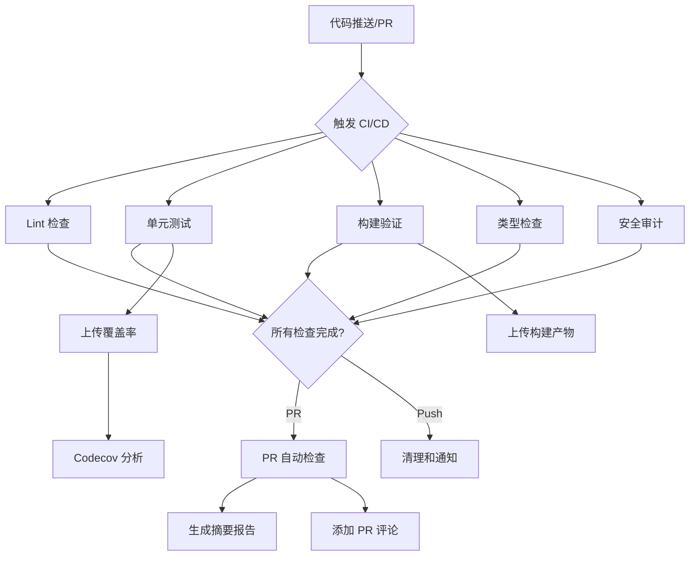
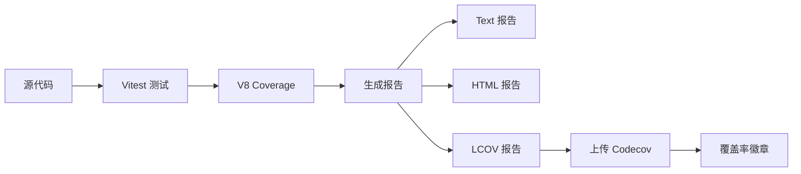

# 🚀 CI/CD 自动化实施方案

> 老王提醒：这个SB方案包含完整的 CI/CD 自动化流程设计，按照 todo 清单逐步完成就行了！

---

## 📋 目录

- [系统概述](#系统概述)
- [已完成工作](#已完成工作)
- [待完成工作](#待完成工作)
- [技术架构](#技术架构)
- [工作流设计](#工作流设计)
- [测试策略](#测试策略)
- [部署流程](#部署流程)
- [最佳实践](#最佳实践)

---

## 系统概述

### 目标

建立完整的 CI/CD 自动化流程，确保：

1. ✅ **代码质量**：自动 Lint 检查
2. ✅ **测试覆盖**：单元测试 + 覆盖率报告（目标 70%+）
3. ✅ **构建验证**：Next.js 生产构建测试
4. ✅ **类型安全**：TypeScript 类型检查
5. ✅ **安全审计**：依赖漏洞扫描
6. ✅ **PR 自动检查**：Pull Request 自动化验证

### 技术栈

| 工具 | 用途 | 版本 |
|------|------|------|
| **GitHub Actions** | CI/CD 平台 | v4 |
| **Vitest** | 测试框架 | 4.0.6 |
| **@vitest/coverage-v8** | 代码覆盖率 | 4.0.6 |
| **ESLint** | 代码质量检查 | 8.57.1 |
| **TypeScript** | 类型检查 | 5.x |
| **pnpm** | 包管理器 | 10.17.1 |
| **Codecov** | 覆盖率报告平台 | v4 |

---

## 已完成工作

### ✅ Phase 1: 基础设施搭建

#### 1.1 测试覆盖率配置

**文件**: `vitest.config.ts`

```typescript
coverage: {
  provider: "v8",
  reporter: ["text", "json", "html", "lcov"],
  exclude: ["node_modules/", ".next/", "dist/", "*.config.{js,ts}"],
  thresholds: {
    lines: 70,
    functions: 70,
    branches: 70,
    statements: 70
  }
}
```

**测试命令**:
- `pnpm test` - 运行测试
- `pnpm test:coverage` - 生成覆盖率报告
- `pnpm test:watch` - 监听模式
- `pnpm test:ui` - UI 模式

#### 1.2 GitHub Actions 工作流

**文件**: `.github/workflows/ci.yml`

**7 个核心 Jobs**:

1. **Lint** - 代码质量检查
   - ESLint 静态分析
   - 允许失败但记录警告

2. **Test** - 单元测试 + 覆盖率
   - 运行 Vitest 测试
   - 生成覆盖率报告
   - 上传到 Codecov
   - 输出摘要到 GitHub Summary

3. **Build** - 构建验证
   - Next.js 生产构建
   - 上传构建产物（保留 7 天）
   - 允许失败但记录警告

4. **TypeCheck** - 类型检查
   - TypeScript 类型验证
   - 允许失败但记录警告

5. **Security** - 安全审计
   - pnpm audit 依赖扫描
   - 生成安全报告
   - 允许失败但记录警告

6. **PR Checks** - PR 自动检查（仅 PR 触发）
   - 汇总所有检查结果
   - 生成 PR 摘要报告
   - 自动添加 PR 评论

7. **Cleanup** - 清理和通知
   - 生成工作流总结
   - 记录运行状态

#### 1.3 .gitignore 规则

**新增规则**:
- `coverage/` - 覆盖率报告
- `.next/` - Next.js 构建缓存
- `.env*` - 环境变量文件
- `*.lcov` - 覆盖率数据文件

#### 1.4 文档

- ✅ `LLM_CONFIG_GUIDE.md` - LLM 配置管理指南
- ✅ `README.md` - 更新 LLM 文档链接

---

## 待完成工作

### 📝 Phase 2: 文档完善

#### 2.1 CI/CD 配置文档

**文件**: `CI_CD_GUIDE.md`

**内容**:
- CI/CD 工作流说明
- 如何查看测试报告
- 如何调试失败的 Job
- 本地测试命令
- 常见问题解答

#### 2.2 README 更新

**文件**: `README.md`

**新增内容**:
- GitHub Actions 徽章（构建状态、覆盖率、许可证）
- CI/CD 系统说明章节
- 测试命令使用指南
- 链接到 CI/CD 文档

**徽章示例**:
```markdown


```

---

### 🔧 Phase 3: GitHub 配置模板

#### 3.1 Pull Request 模板

**文件**: `.github/pull_request_template.md`

**内容**:
```markdown
## 📝 变更说明

<!-- 简要描述本次 PR 的目的和内容 -->

## 🔗 相关 Issue

Closes #

## 📋 变更类型

- [ ] 🐛 Bug 修复
- [ ] ✨ 新功能
- [ ] 📝 文档更新
- [ ] 🎨 代码格式/样式
- [ ] ♻️ 重构
- [ ] ⚡ 性能优化
- [ ] 🔒 安全修复

## 🧪 测试

- [ ] 已添加单元测试
- [ ] 已测试覆盖率 ≥ 70%
- [ ] 已通过本地测试 (`pnpm test`)
- [ ] 已通过构建验证 (`pnpm build`)

## 📸 截图/视频

<!-- 如果是 UI 变更，请添加截图或视频 -->

## ✅ Checklist

- [ ] 代码遵循项目规范
- [ ] 已更新相关文档
- [ ] 已测试所有变更
- [ ] PR 标题遵循 Conventional Commits
```

#### 3.2 Issue 模板

**目录**: `.github/ISSUE_TEMPLATE/`

**模板类型**:

1. **bug_report.md** - Bug 报告
2. **feature_request.md** - 功能请求
3. **documentation.md** - 文档改进
4. **question.md** - 问题咨询

#### 3.3 贡献指南

**文件**: `CONTRIBUTING.md`

**内容**:
- 如何提交 Issue
- 如何创建 PR
- 代码规范
- 提交信息规范
- 测试要求
- 文档要求

---

### 🔍 Phase 4: 代码覆盖率集成

#### 4.1 Codecov 配置

**文件**: `codecov.yml`

```yaml
coverage:
  status:
    project:
      default:
        target: 70%
        threshold: 5%
    patch:
      default:
        target: 70%

comment:
  layout: "reach, diff, flags, files"
  behavior: default
  require_changes: false
```

#### 4.2 覆盖率徽章

在 README.md 添加 Codecov 徽章，实时显示覆盖率。

---

### 🤖 Phase 5: 自动化依赖管理

#### 5.1 Dependabot 配置

**文件**: `.github/dependabot.yml`

```yaml
version: 2
updates:
  - package-ecosystem: "npm"
    directory: "/"
    schedule:
      interval: "weekly"
    open-pull-requests-limit: 10
    labels:
      - "dependencies"
      - "automated"
```

**功能**:
- 自动检测依赖更新
- 每周创建 PR
- 自动运行 CI/CD 测试

---

### 🧪 Phase 6: 本地测试和验证

#### 6.1 本地测试脚本

创建测试脚本验证 CI/CD 配置：

```bash
# test-ci-locally.sh
#!/bin/bash

echo "🔍 运行本地 CI 测试..."

echo "\n1️⃣ Lint 检查..."
pnpm lint

echo "\n2️⃣ 单元测试..."
pnpm test

echo "\n3️⃣ 代码覆盖率..."
pnpm test:coverage

echo "\n4️⃣ 类型检查..."
npx tsc --noEmit

echo "\n5️⃣ 构建验证..."
pnpm build

echo "\n6️⃣ 安全审计..."
pnpm audit --prod --audit-level=moderate

echo "\n✅ 所有检查完成！"
```

#### 6.2 验证清单

- [ ] 测试命令正常运行
- [ ] 覆盖率报告生成成功
- [ ] 构建无致命错误
- [ ] 类型检查通过或有明确记录
- [ ] 安全审计无高危漏洞

---

## 技术架构

### CI/CD 工作流架构



### 测试覆盖率流程



---

## 工作流设计

### 触发条件

| 事件 | 分支 | 说明 |
|------|------|------|
| `push` | `main`, `dev` | 代码推送到主分支或开发分支 |
| `pull_request` | `main`, `dev` | 创建或更新 PR |

### 并发控制

```yaml
concurrency:
  group: ${{ github.workflow }}-${{ github.ref }}
  cancel-in-progress: true
```

- 同一分支只运行一个工作流
- 新的推送会取消旧的运行

### 环境变量

**测试环境**:
```yaml
env:
  NEXT_PUBLIC_SUPABASE_URL: https://test.supabase.co
  NEXT_PUBLIC_SUPABASE_ANON_KEY: test_anon_key
  SUPABASE_SERVICE_ROLE_KEY: test_service_role_key
  GOOGLE_AI_API_KEY: test_google_ai_key
  JWT_SECRET: test_jwt_secret_for_ci
```

---

## 测试策略

### 测试金字塔

```
        /\
       /  \  E2E Tests (计划中)
      /____\
     /      \
    / Unit   \ Unit Tests (已实现)
   /  Tests   \
  /____________\
```

### 当前测试覆盖

**已有测试**:
- `hooks/__tests__/use-profile-data.test.tsx` - 13 个测试用例

**覆盖内容**:
- Profile 数据获取
- API Key 管理（CRUD）
- Credit 交易记录
- 错误处理

### 覆盖率目标

| 指标 | 目标 | 当前 |
|------|------|------|
| **语句覆盖** | ≥ 70% | 待测试 |
| **分支覆盖** | ≥ 70% | 待测试 |
| **函数覆盖** | ≥ 70% | 待测试 |
| **行覆盖** | ≥ 70% | 待测试 |

---

## 部署流程

### 部署策略（计划中）


### 环境配置

| 环境 | 分支 | 触发方式 | URL |
|------|------|---------|-----|
| **开发** | `dev` | 自动 | dev.example.com |
| **预发布** | `staging` | 手动 | staging.example.com |
| **生产** | `main` | 自动 | example.com |

---

## 最佳实践

### 代码提交规范

遵循 **Conventional Commits** 规范：

```
<type>(<scope>): <subject>

<body>

<footer>
```

**Type 类型**:
- `feat`: 新功能
- `fix`: Bug 修复
- `docs`: 文档更新
- `style`: 代码格式
- `refactor`: 重构
- `test`: 测试
- `chore`: 构建/工具

**示例**:
```bash
feat(admin): add LLM configuration management

- Add LLM config page with smart form
- Support 6 LLM providers
- Implement API key encryption

Closes #123
```

### PR 最佳实践

1. **小步提交**：每个 PR 只解决一个问题
2. **清晰描述**：说明"为什么"而不仅是"是什么"
3. **测试覆盖**：新代码必须有测试
4. **文档更新**：代码变更同步更新文档
5. **自我审查**：提交前先自己 review 一遍

### 测试最佳实践

1. **测试先行**：写代码前先写测试（TDD）
2. **隔离测试**：每个测试独立，不依赖其他测试
3. **Mock 外部依赖**：数据库、API 调用等使用 Mock
4. **清晰命名**：测试名称描述测试的行为和预期
5. **边界测试**：测试边界条件和异常情况

---

## 常见问题

### Q1: CI/CD 工作流失败怎么办？

**步骤**:
1. 查看 GitHub Actions 日志
2. 定位失败的 Job 和步骤
3. 本地复现问题：`bash test-ci-locally.sh`
4. 修复后重新提交

### Q2: 代码覆盖率低于 70% 怎么办？

**解决方案**:
1. 识别未覆盖的代码路径
2. 补充单元测试
3. 运行 `pnpm test:coverage` 验证
4. 如果是工具代码，添加到 `exclude` 列表

### Q3: 构建失败但本地构建正常？

**可能原因**:
- 环境变量缺失
- Node.js 版本不一致
- 依赖版本冲突

**解决方案**:
- 检查 CI 环境变量配置
- 确保本地和 CI 使用相同的 Node.js 版本
- 使用 `pnpm install --frozen-lockfile`

### Q4: PR 检查一直运行不结束？

**原因**:
- 测试死循环
- 网络请求超时
- 构建卡住

**解决方案**:
- 检查测试代码中的异步操作
- 为网络请求设置超时
- 手动取消并重新触发

---

## 监控和维护

### 定期检查项

| 项目 | 频率 | 负责人 |
|------|------|--------|
| **依赖更新** | 每周 | Dependabot |
| **安全审计** | 每次提交 | CI |
| **测试覆盖率** | 每次提交 | CI |
| **构建时间** | 每周 | 开发者 |

### 性能优化

- 使用 pnpm 缓存加速依赖安装
- 并行运行独立的 Job
- 缓存 Node.js 环境
- 复用构建产物

---

## 后续规划

### Phase 7: 高级特性（未来）

- [ ] E2E 测试（Playwright）
- [ ] 视觉回归测试
- [ ] 性能测试（Lighthouse CI）
- [ ] 自动化发布（Release Please）
- [ ] Docker 容器化构建
- [ ] 多环境部署策略

---

## 参考资料

### 官方文档

- [GitHub Actions 文档](https://docs.github.com/en/actions)
- [Vitest 文档](https://vitest.dev/)
- [Codecov 文档](https://docs.codecov.com/)
- [Conventional Commits](https://www.conventionalcommits.org/)

### 项目相关文档

- [README.md](./README.md) - 项目概述
- [LLM_CONFIG_GUIDE.md](./LLM_CONFIG_GUIDE.md) - LLM 配置指南
- [CLAUDE.md](./CLAUDE.md) - 开发规范

---

## 总结

**已完成** ✅:
- 测试覆盖率配置
- GitHub Actions 工作流
- .gitignore 规则
- LLM 配置文档

**进行中** 🔄:
- CI/CD 文档编写
- GitHub 模板创建
- 本地测试验证

**计划中** 📋:
- E2E 测试
- 自动化部署
- 性能监控

---

**老王提醒**：这个SB方案虽然复杂，但都是业界标准实践。按照 todo 清单一步步来，别急！
