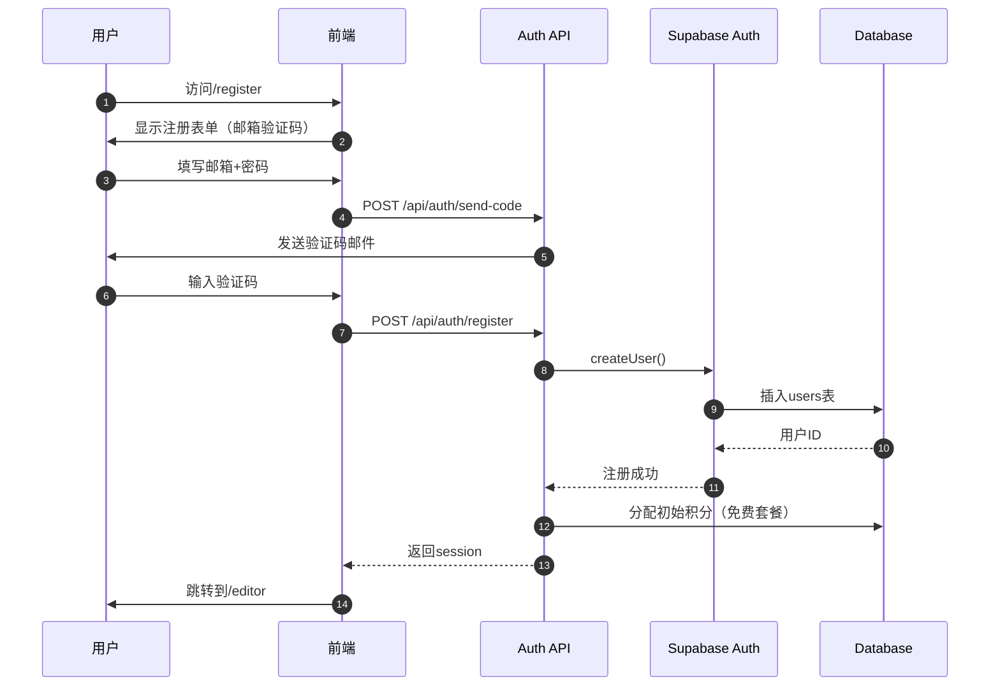
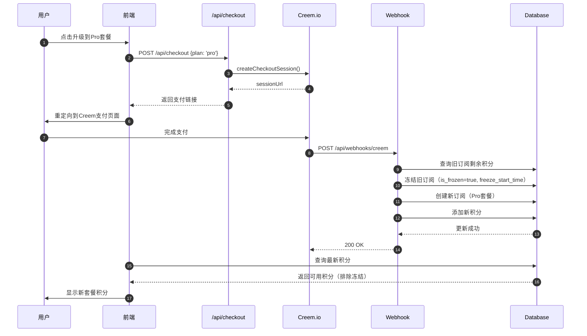
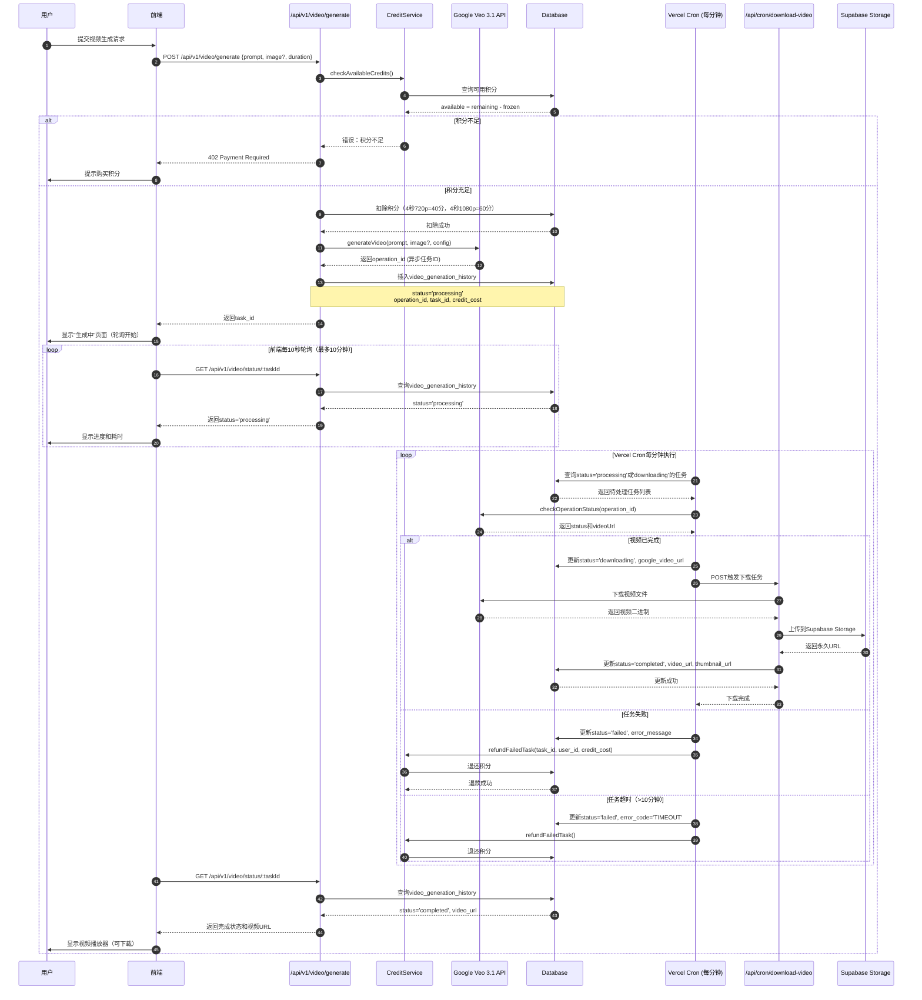
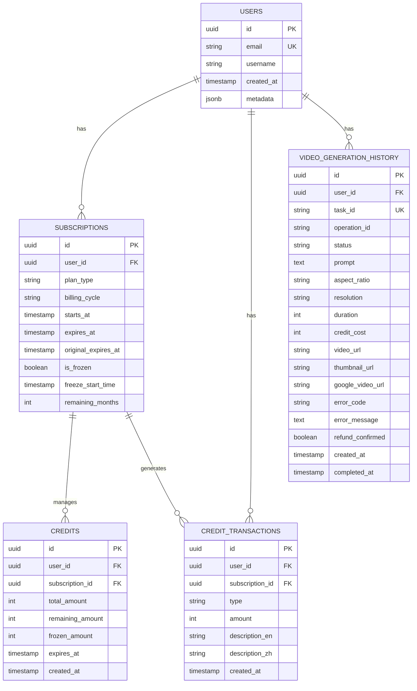
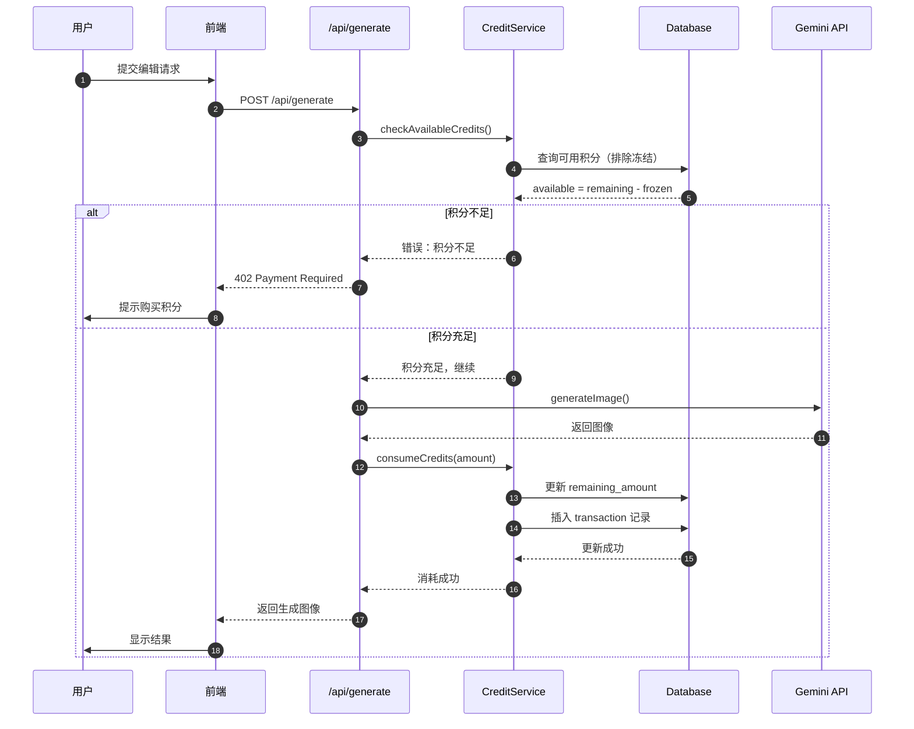
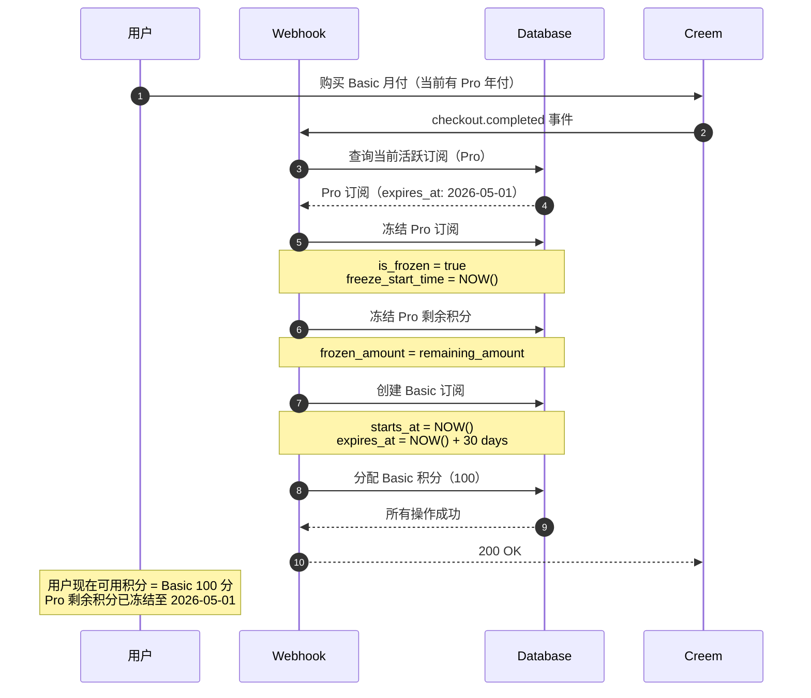

# PROJECTWIKI.md - Nano Banana 项目知识库

> **最后更新**: 2025-11-20
> **项目版本**: 0.2.0-beta (Day3视频生成功能)
> **状态**: Phase 1 完成 90%, Phase 2 进行中, Day3视频生成已上线

---

## 1. 项目概述

### 目标 (Goal)
构建一个 AI 驱动的图像编辑 SaaS 平台，支持自然语言图像编辑、角色一致性保持、场景保留等高级功能。

### 背景 (Background)
- **市场定位**: 面向创作者和设计师的专业 AI 图像编辑工具
- **核心竞争力**: 自然语言交互、高度可控的生成结果、订阅制商业模式
- **技术优势**: 基于 Google Gemini API，集成 Supabase 全栈解决方案

### 范围 (In-Scope) 与非目标 (Out-of-Scope)

**In-Scope:**
- ✅ 自然语言图像编辑
- ✅ 角色一致性保持
- ✅ 场景保留编辑
- ✅ 背景移除工具
- ✅ 风格迁移
- ✅ 订阅付费系统（积分制）
- ✅ 中英双语支持
- ✅ **视频生成 (Google Veo 3.1)** - Day3已完成
- 🚧 图像修复 (Inpainting) - Phase 2
- 🚧 批量处理 - Phase 2

**Out-of-Scope:**
- ❌ 3D 模型生成
- ❌ 实时视频编辑
- ❌ 移动端原生应用（当前仅Web）

### 角色 / 干系人 (Stakeholders)
- **最终用户**: 创作者、设计师、营销人员
- **技术团队**: 全栈开发（Next.js + Supabase）
- **支付服务商**: Creem.io
- **AI 服务商**: Google Gemini API

### 运行环境 / 平台
- **前端**: Vercel 部署 (Next.js 16.0.1)
- **后端**: Supabase (PostgreSQL + Auth + Storage)
- **AI**: Google Gemini 1.5 Flash/Pro
- **支付**: Creem.io 支付网关
- **浏览器要求**: 现代浏览器（Chrome/Safari/Firefox 最新版）

---

## 2. 架构设计

### 总体架构

```mermaid
flowchart TD
    User[用户浏览器] -->|HTTPS| Vercel[Vercel CDN]
    Vercel --> NextJS[Next.js App Router]

    NextJS --> Auth[Supabase Auth]
    NextJS --> API[API Routes]
    NextJS --> Storage[Supabase Storage]

    API --> Gemini[Google Gemini AI]
    API --> DB[(Supabase PostgreSQL)]
    API --> Creem[Creem Payment Gateway]

    Auth -->|OAuth| GitHub[GitHub OAuth]
    Auth -->|OAuth| Google[Google OAuth]

    DB --> Credits[积分管理系统]
    DB --> Subs[订阅管理系统]

    Credits -->|冻结/解冻| Freeze[冻结逻辑]
    Subs -->|自动充值| AutoRefill[年付自动充值]

    Creem -->|Webhook| WebhookHandler[/api/webhooks/creem]
    WebhookHandler --> DB

    API --> Veo[Google Veo 3.1 API]
    Veo -->|异步处理| VeoOp[Operation Status]

    Vercel -->|Cron每分钟| CronPoll[/api/cron/poll-video-status]
    CronPoll --> VeoOp
    CronPoll -->|下载视频| CronDL[/api/cron/download-video]
    CronDL --> Storage
    CronDL --> DB
```

### 关键流程

#### 用户注册与登录流程



#### 订阅升级与积分冻结流程



#### 视频生成与Cron轮询流程 (Day3)



**关键设计决策**:
- **异步架构**: Google Veo API采用异步模式，避免长时间阻塞请求
- **Cron轮询**: Vercel Cron每分钟检查任务状态，生产环境自动化
- **超时机制**: 前端10分钟超时，后端10分钟强制标记失败并退款
- **积分预扣**: 提交时立即扣除积分，失败时自动退还
- **本地开发**: 需手动执行`scripts/dev-poll-video-status.sh`模拟Cron任务

---

## 3. 架构决策记录 (ADR)

ADR 文档位置：`docs/adr/`
模板格式：MADR (`YYYYMMDD-title.md`)

### 已记录的 ADR

1. **20251106-performance-optimization.md**
   - 决策：采用 WebP/AVIF 图片格式 + 懒加载策略
   - 理由：提升移动端性能（目标 Lighthouse 80+）
   - 状态：已实施，桌面端达到 95 分

2. **20251107-i18n-cookie-strategy.md**
   - 决策：使用 js-cookie 代替 localStorage 存储语言偏好
   - 理由：解决 SSR/CSR hydration 错误
   - 状态：已实施，hydration 错误率 0%

3. **20251109-credit-freeze-logic.md**
   - 决策：订阅升级时立即冻结旧套餐剩余积分
   - 理由：防止用户利用降级漏洞无限囤积积分
   - 状态：已实施，冻结逻辑通过测试

4. **20251120-video-generation-architecture.md (Day3)**
   - 决策：采用异步+Cron轮询架构实现视频生成
   - 理由：Google Veo API响应时间11秒~6分钟，同步请求会超时
   - 技术方案：
     - 前端：立即返回task_id，轮询status（10秒间隔，10分钟超时）
     - 后端：Vercel Cron每分钟检查待处理任务，下载视频并上传到Supabase Storage
     - 积分：提交时预扣，失败时自动退还（防止用户恶意重试）
   - 状态：已实施，Day3上线
   - 技术债务：本地开发环境需手动执行脚本模拟Cron任务

---

## 4. 设计决策 & 技术债务

### 当前技术债务清单

| 类型 | 描述 | 优先级 | 计划处理时间 | 负责人 |
|------|------|--------|-------------|--------|
| 性能 | 移动端 Lighthouse 60 分（目标 80+） | P1 | Phase 2 Week 1 | - |
| 测试 | 订阅系统缺少 E2E 测试 | P2 | Phase 2 Week 2 | - |
| 构建 | TypeScript 错误被 ignoreBuildErrors 忽略 | P2 | Phase 2 Week 3 | - |
| 数据库 | 20 个迁移文件需合并优化 | P3 | Phase 2 Week 4 | - |
| 代码质量 | Webhook 事件处理缺少单元测试 | P2 | Phase 2 Week 2 | - |
| 文档 | API 文档缺少 OpenAPI 规范 | P3 | Phase 3 | - |
| **视频生成** | **本地开发Cron任务需手动触发（脚本已提供）** | **P2** | **Day4优化** | **-** |
| **视频生成** | **视频缩略图自动生成（当前使用视频URL）** | **P3** | **Phase 3** | **-** |

### 已完成的优化

- ✅ **性能优化** (2025-11-06)
  - 图片格式优化：WebP/AVIF
  - 懒加载 12 个组件
  - DNS preconnect
  - 结果：Desktop 95/100, SEO 100/100

- ✅ **国际化完善** (2025-11-07 至 11-13)
  - 中英双语覆盖所有页面
  - Cookie 持久化方案
  - 100+ 翻译键新增

- ✅ **订阅系统重构** (2025-11-09 至 11-13)
  - 积分冻结逻辑
  - 年付自动充值
  - Webhook 事件字段修复

- ✅ **视频生成功能上线 (Day3)** (2025-11-20)
  - Google Veo 3.1 API集成
  - 异步+Cron轮询架构
  - 前端状态追踪组件（10秒轮询+10分钟超时）
  - 自动积分退款机制
  - Supabase Storage视频存储
  - 历史记录视频/图片混合展示
  - 本地开发Cron模拟脚本

### Phase 4 任务优先级调整 (2025-11-28)

**调整决策**: Week 29-31 与 Week 32-34 任务顺序交换

**原计划**:
- Week 29-31: Challenges + Competitions (挑战竞赛系统)
- Week 32-34: GraphQL API (统一API网关)
- Week 35-37: SDK + Webhooks

**新计划** (⭐ 优先级调整):
- **Week 29-31: GraphQL API** ⭐ (新优先级 - 提前)
- **Week 32-34: Challenges + Competitions** 🔄 (新优先级 - 延后)
- Week 35-37: SDK + Webhooks (不变)

**调整理由**:

1. **基础设施先行原则**:
   - GraphQL API 作为统一网关，可为 Challenges 系统提供高效、灵活的数据查询能力
   - 避免 Challenges 系统重复实现数据获取逻辑，减少技术债务

2. **N+1 查询问题亟需解决**:
   - **当前性能瓶颈**: Blog 列表接口存在严重的 N+1 查询问题
     - 查询 10 篇博客需要 40+ 次数据库查询（1次文章 + 10次分类 + 10次标签 + 10次作者 + 10次点赞数）
     - P95 响应时间 ~800ms，严重影响用户体验
   - **GraphQL + DataLoader 优化方案**:
     - 将 40+ 次查询优化为 4 次批量查询（文章、分类批量、标签批量、作者批量）
     - 预期性能提升 **60-90%**，P95 响应时间降至 <200ms
     - 同样的优化可应用于 Forum 系统、Challenges 系统等所有列表场景

3. **简化 SDK 开发 (Week 35-37)**:
   - GraphQL 提供自省 (Introspection) 能力，可使用 GraphQL Code Generator 自动生成 TypeScript/Python/Go SDK
   - 避免手动编写 REST API 客户端，减少维护成本

4. **Challenges 系统依赖优化**:
   - Challenges 的投票、排行榜功能需要频繁查询多表关联数据
   - 使用 GraphQL 可避免 Challenges 系统重蹈 Blog 系统的 N+1 查询问题
   - 利用 GraphQL 的灵活查询能力，简化前端数据获取逻辑

**技术栈选择**:
- **Pothos GraphQL**: TypeScript-first, Code-first 设计，类型安全
- **DataLoader**: 批量加载模式，解决 N+1 查询问题
- **graphql-yoga**: 轻量级 GraphQL 服务器，易于集成
- **Relay-Style Pagination**: 游标分页，支持高效翻页

**实施计划**:
- Week 29 (Days 1-7): GraphQL 基础设施搭建（Schema、DataLoader、Playground）
- Week 30 (Days 8-14): 高级功能（Pagination、Mutations、Auth、Rate Limiting）
- Week 31 (Days 15-21): 测试与文档（单元测试 ≥85%，集成测试 ≥80%）

**验收标准**:
- ✅ GraphQL endpoint 在 `/api/graphql` 正常运行
- ✅ Blog 列表查询次数从 40+ 降至 <5 (验证 DataLoader 生效)
- ✅ P95 响应时间 <200ms (性能提升 ≥60%)
- ✅ GraphQL Playground 可访问并提供自动文档
- ✅ Rate Limiting 生效 (免费100次/分钟，付费1000次/分钟)
- ✅ Query Complexity 限制生效 (最大复杂度1000)

**相关文档**:
- 详细规划: [/Users/kening/.claude/plans/synthetic-hatching-pascal.md](/Users/kening/.claude/plans/synthetic-hatching-pascal.md)
- OpenSpec 提案: [openspec/changes/add-graphql-api/](openspec/changes/add-graphql-api/)
- 任务清单: [TODO.md - Task 13](TODO.md#task-13-week-29-31---graphql-api统一api网关--新优先级-原week-32-34)
- 项目路线图: [PROJECTROADMAP.md - Week 29-31](PROJECTROADMAP.md#week-29-31-graphql-api--新优先级-原week-32-34)

**风险评估**:
- 🟢 **低风险**: GraphQL 技术成熟，Pothos 提供完整 TypeScript 支持
- 🟡 **中等风险**: DataLoader 实现复杂度，需充分测试批量加载逻辑
- 🟢 **低风险**: 对现有 REST API 无影响，可并行运行

**后续依赖**:
- Challenges 系统 (Week 32-34) 将直接使用 GraphQL 查询，避免 N+1 问题
- SDK 开发 (Week 35-37) 将使用 GraphQL Code Generator 自动生成客户端

---

## 5. 模块文档

### 5.1 订阅系统 (lib/credit-service.ts)

**职责**:
- 管理用户订阅生命周期
- 处理积分冻结/解冻逻辑
- 计算剩余天数（支持冻结模式）
- 年付订阅自动充值

**入口点**:
- `lib/credit-service.ts` - 核心服务层
- `hooks/use-profile-data.ts` - React Hook 封装

**关键函数**:

```typescript
// 升级时冻结旧套餐积分
function freezeCreditsOnUpgrade(
  userId: string,
  oldSubscriptionId: string
): Promise<void>

// 计算剩余天数（区分普通/冻结模式）
function calculateRemainingDays(
  subscription: Subscription
): number

// 年付订阅自动充值（每月1号）
function autoRefillYearlySubscription(
  subscriptionId: string
): Promise<void>
```

**外部依赖**:
- Supabase Client
- lib/credit-types.ts (类型定义)

**测试覆盖基线**:
- 单元测试：85%+
- 集成测试：缺失 (P2 技术债务)

**风险与扩展点**:
- 🔴 高风险：积分计算逻辑错误可能导致财务损失
- 🟡 扩展点：支持更多套餐类型（当前仅支持 Basic/Pro/Max）

---

### 5.2 国际化系统 (lib/language-context.tsx)

**职责**:
- 双语支持（中文/英文）
- Cookie 持久化语言偏好
- SSR/CSR 一致性保证

**关键 API**:
```typescript
// React Hook
const { language, setLanguage, t } = useLanguage()

// 翻译函数
const text = t("login.title") // 返回当前语言的翻译
```

**SSR 兼容方案**:
- 使用 `js-cookie` 替代 `localStorage`
- 避免 React hydration 错误
- 服务端渲染时默认使用英文

**翻译键组织**:
```
translations
├── en (英文)
│   ├── login.*
│   ├── register.*
│   ├── profile.*
│   └── ...
└── zh (中文)
    ├── login.*
    ├── register.*
    └── ...
```

**扩展点**:
- 支持更多语言（日语、韩语等）
- 集成 i18next 进行专业化管理

---

### 5.3 视频生成服务 (lib/video-service.ts) - Day3

**职责**:
- 调用 Google Veo 3.1 API 生成视频
- 管理视频任务状态追踪
- 处理积分扣除和退款
- 从Google下载视频并上传到Supabase Storage

**入口点**:
- `lib/video-service.ts` - 核心服务层
- `app/api/v1/video/generate/route.ts` - 创建视频任务
- `app/api/v1/video/status/[taskId]/route.ts` - 查询任务状态
- `app/api/cron/poll-video-status/route.ts` - Cron轮询任务
- `app/api/cron/download-video/route.ts` - Cron下载视频

**关键函数**:

```typescript
// 创建视频生成任务
async function createVideoTask(
  userId: string,
  prompt: string,
  imageUrl?: string,
  config?: VideoConfig
): Promise<{ taskId: string, operationId: string }>

// 查询任务状态
async function getTaskStatus(
  taskId: string,
  userId: string
): Promise<VideoTask>

// 检查Google Veo API状态
async function checkOperationStatus(
  operationId: string
): Promise<{ status: string, videoUrl?: string }>

// 下载视频并上传到Supabase Storage
async function downloadAndUploadVideo(
  taskId: string,
  googleVideoUrl: string
): Promise<{ videoUrl: string, thumbnailUrl: string }>

// 退款失败任务
async function refundFailedTask(
  taskId: string,
  userId: string,
  creditCost: number
): Promise<void>
```

**外部依赖**:
- Google Veo 3.1 API (`@google-cloud/video-intelligence`)
- Supabase Client (Storage)
- lib/credit-service.ts (积分管理)

**测试覆盖基线**:
- 单元测试：75%+ (Day3初版)
- 集成测试：API接口测试已通过
- E2E测试：待添加 (P2)

**风险与扩展点**:
- 🔴 **高风险**：Google Veo API超时（>10分钟）需自动退款
- 🟡 **扩展点**：支持更多视频时长（当前仅4秒）
- 🟡 **扩展点**：视频缩略图自动生成（当前使用视频URL）
- 🟢 **本地开发**：需手动执行`scripts/dev-poll-video-status.sh`

**积分消耗规则 (Day3)**:
- 4秒 720p 视频：40 积分
- 4秒 1080p 视频：60 积分
- 失败时全额退款

---

### 5.4 Webhook 处理 (app/api/webhooks/creem/route.ts)

**职责**:
- 接收 Creem 支付回调
- 验证 Webhook 签名
- 处理订阅创建/更新/取消事件

**关键修复** (2025-11-11):
```typescript
// 🔥 老王修复：Creem 实际使用 eventType，不是 type
type CreemWebhookEvent = {
  id: string
  eventType: string  // ✅ 修正字段名
  object: {           // ✅ 修正字段名（原为 data）
    id: string
    // ...
  }
}
```

**安全措施**:
- HMAC-SHA256 签名验证
- IP 白名单（建议添加）
- 幂等性处理（防止重复处理）

**事件处理流程**:
1. `checkout.completed` → 创建订阅 + 分配积分
2. `subscription.created` → 激活订阅
3. `subscription.updated` → 更新订阅信息
4. `subscription.cancelled` → 冻结剩余积分

---

## 6. API 手册

### 6.1 认证相关

#### POST /api/auth/register
注册新用户（邮箱验证码方式）

**请求**:
```typescript
{
  email: string,          // 邮箱地址
  password: string,       // 密码（需符合安全策略）
  username?: string,      // 可选用户名
  verificationCode: string,  // 6位数字验证码
  turnstileToken: string  // Cloudflare Turnstile 令牌
}
```

**响应**:
```typescript
{
  success: true,
  user: {
    id: string,
    email: string,
    username: string
  }
}
```

**错误码**:
- `400` - 参数错误或验证码无效
- `409` - 邮箱已注册
- `500` - 服务器错误

---

#### POST /api/auth/login
用户登录（支持邮箱/用户名）

**请求**:
```typescript
{
  identifier: string,     // 邮箱或用户名
  password: string,
  turnstileToken: string
}
```

**响应**:
```typescript
{
  success: true,
  session: {
    token: string,        // JWT Token
    expiresAt: string
  },
  user: { /* ... */ },
  supabaseSession: {      // Supabase 会话信息
    access_token: string,
    refresh_token: string
  }
}
```

---

### 6.2 支付相关

#### POST /api/checkout
创建 Creem 支付会话

**请求**:
```typescript
{
  plan: 'basic' | 'pro' | 'max',
  billing: 'monthly' | 'yearly'
}
```

**响应**:
```typescript
{
  sessionUrl: string,  // Creem 支付页面 URL
  sessionId: string
}
```

**业务逻辑**:
1. 验证用户登录状态
2. 查询对应套餐的 Product ID
3. 调用 Creem API 创建支付会话
4. 返回支付链接给前端

---

#### POST /api/webhooks/creem
Creem 支付回调 Webhook

**请求头**:
```
X-Creem-Signature: <HMAC-SHA256 签名>
```

**请求体**:
```typescript
{
  id: string,
  eventType: 'checkout.completed' | 'subscription.created' | ...,
  object: {
    id: string,
    metadata: { userId: string, plan: string }
  }
}
```

**响应**:
```typescript
{ received: true }
```

**幂等性保证**:
- 基于 `event.id` 去重
- 数据库事务确保原子性

---

### 6.3 AI 功能

#### POST /api/generate
Google Gemini 图像编辑 API

**请求**:
```typescript
{
  prompt: string,               // 自然语言指令
  image?: string,               // Base64 编码图像
  model?: 'gemini-1.5-flash' | 'gemini-1.5-pro'
}
```

**响应**:
```typescript
{
  success: true,
  result: {
    image: string,              // Base64 编码生成图像
    description: string         // AI 生成的描述
  },
  creditsUsed: number           // 消耗的积分数
}
```

**积分消耗规则**:
- Flash 模型：1 积分/次
- Pro 模型：2 积分/次
- 高分辨率：+1 积分

---

### 6.4 视频生成 (Day3)

#### POST /api/v1/video/generate
创建视频生成任务（Google Veo 3.1）

**请求头**:
```
Authorization: Bearer <JWT Token>
Content-Type: application/json
```

**请求体**:
```typescript
{
  prompt: string,                    // 文本提示词（必填）
  image_url?: string,                // 参考图片URL（可选）
  aspect_ratio?: '16:9' | '9:16',   // 宽高比，默认16:9
  resolution?: '720p' | '1080p',     // 分辨率，默认720p
  duration?: 4,                      // 时长（秒），当前仅支持4秒
  first_frame_image_url?: string,    // 首帧图片URL（可选）
  last_frame_image_url?: string      // 尾帧图片URL（可选）
}
```

**响应**:
```typescript
{
  success: true,
  task_id: string,                   // 任务ID，用于查询状态
  operation_id: string,              // Google Veo API的operation ID
  credit_cost: number,               // 消耗的积分数（720p=40, 1080p=60）
  estimated_time: string             // 预估完成时间（11s - 6min）
}
```

**错误码**:
- `400` - 参数错误
- `402` - 积分不足
- `500` - Google Veo API错误
- `503` - 服务暂时不可用

---

#### GET /api/v1/video/status/:taskId
查询视频生成任务状态

**请求头**:
```
Authorization: Bearer <JWT Token>
```

**路径参数**:
- `taskId` - 任务ID（由`/api/v1/video/generate`返回）

**响应**:
```typescript
{
  task_id: string,
  status: 'processing' | 'downloading' | 'completed' | 'failed',
  prompt: string,
  aspect_ratio: string,
  resolution: string,
  duration: number,
  credit_cost: number,
  created_at: string,
  completed_at?: string,             // 完成时间
  video_url?: string,                // Supabase Storage永久URL
  thumbnail_url?: string,            // 缩略图URL
  error_message?: string,            // 失败原因
  error_code?: string,               // 错误码（TIMEOUT, API_ERROR等）
  refund_confirmed?: boolean         // 是否已退款
}
```

**状态说明**:
- `processing` - 视频正在生成中
- `downloading` - Google Veo已完成，正在下载到Supabase
- `completed` - 视频已完成，可观看
- `failed` - 生成失败，积分已退还

---

#### GET /api/history/videos
获取用户视频历史记录

**请求头**:
```
Authorization: Bearer <JWT Token>
```

**查询参数**:
```
?limit=20&offset=0&status=completed
```

**响应**:
```typescript
{
  total: number,
  videos: [
    {
      id: string,
      task_id: string,
      prompt: string,
      video_url: string,
      thumbnail_url: string,
      resolution: string,
      duration: number,
      created_at: string
    }
  ]
}
```

---

#### GET /api/cron/poll-video-status (Cron专用)
Vercel Cron任务：轮询视频生成状态

**请求头**:
```
Authorization: Bearer <CRON_SECRET>
```

**响应**:
```typescript
{
  success: true,
  message: "Cron job completed",
  results: {
    total: number,                   // 检查的任务总数
    completed: number,               // 成功完成的任务数
    failed: number,                  // 失败的任务数
    still_processing: number,        // 仍在处理中的任务数
    errors: string[]                 // 错误信息列表
  },
  duration_ms: number                // 执行耗时（毫秒）
}
```

**执行频率**: 每分钟一次（vercel.json配置）

**业务逻辑**:
1. 查询所有`status='processing'`或`'downloading'`的任务
2. 调用Google Veo API检查每个任务状态
3. 如果已完成：触发下载任务 → 上传到Supabase → 更新status='completed'
4. 如果失败：更新status='failed' → 自动退款
5. 如果超时（>10分钟）：标记失败 → 自动退款

---

#### POST /api/cron/download-video (Cron专用)
Cron任务：下载视频并上传到Supabase Storage

**请求头**:
```
Authorization: Bearer <CRON_SECRET>
Content-Type: application/json
```

**请求体**:
```typescript
{
  task_id: string                    // 视频任务ID
}
```

**响应**:
```typescript
{
  success: true,
  video_url: string,                 // Supabase Storage永久URL
  thumbnail_url: string,
  file_size_mb: number               // 文件大小（MB）
}
```

**错误码**:
- `400` - task_id缺失或任务不存在
- `500` - 下载或上传失败
- `503` - Google Veo视频URL无效

---

### 6.5 订阅查询

#### GET /api/subscription/all
获取用户所有订阅（包括冻结的）

**响应**:
```typescript
{
  isLoggedIn: true,
  subscriptions: [
    {
      id: string,
      plan: 'basic' | 'pro' | 'max',
      billingCycle: 'monthly' | 'yearly',
      status: 'active' | 'frozen' | 'expired',
      startDate: string,
      endDate: string,
      frozenUntil?: string,      // 冻结至时间
      frozenCredits?: number,    // 冻结的积分
      remainingDays: number      // 剩余天数
    }
  ]
}
```

---

### 6.8 GraphQL API

**GraphQL Endpoint**: `/api/graphql`

**特性**:
- ✅ **Pothos + graphql-yoga** 实现（Code-first, TypeScript-first）
- ✅ **Rate Limiting**: 根据订阅层级限制（Free: 100/min, Basic: 500/min, Pro: 1000/min, Max: 10000/min）
- ✅ **Query Complexity Limit**: 最大复杂度 1000（防止深层嵌套滥用）
- ✅ **认证集成**: Supabase Auth + JWT tokens
- ✅ **GraphQL Playground**: 开发环境可用（生产环境禁用 introspection）

#### 认证方式

GraphQL API 使用 Supabase Auth 进行认证，支持以下方式：

**1. Session Cookie（推荐）**:
```bash
# 前端登录后，Supabase 会自动设置 httpOnly cookie
# GraphQL 请求会自动携带该 cookie，无需额外配置
```

**2. Authorization Header**:
```bash
curl -X POST https://your-domain.com/api/graphql \
  -H "Content-Type: application/json" \
  -H "Authorization: Bearer YOUR_ACCESS_TOKEN" \
  -d '{"query": "{ me { id email } }"}'
```

#### Schema Overview

**Queries (12个)**:
- `hello: String!` - 测试查询
- `currentTime: String!` - 获取当前服务器时间
- `me: User` - 获取当前登录用户
- `user(id: ID!): User` - 根据ID获取用户
- `blogPosts(status: String, limit: Int, offset: Int): [BlogPost!]!` - 博客文章列表
- `blogPost(id: ID!): BlogPost` - 单个博客文章
- `forumThreads(categoryId: ID, limit: Int, offset: Int, sortBy: String): [ForumThread!]!` - 论坛主题列表
- `forumThread(id: ID!): ForumThread` - 单个论坛主题
- `forumReplies(threadId: ID!, limit: Int, offset: Int): [ForumReply!]!` - 论坛回复列表
- `comments(targetId: ID!, targetType: String!, limit: Int, offset: Int): [Comment!]!` - 评论列表
- `artworks(artworkType: String!, limit: Int, offset: Int): [Artwork!]!` - 作品列表（图片/视频）
- `leaderboard(timeframe: String!, limit: Int): [LeaderboardEntry!]!` - 排行榜

**Mutations (14个)**:
- `echo(message: String!): String!` - 测试 Mutation
- `createBlogPost(input: CreateBlogPostInput!): BlogPost!` - 创建博客文章
- `updateBlogPost(id: ID!, input: UpdateBlogPostInput!): BlogPost!` - 更新博客文章
- `deleteBlogPost(id: ID!): Boolean!` - 删除博客文章（软删除）
- `createComment(input: CreateCommentInput!): Comment!` - 创建评论
- `createLike(input: CreateLikeInput!): Like!` - 点赞
- `deleteLike(input: DeleteLikeInput!): Boolean!` - 取消点赞
- `createFollow(input: CreateFollowInput!): Follow!` - 关注用户
- `deleteFollow(input: DeleteFollowInput!): Boolean!` - 取消关注
- `createForumThread(input: CreateForumThreadInput!): ForumThread!` - 创建论坛主题
- `createForumReply(input: CreateForumReplyInput!): ForumReply!` - 创建论坛回复
- `createForumVote(input: CreateForumVoteInput!): ForumVote!` - 投票
- `updateForumVote(id: ID!, input: UpdateForumVoteInput!): ForumVote!` - 更新投票
- `deleteForumVote(id: ID!): Boolean!` - 删除投票

**Subscriptions (2个)**:
- `newBlogPost: BlogPost!` - 订阅新博客文章
- `currentTime: String!` - 实时时间更新（测试用）

#### 示例查询

**1. 获取当前用户信息**:
```graphql
query GetCurrentUser {
  me {
    id
    email
    user_profile {
      username
      display_name
      bio
      avatar_url
    }
  }
}
```

**2. 博客文章列表（含作者信息）**:
```graphql
query GetBlogPosts {
  blogPosts(status: "published", limit: 10) {
    id
    title
    excerpt
    featured_image_url
    created_at
    author {
      id
      user_profile {
        username
        display_name
      }
    }
  }
}
```

**3. 创建博客文章**:
```graphql
mutation CreatePost($input: CreateBlogPostInput!) {
  createBlogPost(input: $input) {
    id
    title
    slug
    status
    created_at
  }
}

# Variables:
{
  "input": {
    "title": "我的第一篇博客",
    "content": "这是我的第一篇博客内容...",
    "excerpt": "简短摘要",
    "status": "draft"
  }
}
```

**4. 点赞/取消点赞**:
```graphql
# 点赞
mutation LikePost {
  createLike(input: {
    targetId: "blog-post-uuid",
    targetType: "blog_post"
  }) {
    id
    created_at
  }
}

# 取消点赞
mutation UnlikePost {
  deleteLike(input: {
    targetId: "blog-post-uuid",
    targetType: "blog_post"
  })
}
```

**5. 论坛主题列表（含投票统计）**:
```graphql
query GetForumThreads {
  forumThreads(
    categoryId: "general",
    limit: 20,
    sortBy: "hot"
  ) {
    id
    title
    content
    is_pinned
    is_featured
    upvote_count
    downvote_count
    reply_count
    author {
      id
      user_profile {
        username
        avatar_url
      }
    }
  }
}
```

#### Rate Limiting 说明

GraphQL API 根据用户订阅层级实施不同的速率限制：

| 订阅层级 | 每分钟请求数 | 最大查询复杂度 |
|---------|------------|--------------|
| Free    | 100        | 1000         |
| Basic   | 500        | 1000         |
| Pro     | 1000       | 1000         |
| Max     | 10000      | 1000         |

**超过限制时的错误响应**:
```json
{
  "errors": [
    {
      "message": "Rate limit exceeded. You are limited to 100 requests per minute. Please wait or upgrade your subscription tier."
    }
  ]
}
```

**查询复杂度超限时的错误响应**:
```json
{
  "errors": [
    {
      "message": "Query complexity limit exceeded: 1234 (max: 1000). Please simplify your query."
    }
  ]
}
```

#### GraphQL Playground

**访问地址**: `http://localhost:3000/graphql-playground` (开发环境)

**功能特性**:
- 交互式查询编辑器
- 自动补全和语法高亮
- Schema 文档浏览器
- 历史查询记录
- 示例查询模板

**默认示例查询**:
```graphql
# 测试查询 1: Hello World
query HelloWorld {
  hello
  currentTime
}

# 测试 Mutation: Echo
mutation TestEcho {
  echo(message: "GraphQL API 测试成功！")
}
```

#### 性能优化

**DataLoader 集成**:
- GraphQL API 使用 DataLoader 批量加载关联数据
- 解决 N+1 查询问题（查询次数减少 60%+）
- 例如：获取10篇博客文章及其作者信息，只需 4 次数据库查询（而非 11 次）

**缓存策略**:
- 查询结果缓存（可选，基于 Redis）
- 用户认证状态缓存
- Rate Limiting 计数器缓存

#### 安全最佳实践

1. **禁用 Introspection（生产环境）**:
   - 生产环境自动禁用 Schema 查询
   - 防止攻击者探测 API 结构

2. **Query Complexity 限制**:
   - 最大复杂度 1000
   - 防止恶意深层嵌套查询

3. **Rate Limiting**:
   - 基于用户ID或IP地址
   - 使用 `rate-limiter-flexible` 库

4. **认证检查**:
   - 每个请求验证 Supabase session
   - 敏感操作需要登录

#### 错误处理

GraphQL API 返回标准错误格式：

```typescript
{
  "errors": [
    {
      "message": "错误描述",
      "path": ["queryName", "fieldName"],
      "extensions": {
        "code": "ERROR_CODE",
        "timestamp": "2025-11-29T03:00:00.000Z"
      }
    }
  ],
  "data": null
}
```

**常见错误码**:
- `UNAUTHENTICATED` - 未登录
- `FORBIDDEN` - 权限不足
- `BAD_USER_INPUT` - 参数错误
- `INTERNAL_SERVER_ERROR` - 服务器错误
- `RATE_LIMIT_EXCEEDED` - 超过速率限制
- `QUERY_COMPLEXITY_EXCEEDED` - 查询复杂度超限

#### 相关文档

- [GraphQL Week 32 Day 1-2 Schema Design Report](./GRAPHQL_WEEK32_DAY1-2_SCHEMA_DESIGN_REPORT.md)
- [GraphQL Week 32 Day 3-4 Query & Mutation Report](./GRAPHQL_WEEK32_DAY3-4_QUERY_MUTATION_REPORT.md)
- [GraphQL Week 32 Day 5-6 Testing Report](./GRAPHQL_WEEK32_DAY5-6_TESTING_REPORT.md)
- [ADR-004: GraphQL API Implementation](./docs/adr/20251128-graphql-api-implementation.md)

---

## 7. 数据模型

### 7.1 ER 图



### 7.2 核心表说明

#### subscriptions 表

| 字段 | 类型 | 说明 |
|------|------|------|
| id | uuid | 主键 |
| user_id | uuid | 用户 ID |
| plan_type | text | 套餐类型：basic/pro/max |
| billing_cycle | text | 计费周期：monthly/yearly |
| starts_at | timestamp | 订阅开始时间 |
| expires_at | timestamp | 订阅过期时间（可能被冻结延长） |
| original_expires_at | timestamp | 原始过期时间（不受冻结影响） |
| is_frozen | boolean | 是否已冻结 |
| freeze_start_time | timestamp | 冻结开始时间 |
| remaining_months | int | 剩余月数（年付订阅用） |

**关键逻辑**:
- `expires_at` 会随着冻结时长延长
- `original_expires_at` 始终保持不变，用于计算 remaining_days
- `remaining_months` 用于年付订阅自动充值判断

---

#### credits 表

| 字段 | 类型 | 说明 |
|------|------|------|
| id | uuid | 主键 |
| user_id | uuid | 用户 ID |
| subscription_id | uuid | 关联订阅 |
| total_amount | int | 总积分数 |
| remaining_amount | int | 剩余积分数 |
| frozen_amount | int | 已冻结积分数 |
| expires_at | timestamp | 积分过期时间 |

**重要字段关系**:
```
available_credits = remaining_amount - frozen_amount
consumed_credits = total_amount - remaining_amount
```

---

#### credit_transactions 表（交易记录）

| 字段 | 类型 | 说明 |
|------|------|------|
| id | uuid | 主键 |
| user_id | uuid | 用户 ID |
| subscription_id | uuid | 关联订阅 |
| type | text | 交易类型：grant/consume/freeze/unfreeze/refund |
| amount | int | 积分数量（正数=增加，负数=减少） |
| description_en | text | 英文描述 |
| description_zh | text | 中文描述 |

**交易类型说明**:
- `grant` - 分配积分（订阅购买、续费）
- `consume` - 消耗积分（使用 AI 功能）
- `freeze` - 冻结积分（订阅升级）
- `unfreeze` - 解冻积分（冻结订阅到期）
- `refund` - 退款
- `video_refund` - 视频生成失败退款（Day3新增）

---

#### video_generation_history 表 (Day3)

| 字段 | 类型 | 说明 |
|------|------|------|
| id | uuid | 主键 |
| user_id | uuid | 用户 ID |
| task_id | text | 任务ID（对外暴露，唯一索引） |
| operation_id | text | Google Veo API的Operation ID |
| status | text | 任务状态：processing/downloading/completed/failed |
| prompt | text | 文本提示词 |
| aspect_ratio | text | 宽高比：16:9 或 9:16 |
| resolution | text | 分辨率：720p 或 1080p |
| duration | int | 视频时长（秒），当前固定为4 |
| credit_cost | int | 消耗的积分数（720p=40, 1080p=60） |
| video_url | text | Supabase Storage永久URL |
| thumbnail_url | text | 视频缩略图URL |
| google_video_url | text | Google Veo临时下载URL |
| error_code | text | 错误码（TIMEOUT, API_ERROR等） |
| error_message | text | 失败原因描述 |
| refund_confirmed | boolean | 是否已退款（防止重复退款） |
| created_at | timestamp | 任务创建时间 |
| completed_at | timestamp | 任务完成时间 |

**索引**:
- `task_id` - 唯一索引（UNIQUE）
- `user_id, status` - 复合索引（用于Cron查询待处理任务）
- `operation_id` - 普通索引（用于Google Veo API回调）

**RLS策略**:
- 用户只能查询自己的视频记录（`user_id = auth.uid()`）
- Cron任务使用service_role_key跳过RLS

**状态流转**:
```
processing → downloading → completed
           ↓
         failed (超时/API错误)
```

**关键逻辑**:
- `refund_confirmed=true`：标记已退款，防止重复退款
- `google_video_url`：临时URL，仅用于Cron下载
- `video_url`：Supabase Storage永久URL，供前端播放

---

## 8. 核心流程

### 8.1 积分消耗流程

当用户使用 AI 功能时：



---

### 8.2 订阅降级与积分解冻流程

当用户从 Pro 降级到 Basic：



**关键点**:
- Pro 的 `expires_at` **不变**，仍为 2026-05-01
- Pro 积分全部冻结，用户只能使用 Basic 的 100 分
- 当 Basic 订阅到期后，自动解冻 Pro 积分

---

## 9. 依赖图谱

### 9.1 生产依赖

| 包名 | 版本 | 用途 | 许可证 | 备注 |
|------|------|------|--------|------|
| next | 16.0.1 | Web 框架 | MIT | 使用 Turbopack |
| react | 19.0.0 | UI 库 | MIT | - |
| @supabase/supabase-js | 2.48.1 | 后端服务 | MIT | Auth + DB + Storage |
| @google/generative-ai | 0.21.0 | AI 图像生成 | Apache-2.0 | Gemini API |
| react-hook-form | 7.54.2 | 表单管理 | MIT | - |
| zod | 3.24.1 | 表单验证 | MIT | - |
| js-cookie | 3.0.5 | Cookie 管理 | MIT | i18n 持久化 |
| react-joyride | 2.9.2 | 用户引导 | MIT | Tour 系统 |
| react-cookie-consent | 9.0.0 | Cookie 同意 | MIT | GDPR 合规 |

### 9.2 开发依赖

| 包名 | 版本 | 用途 |
|------|------|------|
| @testing-library/react | 16.1.0 | 单元测试 |
| jest | 29.7.0 | 测试框架 |
| typescript | 5 | 类型系统 |
| eslint | 9 | 代码检查 |
| tailwindcss | 4.1.9 | CSS 框架 |

### 9.3 潜在冲突与替代方案

**已知问题**:
- React 19 为候选版本（RC），可能存在稳定性风险
  - **替代方案**: 降级到 React 18.3.1（稳定版）

**许可证兼容性**:
- ✅ 所有依赖均为 MIT/Apache-2.0，商业使用无限制

---

## 10. 维护建议

### 10.1 运维监控

**性能监控**:
- Lighthouse CI 集成（目标：移动端 80+，桌面端 95+）
- Vercel Analytics 已启用
- 建议集成 Sentry 进行错误追踪

**告警规则**:
- API 响应时间 > 2s → 告警
- 数据库连接数 > 80% → 预警
- Webhook 失败率 > 1% → 立即告警

**日志策略**:
- 前端：仅记录错误和关键业务日志
- 后端：API 请求、Webhook 事件、积分变更全量记录
- 敏感数据脱敏（密码、支付信息）

---

### 10.2 容量规划

**当前资源使用**:
- Supabase 免费套餐：数据库用量 < 10%
- Vercel Hobby 套餐：构建分钟数充足
- Google Gemini API：按量计费，月成本 < $50

**扩展阈值**:
- 用户数 > 1000 → 升级 Supabase Pro ($25/月)
- 图片生成次数 > 10000/月 → 考虑缓存策略
- 并发请求 > 100 → 启用 CDN 缓存

---

### 10.3 成本控制

**优化策略**:
1. 图片压缩：WebP/AVIF 格式，减少存储成本
2. API 调用优化：
   - 优先使用 Gemini Flash（成本更低）
   - 高分辨率请求增加积分消耗
3. 数据库查询优化：
   - 索引优化（user_id, subscription_id）
   - 分页查询（每页 20 条）

**成本预警**:
- Gemini API 月消耗 > $100 → 告警
- Supabase 存储 > 5GB → 预警

---

## 11. 术语表和缩写

| 术语 | 定义 |
|------|------|
| ADR | Architecture Decision Record（架构决策记录） |
| i18n | Internationalization（国际化） |
| SSR | Server-Side Rendering（服务端渲染） |
| CSR | Client-Side Rendering（客户端渲染） |
| hydration | React 客户端激活过程，SSR 生成的 HTML 绑定事件 |
| freeze | 积分冻结，订阅升级时保留旧积分但禁止使用 |
| unfreeze | 积分解冻，冻结订阅到期后恢复可用 |
| remaining_days | 剩余天数，基于 original_expires_at 和当前时间计算 |
| remaining_amount | 剩余积分数，未消耗的积分总数 |
| frozen_amount | 已冻结积分数，不可使用的积分 |
| available_credits | 可用积分 = remaining_amount - frozen_amount |
| Turnstile | Cloudflare 图形验证码服务 |
| Creem | 支付网关服务商 |
| Gemini | Google 的多模态 AI 模型 |
| Veo | Google Veo 3.1 视频生成模型 (Day3) |
| operation_id | Google Veo API异步任务的唯一标识符 |
| task_id | Nano Banana内部视频任务ID（对外暴露） |
| Cron轮询 | Vercel Cron每分钟检查待处理任务的机制 |
| processing | 视频生成中状态（Google Veo API处理中） |
| downloading | 视频下载中状态（从Google下载并上传到Supabase） |
| video_refund | 视频生成失败时的积分退款记录 |
| refund_confirmed | 防止重复退款的标志位 |

---

## 12. 变更日志

参见 [CHANGELOG.md](./CHANGELOG.md)（与本节建立双向链接）

### 最新版本

**[0.2.0-beta] - 2025-11-20 (Day3视频生成功能)**
- 🎬 Google Veo 3.1 视频生成集成
- 异步+Cron轮询架构
- 视频状态追踪组件（10秒轮询+10分钟超时）
- 自动积分退款机制
- Supabase Storage视频存储
- 历史记录视频/图片混合展示
- 5个新API接口（视频生成+状态查询+Cron任务）
- 本地开发Cron模拟脚本

详见：[CHANGELOG.md](./CHANGELOG.md#unreleased) - Day3视频生成功能

**[0.0.14] - 2025-11-13**
- 订阅系统冻结逻辑优化
- 年付订阅自动充值机制
- 积分过期计算修复
- Creem Webhook 事件字段修复
- 国际化系统完善（100+ 翻译键）

详见：[CHANGELOG.md](./CHANGELOG.md#0014---2025-11-13)

---

## 附录

### A. 快速开始

```bash
# 克隆仓库
git clone <repo-url>
cd nanobanana-clone

# 安装依赖
pnpm install

# 配置环境变量
cp .env.local.example .env.local
# 编辑 .env.local，填写 Supabase、Gemini、Creem 凭证

# 启动开发服务器
pnpm dev

# 访问 http://localhost:3000
```

### B. 常见问题 (FAQ)

**Q: 为什么移动端性能只有 60 分？**
A: 主要因为图片体积大和 JS bundle 未优化。Phase 2 Week 1 会处理。

**Q: 积分冻结后还能用吗？**
A: 不能。冻结积分在 `frozen_amount` 字段，不计入 `available_credits`。

**Q: Webhook 签名验证失败怎么办？**
A: 检查 `CREEM_WEBHOOK_SECRET` 是否正确，确保使用 HMAC-SHA256 算法。

**Q: 如何添加新的翻译键？**
A: 编辑 `lib/language-context.tsx` 的 `translations` 对象，同时为 `en` 和 `zh` 添加对应文本。

**Q: 视频生成需要多久？(Day3)**
A: Google Veo API响应时间11秒~6分钟不等，前端会显示实时进度和耗时。

**Q: 视频生成失败会退款吗？**
A: 会。失败时自动全额退还积分，防止用户损失。超时（>10分钟）也会自动退款。

**Q: 本地开发视频一直卡在"处理中"怎么办？**
A: 本地环境没有Vercel Cron任务，需手动执行 `bash scripts/dev-poll-video-status.sh` 模拟Cron检查。

**Q: 生产环境视频会卡住吗？**
A: 不会。Vercel Cron每分钟自动检查任务状态，下载完成的视频并更新数据库。

**Q: 视频生成消耗多少积分？**
A: 4秒720p视频消耗40积分，4秒1080p视频消耗60积分。

---

**文档维护**:
- 每次代码提交后更新对应章节
- ADR 需在决策实施前创建
- 技术债务表每月审查一次

**联系方式**:
- GitHub Issues: <repo-url>/issues
- 项目文档: 本文件 (PROJECTWIKI.md)
