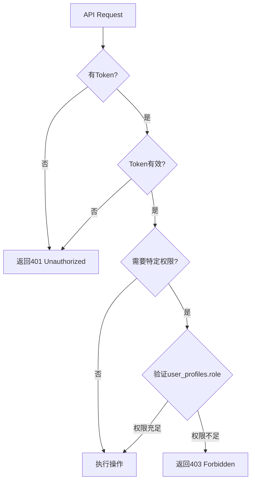

# Forum API 完整文档（第1部分）

> 📅 最后更新：2025-11-24
> 👨‍💻 维护者：老王
> 🎯 版本：v1.0.0
> 📦 涵盖内容：概述 + Categories API + Threads API

---

## 目录

- [API概述](#api概述)
- [认证与权限](#认证与权限)
- [通用响应格式](#通用响应格式)
- [分页规范](#分页规范)
- [Categories API](#categories-api)
- [Threads API](#threads-api)

---

## API概述

### 基础信息

- **Base URL（开发环境）：** `http://localhost:3000/api/forum`
- **Base URL（生产环境）：** `https://yourdomain.com/api/forum`
- **协议：** HTTPS（生产环境）/ HTTP（开发环境）
- **数据格式：** JSON
- **字符编码：** UTF-8

### API端点总览

| 资源 | 端点数 | 说明 |
|-----|--------|------|
| **Categories（分类）** | 5 | 论坛分类管理 |
| **Threads（帖子）** | 5 | 帖子CRUD + 复杂查询 |
| **Replies（回复）** | 4 | 回复CRUD + 嵌套回复 |
| **Votes（投票）** | 1 | 投票/取消/切换 |
| **总计** | 15 | |

---

## 认证与权限

### 认证方式

使用 **Bearer Token** 认证（基于Supabase Auth）：

```http
Authorization: Bearer YOUR_ACCESS_TOKEN
```

**获取Token：**
```typescript
// 前端登录后获取token
const { data: { session } } = await supabase.auth.signInWithPassword({
  email: 'user@example.com',
  password: 'password'
})

const accessToken = session?.access_token
```

### 权限级别

| 角色 | 权限说明 |
|-----|---------|
| **未登录用户** | 只读权限（GET分类/帖子/回复） |
| **普通用户（user）** | + 创建帖子/回复，编辑/删除自己的内容 |
| **审核员（moderator）** | + 编辑/删除所有帖子和回复 |
| **管理员（admin）** | + 管理分类（CRUD） |

### 权限验证流程



---

## 通用响应格式

### 成功响应

```typescript
interface SuccessResponse<T> {
  success: true
  data: T
  message?: string  // 可选的成功消息
}
```

**示例：**
```json
{
  "success": true,
  "data": {
    "id": "uuid",
    "name": "通用讨论"
  },
  "message": "Category created successfully"
}
```

### 错误响应

```typescript
interface ErrorResponse {
  success: false
  error: string  // 错误信息
}
```

**示例：**
```json
{
  "success": false,
  "error": "Authentication required"
}
```

### HTTP状态码

| 状态码 | 说明 | 使用场景 |
|--------|------|---------|
| **200** | OK | GET/PUT/DELETE成功 |
| **201** | Created | POST创建成功 |
| **400** | Bad Request | 请求参数错误 |
| **401** | Unauthorized | 未登录 |
| **403** | Forbidden | 无权限 |
| **404** | Not Found | 资源不存在 |
| **500** | Internal Server Error | 服务器错误 |

---

## 分页规范

### 分页参数

所有支持分页的API遵循统一规范：

| 参数 | 类型 | 默认值 | 最大值 | 说明 |
|-----|------|--------|--------|------|
| `page` | number | 1 | - | 页码（从1开始） |
| `limit` | number | 20 | 100 | 每页数量 |

### 分页响应格式

```typescript
interface PaginatedResponse<T> {
  data: T[]
  pagination: {
    page: number          // 当前页码
    limit: number         // 每页数量
    total: number         // 总记录数
    total_pages: number   // 总页数
    has_next: boolean     // 是否有下一页
    has_prev: boolean     // 是否有上一页
  }
}
```

**示例：**
```json
{
  "success": true,
  "data": {
    "data": [ /* 数据数组 */ ],
    "pagination": {
      "page": 2,
      "limit": 20,
      "total": 42,
      "total_pages": 3,
      "has_next": true,
      "has_prev": true
    }
  }
}
```

---

## Categories API

### 数据模型

```typescript
interface ForumCategory {
  id: string                  // UUID
  name: string                // 中文名称
  name_en?: string            // 英文名称（可选）
  slug: string                // URL友好标识符（唯一）
  description?: string        // 中文描述
  description_en?: string     // 英文描述
  icon?: string               // 图标（如"💬"）
  color?: string              // 颜色（如"#3B82F6"）
  sort_order: number          // 排序权重
  thread_count: number        // 帖子数（自动维护）
  reply_count: number         // 回复数（自动维护）
  is_visible: boolean         // 是否可见
  created_at: string          // 创建时间（ISO 8601）
  updated_at: string          // 更新时间（ISO 8601）
}
```

### 1. GET /api/forum/categories

获取论坛分类列表。

**请求：**
```http
GET /api/forum/categories?include_hidden=false
```

**Query参数：**

| 参数 | 类型 | 必填 | 默认值 | 说明 |
|-----|------|------|--------|------|
| `include_hidden` | boolean | 否 | false | 是否包含隐藏分类（仅管理员） |

**响应示例：**
```json
{
  "success": true,
  "data": [
    {
      "id": "uuid",
      "name": "通用讨论",
      "name_en": "General",
      "slug": "general",
      "description": "讨论各种话题",
      "icon": "💬",
      "color": "#3B82F6",
      "sort_order": 0,
      "thread_count": 42,
      "reply_count": 158,
      "is_visible": true,
      "created_at": "2025-11-24T12:00:00Z",
      "updated_at": "2025-11-24T12:00:00Z"
    }
  ]
}
```

**权限要求：**
- 未登录用户：可以获取可见分类
- 普通用户：可以获取可见分类
- 管理员：可以获取所有分类（包括隐藏）

### 2. POST /api/forum/categories

创建新分类（仅管理员）。

**请求：**
```http
POST /api/forum/categories
Authorization: Bearer YOUR_ACCESS_TOKEN
Content-Type: application/json

{
  "name": "新分类",
  "name_en": "New Category",
  "slug": "new-category",
  "description": "这是一个新分类",
  "icon": "🆕",
  "color": "#FF5733",
  "sort_order": 10
}
```

**Body参数：**

| 参数 | 类型 | 必填 | 说明 |
|-----|------|------|------|
| `name` | string | ✅ | 中文名称 |
| `slug` | string | ✅ | URL标识符（只能包含小写字母/数字/连字符） |
| `name_en` | string | ❌ | 英文名称 |
| `description` | string | ❌ | 中文描述 |
| `description_en` | string | ❌ | 英文描述 |
| `icon` | string | ❌ | 图标 |
| `color` | string | ❌ | 颜色（默认#3B82F6） |
| `sort_order` | number | ❌ | 排序权重（默认0） |
| `is_visible` | boolean | ❌ | 是否可见（默认true） |

**响应示例：**
```json
{
  "success": true,
  "data": { /* ForumCategory对象 */ },
  "message": "Category created successfully"
}
```

**权限要求：** 管理员

**错误响应：**
```json
// 权限不足
{
  "success": false,
  "error": "Admin permission required"
}

// Slug格式错误
{
  "success": false,
  "error": "Slug must contain only lowercase letters, numbers, and hyphens"
}

// Slug已存在
{
  "success": false,
  "error": "Category with this slug already exists"
}
```

### 3. GET /api/forum/categories/[id]

获取单个分类详情。

**请求：**
```http
GET /api/forum/categories/{category_id}
```

**响应示例：**
```json
{
  "success": true,
  "data": { /* ForumCategory对象 */ }
}
```

**错误响应：**
```json
{
  "success": false,
  "error": "Category not found"
}
```

### 4. PUT /api/forum/categories/[id]

更新分类（仅管理员）。

**请求：**
```http
PUT /api/forum/categories/{category_id}
Authorization: Bearer YOUR_ACCESS_TOKEN
Content-Type: application/json

{
  "name": "更新后的名称",
  "description": "更新后的描述"
}
```

**Body参数：** 所有字段可选（只更新提供的字段）

**响应示例：**
```json
{
  "success": true,
  "data": { /* 更新后的ForumCategory对象 */ },
  "message": "Category updated successfully"
}
```

**权限要求：** 管理员

### 5. DELETE /api/forum/categories/[id]

删除分类（仅管理员）。

**请求：**
```http
DELETE /api/forum/categories/{category_id}
Authorization: Bearer YOUR_ACCESS_TOKEN
```

**响应示例：**
```json
{
  "success": true,
  "data": null,
  "message": "Category deleted successfully"
}
```

**权限要求：** 管理员

**安全限制：**
- 不能删除包含帖子的分类（`thread_count > 0`）

**错误响应：**
```json
{
  "success": false,
  "error": "Cannot delete category with 42 threads. Please move or delete threads first."
}
```

---

## Threads API

### 数据模型

```typescript
interface ForumThread {
  id: string                  // UUID
  category_id: string         // 分类ID
  user_id: string             // 作者ID
  title: string               // 标题（3-200字符）
  slug: string                // URL友好标识符（自动生成，唯一）
  content: string             // 内容（≥10字符）
  status: 'open' | 'closed' | 'archived'  // 状态
  is_locked: boolean          // 是否锁定（锁定后不能回复）
  is_pinned: boolean          // 是否置顶
  upvote_count: number        // 点赞数（自动维护）
  downvote_count: number      // 踩数（自动维护）
  reply_count: number         // 回复数（自动维护）
  view_count: number          // 浏览数（自动增加）
  best_answer_reply_id?: string  // 最佳答案回复ID
  last_reply_at?: string      // 最后回复时间
  last_reply_user_id?: string // 最后回复用户ID
  created_at: string          // 创建时间
  updated_at: string          // 更新时间
  deleted_at?: string         // 删除时间（软删除）

  // JOIN查询字段
  category?: ForumCategory    // 分类对象
  author?: {                  // 作者信息
    user_id: string
    display_name?: string
    avatar_url?: string
  }
  last_reply_user?: {         // 最后回复用户信息
    user_id: string
    display_name?: string
    avatar_url?: string
  }
  tags?: ForumTag[]           // 标签数组
}
```

### 1. GET /api/forum/threads

获取帖子列表（支持复杂查询）。

**请求：**
```http
GET /api/forum/threads?page=1&limit=20&category_id=uuid&sort=latest
```

**Query参数：**

| 参数 | 类型 | 必填 | 默认值 | 说明 |
|-----|------|------|--------|------|
| `page` | number | ❌ | 1 | 页码 |
| `limit` | number | ❌ | 20 | 每页数量（最大100） |
| `category_id` | string | ❌ | - | 按分类筛选 |
| `tag_slug` | string | ❌ | - | 按标签筛选 |
| `search` | string | ❌ | - | 全文搜索 |
| `sort` | string | ❌ | latest | 排序方式（见下表） |
| `status` | string | ❌ | - | 按状态筛选（open/closed/archived） |
| `is_pinned` | boolean | ❌ | - | 是否只显示置顶 |

**排序方式（sort）：**

| 值 | 说明 | 排序规则 |
|----|------|---------|
| `latest` | 最新（默认） | 置顶优先 → 创建时间倒序 |
| `hot` | 热门 | 置顶优先 → 最新回复时间倒序 |
| `top` | 最佳 | 置顶优先 → 点赞数倒序 |
| `unanswered` | 未回复 | reply_count=0 → 创建时间倒序 |

**响应示例：**
```json
{
  "success": true,
  "data": {
    "data": [
      {
        "id": "uuid",
        "category_id": "uuid",
        "user_id": "uuid",
        "title": "如何使用AI图像编辑",
        "slug": "ru-he-shi-yong-ai-tu-xiang-bian-ji",
        "content": "我想了解...",
        "status": "open",
        "is_locked": false,
        "is_pinned": false,
        "upvote_count": 12,
        "downvote_count": 2,
        "reply_count": 5,
        "view_count": 108,
        "created_at": "2025-11-24T12:00:00Z",
        "category": { /* 分类对象 */ },
        "author": {
          "user_id": "uuid",
          "display_name": "张三",
          "avatar_url": "https://..."
        },
        "tags": [ /* 标签数组 */ ]
      }
    ],
    "pagination": {
      "page": 1,
      "limit": 20,
      "total": 42,
      "total_pages": 3,
      "has_next": true,
      "has_prev": false
    }
  }
}
```

**全文搜索示例：**
```http
GET /api/forum/threads?search=AI图像编辑
```

**多条件组合示例：**
```http
GET /api/forum/threads?category_id=uuid&tag_slug=tutorial&sort=hot&status=open&page=2&limit=10
```

### 2. POST /api/forum/threads

创建新帖子。

**请求：**
```http
POST /api/forum/threads
Authorization: Bearer YOUR_ACCESS_TOKEN
Content-Type: application/json

{
  "category_id": "uuid",
  "title": "如何使用AI图像编辑",
  "content": "我想了解如何使用Nano Banana的AI图像编辑功能...",
  "tag_ids": ["uuid1", "uuid2"]
}
```

**Body参数：**

| 参数 | 类型 | 必填 | 说明 |
|-----|------|------|------|
| `category_id` | string | ✅ | 分类ID |
| `title` | string | ✅ | 标题（3-200字符） |
| `content` | string | ✅ | 内容（≥10字符） |
| `tag_ids` | string[] | ❌ | 标签ID数组 |

**响应示例：**
```json
{
  "success": true,
  "data": {
    "id": "uuid",
    "slug": "ru-he-shi-yong-ai-tu-xiang-bian-ji",
    /* 其他ForumThread字段 */
  },
  "message": "Thread created successfully"
}
```

**Slug自动生成规则：**
1. 从标题生成基础slug（小写、连字符分隔）
2. 如果slug已存在，自动添加数字后缀
   - "如何使用AI" → "ru-he-shi-yong-ai"
   - 如果已存在 → "ru-he-shi-yong-ai-1"
   - 如果还存在 → "ru-he-shi-yong-ai-2"

**权限要求：** 登录用户

**错误响应：**
```json
// 未登录
{
  "success": false,
  "error": "Authentication required"
}

// 标题过短
{
  "success": false,
  "error": "Title must be between 3 and 200 characters"
}

// 内容过短
{
  "success": false,
  "error": "Content must be at least 10 characters"
}

// 分类不存在
{
  "success": false,
  "error": "Category not found or not visible"
}
```

### 3. GET /api/forum/threads/[id]

获取单个帖子详情。

**请求：**
```http
GET /api/forum/threads/{thread_id}?include_user_vote=true&include_subscription=true
```

**Query参数：**

| 参数 | 类型 | 必填 | 说明 |
|-----|------|------|------|
| `include_user_vote` | boolean | ❌ | 包含当前用户的投票状态 |
| `include_subscription` | boolean | ❌ | 包含当前用户的订阅状态 |

**响应示例：**
```json
{
  "success": true,
  "data": {
    /* ForumThread完整对象 */
    "user_vote": "upvote",      // 如果include_user_vote=true
    "is_subscribed": true       // 如果include_subscription=true
  }
}
```

**自动处理：**
- ✅ 自动增加浏览量（`view_count + 1`）

### 4. PUT /api/forum/threads/[id]

更新帖子（作者或管理员/审核员）。

**请求：**
```http
PUT /api/forum/threads/{thread_id}
Authorization: Bearer YOUR_ACCESS_TOKEN
Content-Type: application/json

{
  "title": "更新后的标题",
  "content": "更新后的内容",
  "status": "closed",
  "tag_ids": ["uuid3", "uuid4"]
}
```

**Body参数：** 所有字段可选

**响应示例：**
```json
{
  "success": true,
  "data": { /* 更新后的ForumThread对象 */ },
  "message": "Thread updated successfully"
}
```

**Slug更新机制：**
- 如果标题变化 → 重新生成slug（确保唯一性）

**权限要求：** 作者或管理员/审核员

### 5. DELETE /api/forum/threads/[id]

删除帖子（软删除）。

**请求：**
```http
DELETE /api/forum/threads/{thread_id}
Authorization: Bearer YOUR_ACCESS_TOKEN
```

**响应示例：**
```json
{
  "success": true,
  "data": null,
  "message": "Thread deleted successfully"
}
```

**软删除机制：**
- 设置 `deleted_at` 时间戳（不物理删除）
- 触发器自动减少分类的 `thread_count`
- 删除后的帖子不会出现在列表中

**权限要求：** 作者或管理员/审核员

---

**📌 接下文档：[FORUM_API_PART2.md](FORUM_API_PART2.md)**
- Replies API
- Votes API
- 错误码汇总
- 最佳实践
- 性能优化建议
