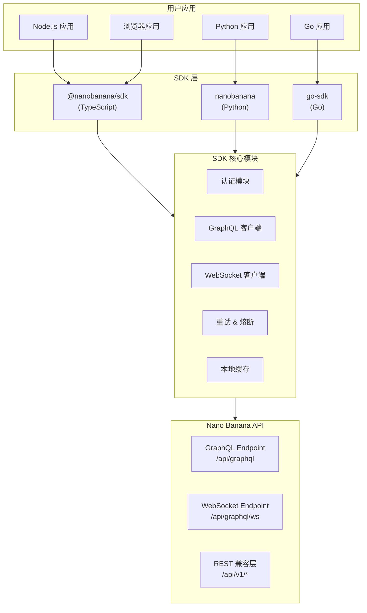
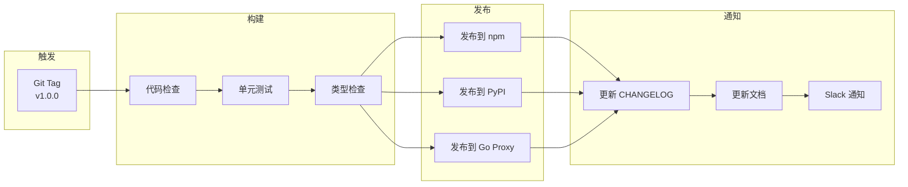

# Nano Banana SDK 架构设计文档

> **版本**: 1.0.0
> **最后更新**: 2025-11-24
> **作者**: 老王技术团队
> **状态**: 设计阶段

---

## 1. 概述

### 1.1 SDK 定位

Nano Banana SDK 是一套多语言客户端库，为开发者提供简洁、类型安全的 API 接口，用于访问 Nano Banana AI 视频生成平台的所有功能。

### 1.2 支持语言

| 语言 | 包名 | 运行时要求 | 优先级 |
|------|------|-----------|--------|
| **JavaScript/TypeScript** | `@nanobanana/sdk` | Node.js 18+ / Browser | P0 (首发) |
| **Python** | `nanobanana` | Python 3.9+ | P0 (首发) |
| **Go** | `github.com/nanobanana/go-sdk` | Go 1.21+ | P1 (二期) |

### 1.3 核心设计原则

```
┌─────────────────────────────────────────────────────────────────┐
│                      SDK 设计原则                                │
├─────────────────────────────────────────────────────────────────┤
│  1. 类型安全优先 - 完整的类型定义和编译时检查                      │
│  2. 统一 API 体验 - 跨语言保持一致的方法签名和行为                 │
│  3. 零配置即可用 - 合理的默认值，开箱即用                          │
│  4. 渐进式复杂度 - 简单任务简单做，复杂任务有支持                   │
│  5. 可观测性内置 - 日志、指标、追踪开箱支持                        │
└─────────────────────────────────────────────────────────────────┘
```

---

## 2. 架构设计

### 2.1 整体架构



### 2.2 模块分层

```
┌──────────────────────────────────────────────────────────────┐
│                    用户 API 层 (Public API)                   │
│  - 简洁的方法签名                                              │
│  - 类型安全的参数和返回值                                       │
│  - 链式调用支持                                                │
├──────────────────────────────────────────────────────────────┤
│                    服务层 (Service Layer)                     │
│  - VideoService: 视频生成、延长、查询                           │
│  - UserService: 用户管理、认证                                  │
│  - CreditService: 积分查询、购买                               │
│  - CommentService: 评论管理                                    │
│  - SubscriptionService: 订阅管理                               │
├──────────────────────────────────────────────────────────────┤
│                    传输层 (Transport Layer)                   │
│  - GraphQL 客户端 (graphql-request / gql / graphql-go)        │
│  - WebSocket 客户端 (实时订阅)                                  │
│  - HTTP 客户端 (文件上传)                                       │
├──────────────────────────────────────────────────────────────┤
│                    基础设施层 (Infrastructure)                 │
│  - 认证管理 (API Key / OAuth Token)                           │
│  - 重试策略 (指数退避)                                         │
│  - 错误处理 (类型化错误)                                        │
│  - 日志 & 追踪                                                 │
│  - 配置管理                                                    │
└──────────────────────────────────────────────────────────────┘
```

---

## 3. JavaScript/TypeScript SDK

### 3.1 安装

```bash
# npm
npm install @nanobanana/sdk

# pnpm
pnpm add @nanobanana/sdk

# yarn
yarn add @nanobanana/sdk
```

### 3.2 快速开始

```typescript
import { NanoBanana } from '@nanobanana/sdk';

// 初始化客户端
const client = new NanoBanana({
  apiKey: 'your-api-key',
  // 可选配置
  baseUrl: 'https://api.nanobanana.ai',
  timeout: 30000,
  retries: 3,
});

// 生成视频
const video = await client.videos.generate({
  prompt: 'A cat playing piano in a jazz bar',
  resolution: '1080p',
  duration: 8,
  aspectRatio: '16:9',
});

console.log(video.id, video.status);
```

### 3.3 类型定义

```typescript
// types/index.ts

/**
 * SDK 配置选项
 */
export interface NanoBananaConfig {
  /** API 密钥 */
  apiKey: string;
  /** 基础 URL (默认: https://api.nanobanana.ai) */
  baseUrl?: string;
  /** 请求超时 (毫秒, 默认: 30000) */
  timeout?: number;
  /** 重试次数 (默认: 3) */
  retries?: number;
  /** 调试模式 */
  debug?: boolean;
  /** 自定义 fetch 实现 */
  fetch?: typeof fetch;
}

/**
 * 视频分辨率
 */
export type VideoResolution = '720p' | '1080p' | '4k';

/**
 * 视频时长 (秒)
 */
export type VideoDuration = 5 | 6 | 7 | 8;

/**
 * 视频状态
 */
export type VideoStatus =
  | 'PENDING'
  | 'PROCESSING'
  | 'COMPLETED'
  | 'FAILED'
  | 'CANCELLED';

/**
 * 视频生成请求
 */
export interface GenerateVideoInput {
  prompt: string;
  resolution?: VideoResolution;
  duration?: VideoDuration;
  aspectRatio?: string;
  referenceImageUrl?: string;
  negativePrompt?: string;
  seed?: number;
}

/**
 * 视频对象
 */
export interface Video {
  id: string;
  prompt: string;
  resolution: VideoResolution;
  duration: number;
  aspectRatio: string;
  status: VideoStatus;
  progress: number;
  videoUrl?: string;
  thumbnailUrl?: string;
  createdAt: Date;
  completedAt?: Date;
  author: User;
  creditCost: number;
  likeCount: number;
  commentCount: number;
  isLikedByMe: boolean;
}

/**
 * 用户对象
 */
export interface User {
  id: string;
  username: string;
  email?: string;
  avatar?: string;
  bio?: string;
  followerCount: number;
  followingCount: number;
  videoCount: number;
  isFollowedByMe: boolean;
}

/**
 * 积分信息
 */
export interface CreditBalance {
  available: number;
  pending: number;
  total: number;
  monthlyAllowance: number;
  usedThisMonth: number;
}

/**
 * 分页参数
 */
export interface PaginationInput {
  first?: number;
  after?: string;
  last?: number;
  before?: string;
}

/**
 * 分页连接 (Relay 规范)
 */
export interface Connection<T> {
  edges: Array<{
    node: T;
    cursor: string;
  }>;
  pageInfo: {
    hasNextPage: boolean;
    hasPreviousPage: boolean;
    startCursor?: string;
    endCursor?: string;
  };
  totalCount: number;
}
```

### 3.4 客户端实现

```typescript
// client.ts
import { GraphQLClient } from 'graphql-request';
import { createClient as createWSClient } from 'graphql-ws';
import type { NanoBananaConfig, Video, User, CreditBalance, Connection } from './types';

export class NanoBanana {
  private config: Required<NanoBananaConfig>;
  private graphql: GraphQLClient;
  private wsClient?: ReturnType<typeof createWSClient>;

  // 服务模块
  public readonly videos: VideoService;
  public readonly users: UserService;
  public readonly credits: CreditService;
  public readonly comments: CommentService;
  public readonly subscriptions: SubscriptionService;

  constructor(config: NanoBananaConfig) {
    this.config = {
      baseUrl: 'https://api.nanobanana.ai',
      timeout: 30000,
      retries: 3,
      debug: false,
      fetch: globalThis.fetch,
      ...config,
    };

    // 初始化 GraphQL 客户端
    this.graphql = new GraphQLClient(`${this.config.baseUrl}/api/graphql`, {
      headers: {
        'Authorization': `Bearer ${this.config.apiKey}`,
        'X-SDK-Version': '1.0.0',
        'X-SDK-Language': 'javascript',
      },
      fetch: this.config.fetch,
      timeout: this.config.timeout,
    });

    // 初始化服务模块
    this.videos = new VideoService(this.graphql, this.config);
    this.users = new UserService(this.graphql, this.config);
    this.credits = new CreditService(this.graphql, this.config);
    this.comments = new CommentService(this.graphql, this.config);
    this.subscriptions = new SubscriptionService(this);
  }

  /**
   * 获取 WebSocket 客户端 (懒加载)
   */
  getWSClient() {
    if (!this.wsClient) {
      this.wsClient = createWSClient({
        url: `${this.config.baseUrl.replace('http', 'ws')}/api/graphql/ws`,
        connectionParams: {
          authorization: `Bearer ${this.config.apiKey}`,
        },
      });
    }
    return this.wsClient;
  }

  /**
   * 关闭所有连接
   */
  async close() {
    if (this.wsClient) {
      await this.wsClient.dispose();
    }
  }
}
```

### 3.5 视频服务

```typescript
// services/video.ts
import { gql } from 'graphql-request';
import type { GraphQLClient } from 'graphql-request';
import type { Video, GenerateVideoInput, Connection, PaginationInput } from '../types';

export class VideoService {
  constructor(
    private client: GraphQLClient,
    private config: NanoBananaConfig
  ) {}

  /**
   * 生成视频
   */
  async generate(input: GenerateVideoInput): Promise<Video> {
    const mutation = gql`
      mutation GenerateVideo($input: GenerateVideoInput!) {
        generateVideo(input: $input) {
          id
          prompt
          resolution
          duration
          aspectRatio
          status
          progress
          videoUrl
          thumbnailUrl
          createdAt
          creditCost
        }
      }
    `;

    const data = await this.client.request(mutation, { input });
    return this.transformVideo(data.generateVideo);
  }

  /**
   * 延长视频
   */
  async extend(videoId: string, additionalSeconds: number): Promise<Video> {
    const mutation = gql`
      mutation ExtendVideo($videoId: ID!, $additionalSeconds: Int!) {
        extendVideo(videoId: $videoId, additionalSeconds: $additionalSeconds) {
          id
          status
          duration
          videoUrl
        }
      }
    `;

    const data = await this.client.request(mutation, { videoId, additionalSeconds });
    return this.transformVideo(data.extendVideo);
  }

  /**
   * 获取视频详情
   */
  async get(id: string): Promise<Video> {
    const query = gql`
      query GetVideo($id: ID!) {
        video(id: $id) {
          id
          prompt
          resolution
          duration
          aspectRatio
          status
          progress
          videoUrl
          thumbnailUrl
          createdAt
          completedAt
          author {
            id
            username
            avatar
          }
          creditCost
          likeCount
          commentCount
          isLikedByMe
        }
      }
    `;

    const data = await this.client.request(query, { id });
    return this.transformVideo(data.video);
  }

  /**
   * 获取我的视频列表
   */
  async mine(pagination?: PaginationInput): Promise<Connection<Video>> {
    const query = gql`
      query MyVideos($first: Int, $after: String) {
        myVideos(first: $first, after: $after) {
          edges {
            node {
              id
              prompt
              status
              videoUrl
              thumbnailUrl
              createdAt
            }
            cursor
          }
          pageInfo {
            hasNextPage
            endCursor
          }
          totalCount
        }
      }
    `;

    const data = await this.client.request(query, pagination || { first: 20 });
    return this.transformConnection(data.myVideos);
  }

  /**
   * 点赞视频
   */
  async like(videoId: string): Promise<boolean> {
    const mutation = gql`
      mutation LikeVideo($videoId: ID!) {
        likeVideo(videoId: $videoId)
      }
    `;

    const data = await this.client.request(mutation, { videoId });
    return data.likeVideo;
  }

  /**
   * 取消点赞
   */
  async unlike(videoId: string): Promise<boolean> {
    const mutation = gql`
      mutation UnlikeVideo($videoId: ID!) {
        unlikeVideo(videoId: $videoId)
      }
    `;

    const data = await this.client.request(mutation, { videoId });
    return data.unlikeVideo;
  }

  /**
   * 订阅视频生成进度
   */
  subscribe(
    videoId: string,
    callbacks: {
      onProgress?: (progress: number, status: string) => void;
      onComplete?: (video: Video) => void;
      onError?: (error: Error) => void;
    }
  ): () => void {
    // 通过 SubscriptionService 实现
    // 返回取消订阅函数
  }

  private transformVideo(raw: any): Video {
    return {
      ...raw,
      createdAt: new Date(raw.createdAt),
      completedAt: raw.completedAt ? new Date(raw.completedAt) : undefined,
    };
  }

  private transformConnection(raw: any): Connection<Video> {
    return {
      ...raw,
      edges: raw.edges.map((edge: any) => ({
        ...edge,
        node: this.transformVideo(edge.node),
      })),
    };
  }
}
```

### 3.6 实时订阅服务

```typescript
// services/subscription.ts
import type { NanoBanana } from '../client';
import type { Video } from '../types';

export class SubscriptionService {
  constructor(private client: NanoBanana) {}

  /**
   * 订阅视频生成进度
   */
  videoProgress(
    videoId: string,
    onProgress: (data: { progress: number; status: string }) => void
  ): () => void {
    const wsClient = this.client.getWSClient();

    const subscription = wsClient.subscribe(
      {
        query: `
          subscription VideoProgress($videoId: ID!) {
            videoProgress(videoId: $videoId) {
              videoId
              status
              progress
              videoUrl
              error
            }
          }
        `,
        variables: { videoId },
      },
      {
        next: (result) => {
          if (result.data?.videoProgress) {
            onProgress(result.data.videoProgress);
          }
        },
        error: (err) => console.error('Subscription error:', err),
        complete: () => console.log('Subscription complete'),
      }
    );

    // 返回取消订阅函数
    return () => subscription.unsubscribe();
  }

  /**
   * 订阅通知
   */
  notifications(
    onNotification: (notification: any) => void
  ): () => void {
    const wsClient = this.client.getWSClient();

    const subscription = wsClient.subscribe(
      {
        query: `
          subscription Notifications {
            notifications {
              id
              type
              title
              message
              data
              createdAt
            }
          }
        `,
      },
      {
        next: (result) => {
          if (result.data?.notifications) {
            onNotification(result.data.notifications);
          }
        },
        error: (err) => console.error('Subscription error:', err),
        complete: () => console.log('Subscription complete'),
      }
    );

    return () => subscription.unsubscribe();
  }
}
```

### 3.7 错误处理

```typescript
// errors.ts

/**
 * SDK 基础错误
 */
export class NanoBananaError extends Error {
  constructor(
    message: string,
    public code: string,
    public statusCode?: number,
    public details?: Record<string, unknown>
  ) {
    super(message);
    this.name = 'NanoBananaError';
  }
}

/**
 * 认证错误
 */
export class AuthenticationError extends NanoBananaError {
  constructor(message = 'Authentication failed') {
    super(message, 'UNAUTHENTICATED', 401);
    this.name = 'AuthenticationError';
  }
}

/**
 * 权限错误
 */
export class ForbiddenError extends NanoBananaError {
  constructor(message = 'Access denied') {
    super(message, 'FORBIDDEN', 403);
    this.name = 'ForbiddenError';
  }
}

/**
 * 资源未找到
 */
export class NotFoundError extends NanoBananaError {
  constructor(resource: string, id: string) {
    super(`${resource} with id '${id}' not found`, 'NOT_FOUND', 404);
    this.name = 'NotFoundError';
  }
}

/**
 * 积分不足
 */
export class InsufficientCreditsError extends NanoBananaError {
  constructor(required: number, available: number) {
    super(
      `Insufficient credits: required ${required}, available ${available}`,
      'INSUFFICIENT_CREDITS',
      402,
      { required, available }
    );
    this.name = 'InsufficientCreditsError';
  }
}

/**
 * 速率限制
 */
export class RateLimitError extends NanoBananaError {
  constructor(retryAfter: number) {
    super(
      `Rate limit exceeded. Retry after ${retryAfter} seconds`,
      'RATE_LIMITED',
      429,
      { retryAfter }
    );
    this.name = 'RateLimitError';
  }
}

/**
 * 验证错误
 */
export class ValidationError extends NanoBananaError {
  constructor(message: string, fields?: Record<string, string[]>) {
    super(message, 'VALIDATION_ERROR', 400, { fields });
    this.name = 'ValidationError';
  }
}
```

### 3.8 重试策略

```typescript
// utils/retry.ts

export interface RetryConfig {
  maxRetries: number;
  baseDelay: number;
  maxDelay: number;
  retryableErrors: string[];
}

const DEFAULT_RETRY_CONFIG: RetryConfig = {
  maxRetries: 3,
  baseDelay: 1000,
  maxDelay: 30000,
  retryableErrors: ['RATE_LIMITED', 'SERVICE_UNAVAILABLE', 'TIMEOUT'],
};

export async function withRetry<T>(
  fn: () => Promise<T>,
  config: Partial<RetryConfig> = {}
): Promise<T> {
  const { maxRetries, baseDelay, maxDelay, retryableErrors } = {
    ...DEFAULT_RETRY_CONFIG,
    ...config,
  };

  let lastError: Error;

  for (let attempt = 0; attempt <= maxRetries; attempt++) {
    try {
      return await fn();
    } catch (error) {
      lastError = error as Error;

      // 检查是否可重试
      const isRetryable =
        error instanceof NanoBananaError &&
        retryableErrors.includes(error.code);

      if (!isRetryable || attempt === maxRetries) {
        throw error;
      }

      // 计算延迟 (指数退避 + 抖动)
      const delay = Math.min(
        baseDelay * Math.pow(2, attempt) + Math.random() * 1000,
        maxDelay
      );

      await sleep(delay);
    }
  }

  throw lastError!;
}

function sleep(ms: number): Promise<void> {
  return new Promise((resolve) => setTimeout(resolve, ms));
}
```

---

## 4. Python SDK

### 4.1 安装

```bash
# pip
pip install nanobanana

# poetry
poetry add nanobanana

# pipenv
pipenv install nanobanana
```

### 4.2 快速开始

```python
from nanobanana import NanoBanana

# 初始化客户端
client = NanoBanana(api_key="your-api-key")

# 生成视频
video = client.videos.generate(
    prompt="A cat playing piano in a jazz bar",
    resolution="1080p",
    duration=8,
    aspect_ratio="16:9",
)

print(f"Video ID: {video.id}, Status: {video.status}")

# 异步支持
import asyncio
from nanobanana import AsyncNanoBanana

async def main():
    async with AsyncNanoBanana(api_key="your-api-key") as client:
        video = await client.videos.generate(prompt="A cat playing piano")
        print(video.id)

asyncio.run(main())
```

### 4.3 类型定义

```python
# nanobanana/types.py
from dataclasses import dataclass
from datetime import datetime
from enum import Enum
from typing import Optional, List, Generic, TypeVar

class VideoResolution(str, Enum):
    HD_720P = "720p"
    FHD_1080P = "1080p"
    UHD_4K = "4k"

class VideoStatus(str, Enum):
    PENDING = "PENDING"
    PROCESSING = "PROCESSING"
    COMPLETED = "COMPLETED"
    FAILED = "FAILED"
    CANCELLED = "CANCELLED"

@dataclass
class User:
    id: str
    username: str
    email: Optional[str] = None
    avatar: Optional[str] = None
    bio: Optional[str] = None
    follower_count: int = 0
    following_count: int = 0
    video_count: int = 0
    is_followed_by_me: bool = False

@dataclass
class Video:
    id: str
    prompt: str
    resolution: VideoResolution
    duration: int
    aspect_ratio: str
    status: VideoStatus
    progress: int = 0
    video_url: Optional[str] = None
    thumbnail_url: Optional[str] = None
    created_at: Optional[datetime] = None
    completed_at: Optional[datetime] = None
    author: Optional[User] = None
    credit_cost: int = 0
    like_count: int = 0
    comment_count: int = 0
    is_liked_by_me: bool = False

@dataclass
class CreditBalance:
    available: int
    pending: int
    total: int
    monthly_allowance: int
    used_this_month: int

@dataclass
class GenerateVideoInput:
    prompt: str
    resolution: VideoResolution = VideoResolution.FHD_1080P
    duration: int = 5
    aspect_ratio: str = "16:9"
    reference_image_url: Optional[str] = None
    negative_prompt: Optional[str] = None
    seed: Optional[int] = None

T = TypeVar('T')

@dataclass
class Edge(Generic[T]):
    node: T
    cursor: str

@dataclass
class PageInfo:
    has_next_page: bool
    has_previous_page: bool
    start_cursor: Optional[str] = None
    end_cursor: Optional[str] = None

@dataclass
class Connection(Generic[T]):
    edges: List[Edge[T]]
    page_info: PageInfo
    total_count: int
```

### 4.4 客户端实现

```python
# nanobanana/client.py
from typing import Optional
import httpx
from gql import Client, gql
from gql.transport.httpx import HTTPXAsyncTransport, HTTPXTransport

from .types import *
from .services import VideoService, UserService, CreditService, CommentService
from .exceptions import NanoBananaError

class NanoBanana:
    """
    Nano Banana SDK 同步客户端
    """

    def __init__(
        self,
        api_key: str,
        base_url: str = "https://api.nanobanana.ai",
        timeout: float = 30.0,
        retries: int = 3,
    ):
        self.api_key = api_key
        self.base_url = base_url
        self.timeout = timeout
        self.retries = retries

        # 初始化 GraphQL 客户端
        transport = HTTPXTransport(
            url=f"{base_url}/api/graphql",
            headers={
                "Authorization": f"Bearer {api_key}",
                "X-SDK-Version": "1.0.0",
                "X-SDK-Language": "python",
            },
            timeout=timeout,
            retries=retries,
        )
        self._gql_client = Client(transport=transport, fetch_schema_from_transport=False)

        # 初始化服务
        self.videos = VideoService(self._gql_client)
        self.users = UserService(self._gql_client)
        self.credits = CreditService(self._gql_client)
        self.comments = CommentService(self._gql_client)

    def __enter__(self):
        return self

    def __exit__(self, exc_type, exc_val, exc_tb):
        self.close()

    def close(self):
        """关闭客户端连接"""
        pass


class AsyncNanoBanana:
    """
    Nano Banana SDK 异步客户端
    """

    def __init__(
        self,
        api_key: str,
        base_url: str = "https://api.nanobanana.ai",
        timeout: float = 30.0,
        retries: int = 3,
    ):
        self.api_key = api_key
        self.base_url = base_url
        self.timeout = timeout
        self.retries = retries

        # 初始化异步 GraphQL 客户端
        transport = HTTPXAsyncTransport(
            url=f"{base_url}/api/graphql",
            headers={
                "Authorization": f"Bearer {api_key}",
                "X-SDK-Version": "1.0.0",
                "X-SDK-Language": "python",
            },
            timeout=timeout,
            retries=retries,
        )
        self._gql_client = Client(transport=transport, fetch_schema_from_transport=False)

        # 初始化异步服务
        self.videos = AsyncVideoService(self._gql_client)
        self.users = AsyncUserService(self._gql_client)
        self.credits = AsyncCreditService(self._gql_client)
        self.comments = AsyncCommentService(self._gql_client)

    async def __aenter__(self):
        return self

    async def __aexit__(self, exc_type, exc_val, exc_tb):
        await self.close()

    async def close(self):
        """关闭客户端连接"""
        pass
```

### 4.5 视频服务

```python
# nanobanana/services/video.py
from gql import gql
from typing import Optional
from ..types import Video, GenerateVideoInput, Connection, VideoStatus

GENERATE_VIDEO_MUTATION = gql("""
    mutation GenerateVideo($input: GenerateVideoInput!) {
        generateVideo(input: $input) {
            id
            prompt
            resolution
            duration
            aspectRatio
            status
            progress
            videoUrl
            thumbnailUrl
            createdAt
            creditCost
        }
    }
""")

GET_VIDEO_QUERY = gql("""
    query GetVideo($id: ID!) {
        video(id: $id) {
            id
            prompt
            resolution
            duration
            aspectRatio
            status
            progress
            videoUrl
            thumbnailUrl
            createdAt
            completedAt
            author {
                id
                username
                avatar
            }
            creditCost
            likeCount
            commentCount
            isLikedByMe
        }
    }
""")

MY_VIDEOS_QUERY = gql("""
    query MyVideos($first: Int, $after: String) {
        myVideos(first: $first, after: $after) {
            edges {
                node {
                    id
                    prompt
                    status
                    videoUrl
                    thumbnailUrl
                    createdAt
                }
                cursor
            }
            pageInfo {
                hasNextPage
                endCursor
            }
            totalCount
        }
    }
""")


class VideoService:
    """视频服务 (同步)"""

    def __init__(self, client):
        self._client = client

    def generate(
        self,
        prompt: str,
        resolution: str = "1080p",
        duration: int = 5,
        aspect_ratio: str = "16:9",
        reference_image_url: Optional[str] = None,
        negative_prompt: Optional[str] = None,
        seed: Optional[int] = None,
    ) -> Video:
        """生成视频"""
        input_data = {
            "prompt": prompt,
            "resolution": resolution,
            "duration": duration,
            "aspectRatio": aspect_ratio,
        }
        if reference_image_url:
            input_data["referenceImageUrl"] = reference_image_url
        if negative_prompt:
            input_data["negativePrompt"] = negative_prompt
        if seed is not None:
            input_data["seed"] = seed

        result = self._client.execute(
            GENERATE_VIDEO_MUTATION,
            variable_values={"input": input_data}
        )
        return self._transform_video(result["generateVideo"])

    def get(self, video_id: str) -> Video:
        """获取视频详情"""
        result = self._client.execute(
            GET_VIDEO_QUERY,
            variable_values={"id": video_id}
        )
        return self._transform_video(result["video"])

    def mine(
        self,
        first: int = 20,
        after: Optional[str] = None,
    ) -> Connection[Video]:
        """获取我的视频列表"""
        result = self._client.execute(
            MY_VIDEOS_QUERY,
            variable_values={"first": first, "after": after}
        )
        return self._transform_connection(result["myVideos"])

    def extend(self, video_id: str, additional_seconds: int) -> Video:
        """延长视频"""
        mutation = gql("""
            mutation ExtendVideo($videoId: ID!, $additionalSeconds: Int!) {
                extendVideo(videoId: $videoId, additionalSeconds: $additionalSeconds) {
                    id
                    status
                    duration
                    videoUrl
                }
            }
        """)
        result = self._client.execute(
            mutation,
            variable_values={"videoId": video_id, "additionalSeconds": additional_seconds}
        )
        return self._transform_video(result["extendVideo"])

    def like(self, video_id: str) -> bool:
        """点赞视频"""
        mutation = gql("""
            mutation LikeVideo($videoId: ID!) {
                likeVideo(videoId: $videoId)
            }
        """)
        result = self._client.execute(mutation, variable_values={"videoId": video_id})
        return result["likeVideo"]

    def unlike(self, video_id: str) -> bool:
        """取消点赞"""
        mutation = gql("""
            mutation UnlikeVideo($videoId: ID!) {
                unlikeVideo(videoId: $videoId)
            }
        """)
        result = self._client.execute(mutation, variable_values={"videoId": video_id})
        return result["unlikeVideo"]

    def _transform_video(self, data: dict) -> Video:
        """转换视频数据"""
        from datetime import datetime
        return Video(
            id=data["id"],
            prompt=data["prompt"],
            resolution=data.get("resolution", "1080p"),
            duration=data.get("duration", 5),
            aspect_ratio=data.get("aspectRatio", "16:9"),
            status=VideoStatus(data["status"]),
            progress=data.get("progress", 0),
            video_url=data.get("videoUrl"),
            thumbnail_url=data.get("thumbnailUrl"),
            created_at=datetime.fromisoformat(data["createdAt"]) if data.get("createdAt") else None,
            completed_at=datetime.fromisoformat(data["completedAt"]) if data.get("completedAt") else None,
            credit_cost=data.get("creditCost", 0),
            like_count=data.get("likeCount", 0),
            comment_count=data.get("commentCount", 0),
            is_liked_by_me=data.get("isLikedByMe", False),
        )

    def _transform_connection(self, data: dict) -> Connection[Video]:
        """转换分页连接数据"""
        from ..types import Edge, PageInfo
        return Connection(
            edges=[
                Edge(
                    node=self._transform_video(edge["node"]),
                    cursor=edge["cursor"]
                )
                for edge in data["edges"]
            ],
            page_info=PageInfo(
                has_next_page=data["pageInfo"]["hasNextPage"],
                has_previous_page=data["pageInfo"].get("hasPreviousPage", False),
                start_cursor=data["pageInfo"].get("startCursor"),
                end_cursor=data["pageInfo"].get("endCursor"),
            ),
            total_count=data.get("totalCount", 0),
        )


class AsyncVideoService(VideoService):
    """视频服务 (异步)"""

    async def generate(self, *args, **kwargs) -> Video:
        """异步生成视频"""
        # 使用 async session
        pass

    async def get(self, video_id: str) -> Video:
        """异步获取视频详情"""
        pass

    async def mine(self, first: int = 20, after: Optional[str] = None) -> Connection[Video]:
        """异步获取我的视频列表"""
        pass
```

### 4.6 异常处理

```python
# nanobanana/exceptions.py

class NanoBananaError(Exception):
    """SDK 基础错误"""

    def __init__(
        self,
        message: str,
        code: str = "UNKNOWN_ERROR",
        status_code: int = 500,
        details: dict = None,
    ):
        super().__init__(message)
        self.code = code
        self.status_code = status_code
        self.details = details or {}


class AuthenticationError(NanoBananaError):
    """认证错误"""

    def __init__(self, message: str = "Authentication failed"):
        super().__init__(message, code="UNAUTHENTICATED", status_code=401)


class ForbiddenError(NanoBananaError):
    """权限错误"""

    def __init__(self, message: str = "Access denied"):
        super().__init__(message, code="FORBIDDEN", status_code=403)


class NotFoundError(NanoBananaError):
    """资源未找到"""

    def __init__(self, resource: str, resource_id: str):
        super().__init__(
            f"{resource} with id '{resource_id}' not found",
            code="NOT_FOUND",
            status_code=404,
        )


class InsufficientCreditsError(NanoBananaError):
    """积分不足"""

    def __init__(self, required: int, available: int):
        super().__init__(
            f"Insufficient credits: required {required}, available {available}",
            code="INSUFFICIENT_CREDITS",
            status_code=402,
            details={"required": required, "available": available},
        )


class RateLimitError(NanoBananaError):
    """速率限制"""

    def __init__(self, retry_after: int):
        super().__init__(
            f"Rate limit exceeded. Retry after {retry_after} seconds",
            code="RATE_LIMITED",
            status_code=429,
            details={"retry_after": retry_after},
        )


class ValidationError(NanoBananaError):
    """验证错误"""

    def __init__(self, message: str, fields: dict = None):
        super().__init__(
            message,
            code="VALIDATION_ERROR",
            status_code=400,
            details={"fields": fields} if fields else {},
        )
```

---

## 5. Go SDK

### 5.1 安装

```bash
go get github.com/nanobanana/go-sdk
```

### 5.2 快速开始

```go
package main

import (
    "context"
    "fmt"
    "log"

    nanobanana "github.com/nanobanana/go-sdk"
)

func main() {
    // 初始化客户端
    client := nanobanana.NewClient("your-api-key")

    // 生成视频
    video, err := client.Videos.Generate(context.Background(), &nanobanana.GenerateVideoInput{
        Prompt:      "A cat playing piano in a jazz bar",
        Resolution:  nanobanana.Resolution1080p,
        Duration:    8,
        AspectRatio: "16:9",
    })
    if err != nil {
        log.Fatal(err)
    }

    fmt.Printf("Video ID: %s, Status: %s\n", video.ID, video.Status)
}
```

### 5.3 类型定义

```go
// types.go
package nanobanana

import "time"

// VideoResolution 视频分辨率
type VideoResolution string

const (
    Resolution720p  VideoResolution = "720p"
    Resolution1080p VideoResolution = "1080p"
    Resolution4K    VideoResolution = "4k"
)

// VideoStatus 视频状态
type VideoStatus string

const (
    StatusPending    VideoStatus = "PENDING"
    StatusProcessing VideoStatus = "PROCESSING"
    StatusCompleted  VideoStatus = "COMPLETED"
    StatusFailed     VideoStatus = "FAILED"
    StatusCancelled  VideoStatus = "CANCELLED"
)

// User 用户
type User struct {
    ID             string `json:"id"`
    Username       string `json:"username"`
    Email          string `json:"email,omitempty"`
    Avatar         string `json:"avatar,omitempty"`
    Bio            string `json:"bio,omitempty"`
    FollowerCount  int    `json:"followerCount"`
    FollowingCount int    `json:"followingCount"`
    VideoCount     int    `json:"videoCount"`
    IsFollowedByMe bool   `json:"isFollowedByMe"`
}

// Video 视频
type Video struct {
    ID           string          `json:"id"`
    Prompt       string          `json:"prompt"`
    Resolution   VideoResolution `json:"resolution"`
    Duration     int             `json:"duration"`
    AspectRatio  string          `json:"aspectRatio"`
    Status       VideoStatus     `json:"status"`
    Progress     int             `json:"progress"`
    VideoURL     string          `json:"videoUrl,omitempty"`
    ThumbnailURL string          `json:"thumbnailUrl,omitempty"`
    CreatedAt    time.Time       `json:"createdAt"`
    CompletedAt  *time.Time      `json:"completedAt,omitempty"`
    Author       *User           `json:"author,omitempty"`
    CreditCost   int             `json:"creditCost"`
    LikeCount    int             `json:"likeCount"`
    CommentCount int             `json:"commentCount"`
    IsLikedByMe  bool            `json:"isLikedByMe"`
}

// GenerateVideoInput 生成视频请求
type GenerateVideoInput struct {
    Prompt            string          `json:"prompt"`
    Resolution        VideoResolution `json:"resolution,omitempty"`
    Duration          int             `json:"duration,omitempty"`
    AspectRatio       string          `json:"aspectRatio,omitempty"`
    ReferenceImageURL string          `json:"referenceImageUrl,omitempty"`
    NegativePrompt    string          `json:"negativePrompt,omitempty"`
    Seed              *int            `json:"seed,omitempty"`
}

// CreditBalance 积分余额
type CreditBalance struct {
    Available        int `json:"available"`
    Pending          int `json:"pending"`
    Total            int `json:"total"`
    MonthlyAllowance int `json:"monthlyAllowance"`
    UsedThisMonth    int `json:"usedThisMonth"`
}

// PageInfo 分页信息
type PageInfo struct {
    HasNextPage     bool    `json:"hasNextPage"`
    HasPreviousPage bool    `json:"hasPreviousPage"`
    StartCursor     *string `json:"startCursor,omitempty"`
    EndCursor       *string `json:"endCursor,omitempty"`
}

// Edge 边 (Relay 规范)
type Edge[T any] struct {
    Node   T      `json:"node"`
    Cursor string `json:"cursor"`
}

// Connection 连接 (Relay 规范)
type Connection[T any] struct {
    Edges      []Edge[T] `json:"edges"`
    PageInfo   PageInfo  `json:"pageInfo"`
    TotalCount int       `json:"totalCount"`
}

// PaginationInput 分页参数
type PaginationInput struct {
    First  *int    `json:"first,omitempty"`
    After  *string `json:"after,omitempty"`
    Last   *int    `json:"last,omitempty"`
    Before *string `json:"before,omitempty"`
}
```

### 5.4 客户端实现

```go
// client.go
package nanobanana

import (
    "context"
    "net/http"
    "time"

    "github.com/Khan/genqlient/graphql"
)

// ClientOption 客户端配置选项
type ClientOption func(*Client)

// WithBaseURL 设置基础 URL
func WithBaseURL(url string) ClientOption {
    return func(c *Client) {
        c.baseURL = url
    }
}

// WithTimeout 设置超时
func WithTimeout(timeout time.Duration) ClientOption {
    return func(c *Client) {
        c.timeout = timeout
    }
}

// WithRetries 设置重试次数
func WithRetries(retries int) ClientOption {
    return func(c *Client) {
        c.retries = retries
    }
}

// WithHTTPClient 设置自定义 HTTP 客户端
func WithHTTPClient(client *http.Client) ClientOption {
    return func(c *Client) {
        c.httpClient = client
    }
}

// Client Nano Banana SDK 客户端
type Client struct {
    apiKey     string
    baseURL    string
    timeout    time.Duration
    retries    int
    httpClient *http.Client
    gqlClient  graphql.Client

    // 服务
    Videos   *VideoService
    Users    *UserService
    Credits  *CreditService
    Comments *CommentService
}

// NewClient 创建新客户端
func NewClient(apiKey string, opts ...ClientOption) *Client {
    c := &Client{
        apiKey:  apiKey,
        baseURL: "https://api.nanobanana.ai",
        timeout: 30 * time.Second,
        retries: 3,
    }

    // 应用选项
    for _, opt := range opts {
        opt(c)
    }

    // 初始化 HTTP 客户端
    if c.httpClient == nil {
        c.httpClient = &http.Client{
            Timeout: c.timeout,
            Transport: &authTransport{
                apiKey:    c.apiKey,
                transport: http.DefaultTransport,
            },
        }
    }

    // 初始化 GraphQL 客户端
    c.gqlClient = graphql.NewClient(
        c.baseURL+"/api/graphql",
        c.httpClient,
    )

    // 初始化服务
    c.Videos = &VideoService{client: c}
    c.Users = &UserService{client: c}
    c.Credits = &CreditService{client: c}
    c.Comments = &CommentService{client: c}

    return c
}

// authTransport 添加认证头的 Transport
type authTransport struct {
    apiKey    string
    transport http.RoundTripper
}

func (t *authTransport) RoundTrip(req *http.Request) (*http.Response, error) {
    req.Header.Set("Authorization", "Bearer "+t.apiKey)
    req.Header.Set("X-SDK-Version", "1.0.0")
    req.Header.Set("X-SDK-Language", "go")
    return t.transport.RoundTrip(req)
}
```

### 5.5 视频服务

```go
// services/video.go
package nanobanana

import (
    "context"
)

// VideoService 视频服务
type VideoService struct {
    client *Client
}

// Generate 生成视频
func (s *VideoService) Generate(ctx context.Context, input *GenerateVideoInput) (*Video, error) {
    // 构建 GraphQL mutation
    var resp struct {
        GenerateVideo Video `json:"generateVideo"`
    }

    err := s.client.gqlClient.MakeRequest(ctx, &graphql.Request{
        Query: `
            mutation GenerateVideo($input: GenerateVideoInput!) {
                generateVideo(input: $input) {
                    id
                    prompt
                    resolution
                    duration
                    aspectRatio
                    status
                    progress
                    videoUrl
                    thumbnailUrl
                    createdAt
                    creditCost
                }
            }
        `,
        Variables: map[string]interface{}{
            "input": input,
        },
    }, &resp)

    if err != nil {
        return nil, wrapError(err)
    }

    return &resp.GenerateVideo, nil
}

// Get 获取视频详情
func (s *VideoService) Get(ctx context.Context, id string) (*Video, error) {
    var resp struct {
        Video Video `json:"video"`
    }

    err := s.client.gqlClient.MakeRequest(ctx, &graphql.Request{
        Query: `
            query GetVideo($id: ID!) {
                video(id: $id) {
                    id
                    prompt
                    resolution
                    duration
                    aspectRatio
                    status
                    progress
                    videoUrl
                    thumbnailUrl
                    createdAt
                    completedAt
                    author {
                        id
                        username
                        avatar
                    }
                    creditCost
                    likeCount
                    commentCount
                    isLikedByMe
                }
            }
        `,
        Variables: map[string]interface{}{
            "id": id,
        },
    }, &resp)

    if err != nil {
        return nil, wrapError(err)
    }

    return &resp.Video, nil
}

// Mine 获取我的视频列表
func (s *VideoService) Mine(ctx context.Context, pagination *PaginationInput) (*Connection[Video], error) {
    var resp struct {
        MyVideos Connection[Video] `json:"myVideos"`
    }

    vars := make(map[string]interface{})
    if pagination != nil {
        if pagination.First != nil {
            vars["first"] = *pagination.First
        }
        if pagination.After != nil {
            vars["after"] = *pagination.After
        }
    } else {
        vars["first"] = 20
    }

    err := s.client.gqlClient.MakeRequest(ctx, &graphql.Request{
        Query: `
            query MyVideos($first: Int, $after: String) {
                myVideos(first: $first, after: $after) {
                    edges {
                        node {
                            id
                            prompt
                            status
                            videoUrl
                            thumbnailUrl
                            createdAt
                        }
                        cursor
                    }
                    pageInfo {
                        hasNextPage
                        endCursor
                    }
                    totalCount
                }
            }
        `,
        Variables: vars,
    }, &resp)

    if err != nil {
        return nil, wrapError(err)
    }

    return &resp.MyVideos, nil
}

// Extend 延长视频
func (s *VideoService) Extend(ctx context.Context, videoID string, additionalSeconds int) (*Video, error) {
    var resp struct {
        ExtendVideo Video `json:"extendVideo"`
    }

    err := s.client.gqlClient.MakeRequest(ctx, &graphql.Request{
        Query: `
            mutation ExtendVideo($videoId: ID!, $additionalSeconds: Int!) {
                extendVideo(videoId: $videoId, additionalSeconds: $additionalSeconds) {
                    id
                    status
                    duration
                    videoUrl
                }
            }
        `,
        Variables: map[string]interface{}{
            "videoId":           videoID,
            "additionalSeconds": additionalSeconds,
        },
    }, &resp)

    if err != nil {
        return nil, wrapError(err)
    }

    return &resp.ExtendVideo, nil
}

// Like 点赞视频
func (s *VideoService) Like(ctx context.Context, videoID string) (bool, error) {
    var resp struct {
        LikeVideo bool `json:"likeVideo"`
    }

    err := s.client.gqlClient.MakeRequest(ctx, &graphql.Request{
        Query: `
            mutation LikeVideo($videoId: ID!) {
                likeVideo(videoId: $videoId)
            }
        `,
        Variables: map[string]interface{}{
            "videoId": videoID,
        },
    }, &resp)

    if err != nil {
        return false, wrapError(err)
    }

    return resp.LikeVideo, nil
}

// Unlike 取消点赞
func (s *VideoService) Unlike(ctx context.Context, videoID string) (bool, error) {
    var resp struct {
        UnlikeVideo bool `json:"unlikeVideo"`
    }

    err := s.client.gqlClient.MakeRequest(ctx, &graphql.Request{
        Query: `
            mutation UnlikeVideo($videoId: ID!) {
                unlikeVideo(videoId: $videoId)
            }
        `,
        Variables: map[string]interface{}{
            "videoId": videoID,
        },
    }, &resp)

    if err != nil {
        return false, wrapError(err)
    }

    return resp.UnlikeVideo, nil
}
```

### 5.6 错误处理

```go
// errors.go
package nanobanana

import (
    "errors"
    "fmt"
)

// ErrorCode 错误码
type ErrorCode string

const (
    ErrCodeUnauthenticated     ErrorCode = "UNAUTHENTICATED"
    ErrCodeForbidden           ErrorCode = "FORBIDDEN"
    ErrCodeNotFound            ErrorCode = "NOT_FOUND"
    ErrCodeInsufficientCredits ErrorCode = "INSUFFICIENT_CREDITS"
    ErrCodeRateLimited         ErrorCode = "RATE_LIMITED"
    ErrCodeValidation          ErrorCode = "VALIDATION_ERROR"
    ErrCodeInternal            ErrorCode = "INTERNAL_ERROR"
)

// NanoBananaError SDK 错误
type NanoBananaError struct {
    Code       ErrorCode              `json:"code"`
    Message    string                 `json:"message"`
    StatusCode int                    `json:"statusCode"`
    Details    map[string]interface{} `json:"details,omitempty"`
}

func (e *NanoBananaError) Error() string {
    return fmt.Sprintf("[%s] %s", e.Code, e.Message)
}

// Is 实现 errors.Is 接口
func (e *NanoBananaError) Is(target error) bool {
    t, ok := target.(*NanoBananaError)
    if !ok {
        return false
    }
    return e.Code == t.Code
}

// 预定义错误
var (
    ErrUnauthenticated = &NanoBananaError{
        Code:       ErrCodeUnauthenticated,
        Message:    "Authentication failed",
        StatusCode: 401,
    }

    ErrForbidden = &NanoBananaError{
        Code:       ErrCodeForbidden,
        Message:    "Access denied",
        StatusCode: 403,
    }
)

// NewNotFoundError 创建资源未找到错误
func NewNotFoundError(resource, id string) *NanoBananaError {
    return &NanoBananaError{
        Code:       ErrCodeNotFound,
        Message:    fmt.Sprintf("%s with id '%s' not found", resource, id),
        StatusCode: 404,
    }
}

// NewInsufficientCreditsError 创建积分不足错误
func NewInsufficientCreditsError(required, available int) *NanoBananaError {
    return &NanoBananaError{
        Code:       ErrCodeInsufficientCredits,
        Message:    fmt.Sprintf("Insufficient credits: required %d, available %d", required, available),
        StatusCode: 402,
        Details: map[string]interface{}{
            "required":  required,
            "available": available,
        },
    }
}

// NewRateLimitError 创建速率限制错误
func NewRateLimitError(retryAfter int) *NanoBananaError {
    return &NanoBananaError{
        Code:       ErrCodeRateLimited,
        Message:    fmt.Sprintf("Rate limit exceeded. Retry after %d seconds", retryAfter),
        StatusCode: 429,
        Details: map[string]interface{}{
            "retryAfter": retryAfter,
        },
    }
}

// NewValidationError 创建验证错误
func NewValidationError(message string, fields map[string][]string) *NanoBananaError {
    return &NanoBananaError{
        Code:       ErrCodeValidation,
        Message:    message,
        StatusCode: 400,
        Details: map[string]interface{}{
            "fields": fields,
        },
    }
}

// wrapError 包装 GraphQL 错误
func wrapError(err error) error {
    if err == nil {
        return nil
    }
    // TODO: 解析 GraphQL 错误并转换为 NanoBananaError
    return &NanoBananaError{
        Code:       ErrCodeInternal,
        Message:    err.Error(),
        StatusCode: 500,
    }
}

// IsAuthError 检查是否为认证错误
func IsAuthError(err error) bool {
    var e *NanoBananaError
    return errors.As(err, &e) && e.Code == ErrCodeUnauthenticated
}

// IsNotFoundError 检查是否为资源未找到错误
func IsNotFoundError(err error) bool {
    var e *NanoBananaError
    return errors.As(err, &e) && e.Code == ErrCodeNotFound
}

// IsRateLimitError 检查是否为速率限制错误
func IsRateLimitError(err error) bool {
    var e *NanoBananaError
    return errors.As(err, &e) && e.Code == ErrCodeRateLimited
}
```

---

## 6. SDK 公共功能

### 6.1 重试策略

所有 SDK 都实现统一的重试策略:

```
┌─────────────────────────────────────────────────────────────────┐
│                        重试策略                                  │
├─────────────────────────────────────────────────────────────────┤
│  最大重试次数: 3                                                 │
│  基础延迟: 1 秒                                                  │
│  最大延迟: 30 秒                                                 │
│  退避算法: 指数退避 + 随机抖动                                    │
│                                                                 │
│  可重试错误码:                                                   │
│  - RATE_LIMITED (429)                                           │
│  - SERVICE_UNAVAILABLE (503)                                    │
│  - GATEWAY_TIMEOUT (504)                                        │
│  - 网络超时                                                      │
│                                                                 │
│  不可重试错误码:                                                 │
│  - UNAUTHENTICATED (401)                                        │
│  - FORBIDDEN (403)                                              │
│  - NOT_FOUND (404)                                              │
│  - VALIDATION_ERROR (400)                                       │
│  - INSUFFICIENT_CREDITS (402)                                   │
└─────────────────────────────────────────────────────────────────┘
```

### 6.2 日志配置

```typescript
// TypeScript
const client = new NanoBanana({
  apiKey: 'xxx',
  debug: true,
  logger: {
    debug: (msg, meta) => console.debug(msg, meta),
    info: (msg, meta) => console.info(msg, meta),
    warn: (msg, meta) => console.warn(msg, meta),
    error: (msg, meta) => console.error(msg, meta),
  },
});
```

```python
# Python
import logging
logging.basicConfig(level=logging.DEBUG)

client = NanoBanana(
    api_key="xxx",
    debug=True,
)
```

```go
// Go
import "log/slog"

client := nanobanana.NewClient("xxx",
    nanobanana.WithLogger(slog.Default()),
    nanobanana.WithDebug(true),
)
```

### 6.3 代理配置

```typescript
// TypeScript (Node.js)
import { HttpsProxyAgent } from 'https-proxy-agent';

const client = new NanoBanana({
  apiKey: 'xxx',
  fetch: (url, init) => {
    return fetch(url, {
      ...init,
      agent: new HttpsProxyAgent('http://proxy:8080'),
    });
  },
});
```

```python
# Python
client = NanoBanana(
    api_key="xxx",
    proxy="http://proxy:8080",
)
```

```go
// Go
import "net/http"
import "net/url"

proxyURL, _ := url.Parse("http://proxy:8080")
httpClient := &http.Client{
    Transport: &http.Transport{
        Proxy: http.ProxyURL(proxyURL),
    },
}

client := nanobanana.NewClient("xxx",
    nanobanana.WithHTTPClient(httpClient),
)
```

---

## 7. 测试

### 7.1 单元测试示例

```typescript
// TypeScript
import { NanoBanana } from '@nanobanana/sdk';
import { describe, it, expect, beforeEach, vi } from 'vitest';

describe('VideoService', () => {
  let client: NanoBanana;

  beforeEach(() => {
    client = new NanoBanana({ apiKey: 'test-key' });
  });

  it('should generate video', async () => {
    const video = await client.videos.generate({
      prompt: 'Test prompt',
      resolution: '1080p',
      duration: 5,
    });

    expect(video.id).toBeDefined();
    expect(video.status).toBe('PENDING');
  });

  it('should handle rate limit', async () => {
    // Mock rate limit response
    vi.spyOn(global, 'fetch').mockRejectedValueOnce(
      new RateLimitError(60)
    );

    await expect(
      client.videos.generate({ prompt: 'Test' })
    ).rejects.toThrow(RateLimitError);
  });
});
```

```python
# Python
import pytest
from nanobanana import NanoBanana
from nanobanana.exceptions import RateLimitError

class TestVideoService:
    def setup_method(self):
        self.client = NanoBanana(api_key="test-key")

    def test_generate_video(self):
        video = self.client.videos.generate(
            prompt="Test prompt",
            resolution="1080p",
            duration=5,
        )

        assert video.id is not None
        assert video.status == "PENDING"

    def test_rate_limit_error(self, mocker):
        mocker.patch.object(
            self.client.videos,
            'generate',
            side_effect=RateLimitError(60),
        )

        with pytest.raises(RateLimitError):
            self.client.videos.generate(prompt="Test")
```

```go
// Go
package nanobanana_test

import (
    "context"
    "testing"

    "github.com/stretchr/testify/assert"
    "github.com/stretchr/testify/require"

    nanobanana "github.com/nanobanana/go-sdk"
)

func TestVideoService_Generate(t *testing.T) {
    client := nanobanana.NewClient("test-key")

    video, err := client.Videos.Generate(context.Background(), &nanobanana.GenerateVideoInput{
        Prompt:     "Test prompt",
        Resolution: nanobanana.Resolution1080p,
        Duration:   5,
    })

    require.NoError(t, err)
    assert.NotEmpty(t, video.ID)
    assert.Equal(t, nanobanana.StatusPending, video.Status)
}

func TestVideoService_RateLimit(t *testing.T) {
    // Setup mock server that returns 429
    // ...

    client := nanobanana.NewClient("test-key")

    _, err := client.Videos.Generate(context.Background(), &nanobanana.GenerateVideoInput{
        Prompt: "Test",
    })

    assert.True(t, nanobanana.IsRateLimitError(err))
}
```

---

## 8. 发布计划

### 8.1 版本规划

| 版本 | 功能 | 预计发布 |
|------|------|---------|
| **1.0.0** | 核心 API (视频生成、用户、积分) | Week 5 |
| **1.1.0** | 实时订阅 (WebSocket) | Week 6 |
| **1.2.0** | 文件上传 (大文件分块) | Week 7 |
| **2.0.0** | 批量操作、高级配置 | Week 10 |

### 8.2 包管理

| 语言 | 发布平台 | 包名 |
|------|---------|------|
| JavaScript | npm | `@nanobanana/sdk` |
| Python | PyPI | `nanobanana` |
| Go | GitHub | `github.com/nanobanana/go-sdk` |

### 8.3 CI/CD 流程



---

## 9. 文档

### 9.1 文档站点结构

```
docs/
├── getting-started/
│   ├── installation.md
│   ├── authentication.md
│   └── quickstart.md
├── guides/
│   ├── video-generation.md
│   ├── real-time-progress.md
│   ├── error-handling.md
│   └── pagination.md
├── api-reference/
│   ├── javascript/
│   ├── python/
│   └── go/
├── examples/
│   ├── basic-usage/
│   ├── advanced-patterns/
│   └── integrations/
└── changelog.md
```

### 9.2 代码示例仓库

每种语言提供独立的示例仓库:

- `github.com/nanobanana/examples-javascript`
- `github.com/nanobanana/examples-python`
- `github.com/nanobanana/examples-go`

---

## 10. 附录

### 10.1 依赖清单

**JavaScript/TypeScript**:
- `graphql-request` - GraphQL 客户端
- `graphql-ws` - WebSocket 客户端
- `graphql` - GraphQL 核心库

**Python**:
- `gql[httpx]` - GraphQL 客户端
- `httpx` - HTTP 客户端
- `websockets` - WebSocket 客户端

**Go**:
- `github.com/Khan/genqlient` - GraphQL 代码生成
- `nhooyr.io/websocket` - WebSocket 客户端

### 10.2 相关文档

- [GraphQL API Schema 设计](./GRAPHQL_SCHEMA.md)
- [Webhook 系统设计](./WEBHOOK_DESIGN.md) (待创建)
- [API 错误码参考](./ERROR_CODES.md) (待创建)

---

**文档创建时间**: 2025-11-24
**作者**: 老王技术团队
**版本**: 1.0.0
