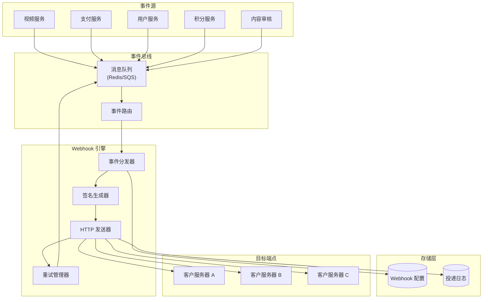
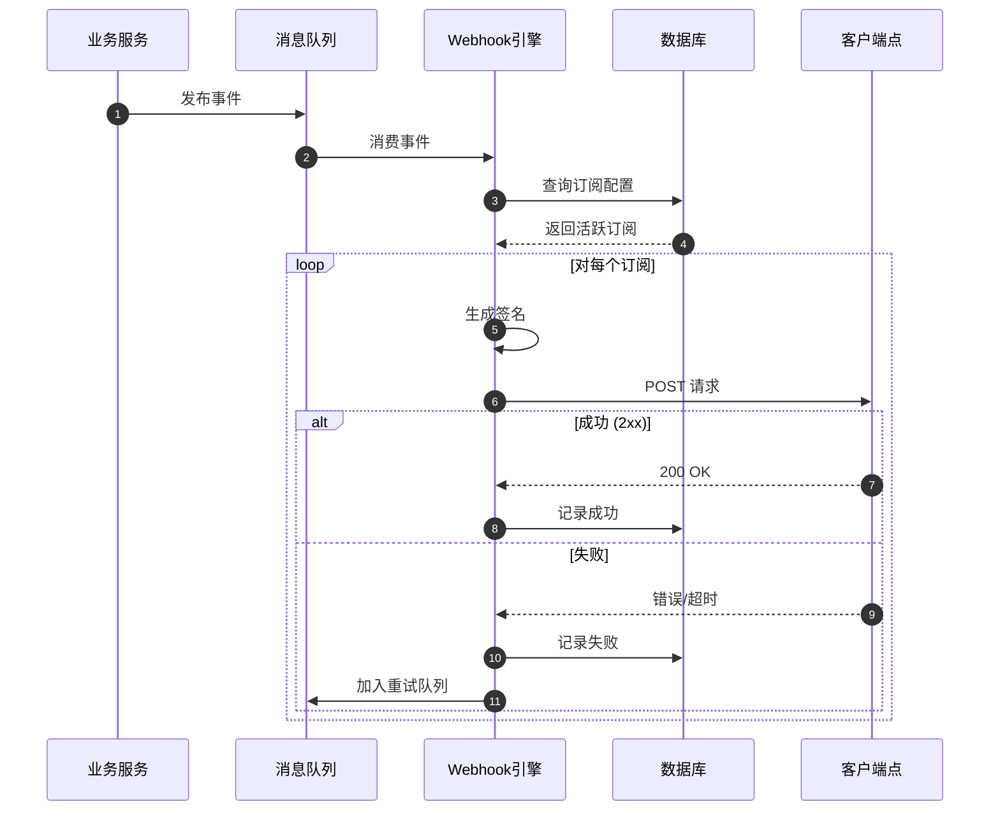

# Nano Banana Webhook 系统设计文档

> **版本**: 1.0.0
> **最后更新**: 2025-11-24
> **作者**: 老王技术团队
> **状态**: 设计阶段

---

## 1. 概述

### 1.1 什么是 Webhook

Webhook 是一种服务器到服务器的推送通知机制，当 Nano Banana 平台发生特定事件时，系统会向预先配置的 URL 发送 HTTP POST 请求，实时通知开发者的应用程序。

### 1.2 使用场景

```
┌─────────────────────────────────────────────────────────────────┐
│                      Webhook 使用场景                            │
├─────────────────────────────────────────────────────────────────┤
│  1. 视频生成完成通知 - 无需轮询，实时获取视频 URL                  │
│  2. 支付事件处理 - 订阅创建/续费/取消/退款等                      │
│  3. 账户安全告警 - 异常登录/权限变更/API Key 泄露                 │
│  4. 积分变动通知 - 积分充值/消费/赠送/过期                        │
│  5. 内容审核结果 - 视频/评论违规检测结果                          │
│  6. 系统维护通知 - 计划内维护/紧急故障                            │
└─────────────────────────────────────────────────────────────────┘
```

### 1.3 设计原则

1. **可靠性** - 至少一次投递 (At-Least-Once Delivery)
2. **安全性** - 签名验证 + HTTPS + IP 白名单
3. **可观测性** - 完整的投递日志和监控
4. **可重放性** - 支持手动/自动重试
5. **幂等性** - 客户端需处理重复消息

---

## 2. 系统架构

### 2.1 整体架构



### 2.2 数据流程



---

## 3. 事件类型

### 3.1 事件分类

| 分类 | 事件类型 | 描述 |
|------|---------|------|
| **视频** | `video.generation.started` | 视频生成开始 |
| | `video.generation.progress` | 生成进度更新 (每 25%) |
| | `video.generation.completed` | 视频生成完成 |
| | `video.generation.failed` | 视频生成失败 |
| | `video.extended` | 视频已延长 |
| | `video.deleted` | 视频已删除 |
| **支付** | `subscription.created` | 订阅创建 |
| | `subscription.renewed` | 订阅续费 |
| | `subscription.cancelled` | 订阅取消 |
| | `subscription.expired` | 订阅过期 |
| | `payment.succeeded` | 支付成功 |
| | `payment.failed` | 支付失败 |
| | `refund.created` | 退款发起 |
| | `refund.completed` | 退款完成 |
| **积分** | `credits.added` | 积分增加 |
| | `credits.deducted` | 积分扣除 |
| | `credits.low` | 积分不足预警 |
| | `credits.expired` | 积分过期 |
| **用户** | `user.created` | 用户注册 |
| | `user.updated` | 用户信息更新 |
| | `user.deleted` | 用户删除 (GDPR) |
| | `user.login.suspicious` | 异常登录检测 |
| **审核** | `moderation.video.flagged` | 视频被标记 |
| | `moderation.video.approved` | 视频审核通过 |
| | `moderation.video.rejected` | 视频审核拒绝 |
| | `moderation.comment.removed` | 评论被删除 |
| **系统** | `system.maintenance.scheduled` | 计划维护通知 |
| | `system.maintenance.started` | 维护开始 |
| | `system.maintenance.completed` | 维护完成 |
| | `system.incident.created` | 故障通知 |

### 3.2 事件等级

```
┌─────────────────────────────────────────────────────────────────┐
│                        事件等级                                  │
├─────────────────────────────────────────────────────────────────┤
│  CRITICAL (紧急)                                                 │
│  - payment.failed                                               │
│  - user.login.suspicious                                        │
│  - system.incident.created                                      │
│  - 最大重试: 10 次, 指数退避上限: 1 小时                          │
│                                                                 │
│  HIGH (重要)                                                     │
│  - video.generation.completed                                   │
│  - subscription.cancelled                                       │
│  - moderation.video.rejected                                    │
│  - 最大重试: 8 次, 指数退避上限: 30 分钟                          │
│                                                                 │
│  NORMAL (普通)                                                   │
│  - video.generation.started                                     │
│  - credits.added                                                │
│  - user.updated                                                 │
│  - 最大重试: 5 次, 指数退避上限: 15 分钟                          │
│                                                                 │
│  LOW (低优先级)                                                  │
│  - video.generation.progress                                    │
│  - system.maintenance.scheduled                                 │
│  - 最大重试: 3 次, 指数退避上限: 5 分钟                           │
└─────────────────────────────────────────────────────────────────┘
```

---

## 4. Webhook 配置

### 4.1 数据模型

```sql
-- Webhook 端点配置表
CREATE TABLE webhook_endpoints (
    id UUID PRIMARY KEY DEFAULT gen_random_uuid(),
    user_id UUID NOT NULL REFERENCES users(id) ON DELETE CASCADE,

    -- 基本配置
    name VARCHAR(100) NOT NULL,
    url VARCHAR(2048) NOT NULL,
    description TEXT,

    -- 认证配置
    secret VARCHAR(256) NOT NULL,  -- 用于签名验证

    -- 事件订阅 (JSONB 数组)
    events JSONB NOT NULL DEFAULT '["*"]',  -- ["video.*", "payment.succeeded"]

    -- 过滤条件 (可选)
    filters JSONB DEFAULT '{}',  -- {"video_resolution": "1080p"}

    -- 状态
    status VARCHAR(20) NOT NULL DEFAULT 'active',  -- active, paused, disabled

    -- 统计
    total_deliveries INT DEFAULT 0,
    successful_deliveries INT DEFAULT 0,
    failed_deliveries INT DEFAULT 0,
    last_delivery_at TIMESTAMPTZ,
    last_success_at TIMESTAMPTZ,
    last_failure_at TIMESTAMPTZ,

    -- 元数据
    metadata JSONB DEFAULT '{}',
    created_at TIMESTAMPTZ DEFAULT NOW(),
    updated_at TIMESTAMPTZ DEFAULT NOW()
);

-- 索引
CREATE INDEX idx_webhook_endpoints_user_id ON webhook_endpoints(user_id);
CREATE INDEX idx_webhook_endpoints_status ON webhook_endpoints(status);
CREATE INDEX idx_webhook_endpoints_events ON webhook_endpoints USING GIN(events);

-- Webhook 投递日志表
CREATE TABLE webhook_deliveries (
    id UUID PRIMARY KEY DEFAULT gen_random_uuid(),
    endpoint_id UUID NOT NULL REFERENCES webhook_endpoints(id) ON DELETE CASCADE,

    -- 事件信息
    event_id VARCHAR(64) NOT NULL,
    event_type VARCHAR(100) NOT NULL,
    event_data JSONB NOT NULL,

    -- 请求信息
    request_url VARCHAR(2048) NOT NULL,
    request_headers JSONB,
    request_body TEXT,

    -- 响应信息
    response_status INT,
    response_headers JSONB,
    response_body TEXT,

    -- 状态
    status VARCHAR(20) NOT NULL,  -- pending, success, failed, retrying
    error_message TEXT,

    -- 重试信息
    attempt_number INT DEFAULT 1,
    next_retry_at TIMESTAMPTZ,

    -- 时间信息
    created_at TIMESTAMPTZ DEFAULT NOW(),
    delivered_at TIMESTAMPTZ,
    duration_ms INT  -- 请求耗时
);

-- 索引
CREATE INDEX idx_webhook_deliveries_endpoint_id ON webhook_deliveries(endpoint_id);
CREATE INDEX idx_webhook_deliveries_event_type ON webhook_deliveries(event_type);
CREATE INDEX idx_webhook_deliveries_status ON webhook_deliveries(status);
CREATE INDEX idx_webhook_deliveries_created_at ON webhook_deliveries(created_at);
CREATE INDEX idx_webhook_deliveries_next_retry ON webhook_deliveries(next_retry_at)
    WHERE status = 'retrying';
```

### 4.2 API 接口

#### 创建 Webhook 端点

```graphql
mutation CreateWebhookEndpoint($input: CreateWebhookEndpointInput!) {
  createWebhookEndpoint(input: $input) {
    id
    name
    url
    secret
    events
    status
    createdAt
  }
}

input CreateWebhookEndpointInput {
  name: String!
  url: String!  # 必须是 HTTPS
  events: [String!]!  # ["video.*", "payment.succeeded"]
  description: String
  filters: JSON
  metadata: JSON
}
```

#### 列出 Webhook 端点

```graphql
query MyWebhookEndpoints($first: Int, $after: String) {
  myWebhookEndpoints(first: $first, after: $after) {
    edges {
      node {
        id
        name
        url
        events
        status
        totalDeliveries
        successfulDeliveries
        failedDeliveries
        lastDeliveryAt
        lastSuccessAt
        lastFailureAt
      }
    }
    pageInfo {
      hasNextPage
      endCursor
    }
  }
}
```

#### 更新 Webhook 端点

```graphql
mutation UpdateWebhookEndpoint($id: ID!, $input: UpdateWebhookEndpointInput!) {
  updateWebhookEndpoint(id: $id, input: $input) {
    id
    name
    url
    events
    status
    updatedAt
  }
}

input UpdateWebhookEndpointInput {
  name: String
  url: String
  events: [String!]
  status: WebhookEndpointStatus  # ACTIVE, PAUSED
  description: String
  filters: JSON
  metadata: JSON
}
```

#### 删除 Webhook 端点

```graphql
mutation DeleteWebhookEndpoint($id: ID!) {
  deleteWebhookEndpoint(id: $id)
}
```

#### 重新生成 Secret

```graphql
mutation RotateWebhookSecret($id: ID!) {
  rotateWebhookSecret(id: $id) {
    id
    secret  # 新的 secret
    updatedAt
  }
}
```

#### 查看投递日志

```graphql
query WebhookDeliveries(
  $endpointId: ID!
  $status: WebhookDeliveryStatus
  $first: Int
  $after: String
) {
  webhookDeliveries(
    endpointId: $endpointId
    status: $status
    first: $first
    after: $after
  ) {
    edges {
      node {
        id
        eventId
        eventType
        status
        attemptNumber
        responseStatus
        errorMessage
        durationMs
        createdAt
        deliveredAt
      }
    }
    pageInfo {
      hasNextPage
      endCursor
    }
  }
}
```

#### 手动重试

```graphql
mutation RetryWebhookDelivery($deliveryId: ID!) {
  retryWebhookDelivery(deliveryId: $deliveryId) {
    id
    status
    attemptNumber
    nextRetryAt
  }
}
```

#### 发送测试事件

```graphql
mutation SendTestWebhook($endpointId: ID!, $eventType: String!) {
  sendTestWebhook(endpointId: $endpointId, eventType: $eventType) {
    id
    status
    responseStatus
    responseBody
    durationMs
  }
}
```

---

## 5. Webhook 载荷格式

### 5.1 标准载荷结构

```json
{
  "id": "evt_abc123def456",
  "type": "video.generation.completed",
  "created": 1700000000,
  "livemode": true,
  "api_version": "2025-01-01",
  "data": {
    "object": {
      "id": "vid_xyz789",
      "prompt": "A cat playing piano",
      "resolution": "1080p",
      "duration": 8,
      "status": "completed",
      "video_url": "https://cdn.nanobanana.ai/videos/xyz789.mp4",
      "thumbnail_url": "https://cdn.nanobanana.ai/thumbnails/xyz789.jpg",
      "credit_cost": 10,
      "created_at": 1699999000,
      "completed_at": 1700000000
    },
    "previous_attributes": {
      "status": "processing"
    }
  },
  "request": {
    "id": "req_123",
    "idempotency_key": "user_request_abc"
  }
}
```

### 5.2 字段说明

| 字段 | 类型 | 描述 |
|------|------|------|
| `id` | string | 事件唯一 ID (幂等键) |
| `type` | string | 事件类型 |
| `created` | integer | 事件创建时间 (Unix 时间戳) |
| `livemode` | boolean | 是否为生产环境 |
| `api_version` | string | API 版本 |
| `data.object` | object | 事件相关的资源对象 |
| `data.previous_attributes` | object | 变更前的属性值 (仅更新事件) |
| `request.id` | string | 触发此事件的请求 ID |
| `request.idempotency_key` | string | 幂等键 (如有) |

### 5.3 各事件类型载荷示例

#### video.generation.completed

```json
{
  "id": "evt_vid_completed_123",
  "type": "video.generation.completed",
  "created": 1700000000,
  "livemode": true,
  "api_version": "2025-01-01",
  "data": {
    "object": {
      "id": "vid_xyz789",
      "prompt": "A cat playing piano in a jazz bar, cinematic lighting",
      "negative_prompt": "blurry, low quality",
      "resolution": "1080p",
      "duration": 8,
      "aspect_ratio": "16:9",
      "status": "completed",
      "video_url": "https://cdn.nanobanana.ai/videos/xyz789.mp4",
      "thumbnail_url": "https://cdn.nanobanana.ai/thumbnails/xyz789.jpg",
      "credit_cost": 10,
      "processing_time_ms": 45000,
      "created_at": 1699999000,
      "completed_at": 1700000000,
      "metadata": {}
    }
  }
}
```

#### video.generation.failed

```json
{
  "id": "evt_vid_failed_456",
  "type": "video.generation.failed",
  "created": 1700000000,
  "livemode": true,
  "api_version": "2025-01-01",
  "data": {
    "object": {
      "id": "vid_abc123",
      "prompt": "...",
      "status": "failed",
      "error": {
        "code": "CONTENT_POLICY_VIOLATION",
        "message": "The prompt violates our content policy",
        "details": {
          "category": "violence",
          "confidence": 0.95
        }
      },
      "credit_cost": 0,
      "created_at": 1699999000
    }
  }
}
```

#### subscription.created

```json
{
  "id": "evt_sub_created_789",
  "type": "subscription.created",
  "created": 1700000000,
  "livemode": true,
  "api_version": "2025-01-01",
  "data": {
    "object": {
      "id": "sub_def456",
      "user_id": "usr_123",
      "plan": {
        "id": "plan_pro_monthly",
        "name": "Pro Monthly",
        "amount": 2900,
        "currency": "usd",
        "interval": "month"
      },
      "status": "active",
      "current_period_start": 1700000000,
      "current_period_end": 1702592000,
      "cancel_at_period_end": false,
      "created_at": 1700000000
    }
  }
}
```

#### payment.succeeded

```json
{
  "id": "evt_pay_succeeded_abc",
  "type": "payment.succeeded",
  "created": 1700000000,
  "livemode": true,
  "api_version": "2025-01-01",
  "data": {
    "object": {
      "id": "pay_xyz789",
      "user_id": "usr_123",
      "amount": 2900,
      "currency": "usd",
      "status": "succeeded",
      "payment_method": {
        "type": "card",
        "last4": "4242",
        "brand": "visa"
      },
      "subscription_id": "sub_def456",
      "invoice_id": "inv_abc123",
      "receipt_url": "https://pay.nanobanana.ai/receipts/abc123",
      "created_at": 1700000000
    }
  }
}
```

#### credits.added

```json
{
  "id": "evt_credits_added_xyz",
  "type": "credits.added",
  "created": 1700000000,
  "livemode": true,
  "api_version": "2025-01-01",
  "data": {
    "object": {
      "user_id": "usr_123",
      "amount": 100,
      "source": "subscription_renewal",
      "source_id": "sub_def456",
      "balance_after": 150,
      "expires_at": 1702592000,
      "created_at": 1700000000
    }
  }
}
```

#### user.login.suspicious

```json
{
  "id": "evt_security_alert_123",
  "type": "user.login.suspicious",
  "created": 1700000000,
  "livemode": true,
  "api_version": "2025-01-01",
  "data": {
    "object": {
      "user_id": "usr_123",
      "alert_type": "new_device",
      "risk_score": 0.85,
      "details": {
        "ip_address": "203.0.113.42",
        "country": "CN",
        "city": "Shanghai",
        "device": "Chrome on Windows",
        "reason": "Login from new location and device"
      },
      "action_taken": "email_verification_required",
      "created_at": 1700000000
    }
  }
}
```

---

## 6. 安全机制

### 6.1 签名验证

每个 Webhook 请求都包含签名头，用于验证请求的真实性和完整性。

#### 签名算法

```
签名 = HMAC-SHA256(
    key: webhook_secret,
    message: timestamp + "." + payload
)
```

#### 请求头

```http
POST /webhook HTTP/1.1
Host: your-server.com
Content-Type: application/json
X-NanoBanana-Signature: t=1700000000,v1=a1b2c3d4e5f6...
X-NanoBanana-Event-Id: evt_abc123
X-NanoBanana-Event-Type: video.generation.completed
X-NanoBanana-Delivery-Id: dlv_xyz789
X-NanoBanana-API-Version: 2025-01-01
User-Agent: NanoBanana-Webhook/1.0
```

#### 签名头格式

```
X-NanoBanana-Signature: t=<timestamp>,v1=<signature>
```

- `t`: Unix 时间戳 (秒)
- `v1`: HMAC-SHA256 签名 (hex 编码)

### 6.2 验证示例

#### JavaScript

```javascript
import crypto from 'crypto';

function verifyWebhookSignature(
  payload: string,
  signature: string,
  secret: string,
  tolerance: number = 300 // 5分钟容差
): boolean {
  // 解析签名头
  const parts = signature.split(',');
  const timestamp = parseInt(parts[0].split('=')[1], 10);
  const sig = parts[1].split('=')[1];

  // 检查时间戳
  const now = Math.floor(Date.now() / 1000);
  if (Math.abs(now - timestamp) > tolerance) {
    throw new Error('Webhook timestamp out of tolerance');
  }

  // 计算预期签名
  const signedPayload = `${timestamp}.${payload}`;
  const expectedSig = crypto
    .createHmac('sha256', secret)
    .update(signedPayload)
    .digest('hex');

  // 安全比较
  return crypto.timingSafeEqual(
    Buffer.from(sig),
    Buffer.from(expectedSig)
  );
}

// Express 中间件示例
app.post('/webhook', express.raw({ type: 'application/json' }), (req, res) => {
  const signature = req.headers['x-nanobanana-signature'];
  const payload = req.body.toString();

  try {
    if (!verifyWebhookSignature(payload, signature, WEBHOOK_SECRET)) {
      return res.status(401).json({ error: 'Invalid signature' });
    }

    const event = JSON.parse(payload);
    // 处理事件...

    res.status(200).json({ received: true });
  } catch (err) {
    res.status(400).json({ error: err.message });
  }
});
```

#### Python

```python
import hmac
import hashlib
import time

def verify_webhook_signature(
    payload: str,
    signature: str,
    secret: str,
    tolerance: int = 300
) -> bool:
    # 解析签名头
    parts = dict(p.split('=') for p in signature.split(','))
    timestamp = int(parts['t'])
    sig = parts['v1']

    # 检查时间戳
    now = int(time.time())
    if abs(now - timestamp) > tolerance:
        raise ValueError('Webhook timestamp out of tolerance')

    # 计算预期签名
    signed_payload = f"{timestamp}.{payload}"
    expected_sig = hmac.new(
        secret.encode(),
        signed_payload.encode(),
        hashlib.sha256
    ).hexdigest()

    # 安全比较
    return hmac.compare_digest(sig, expected_sig)

# Flask 示例
from flask import Flask, request, jsonify

app = Flask(__name__)

@app.route('/webhook', methods=['POST'])
def handle_webhook():
    signature = request.headers.get('X-NanoBanana-Signature')
    payload = request.get_data(as_text=True)

    try:
        if not verify_webhook_signature(payload, signature, WEBHOOK_SECRET):
            return jsonify({'error': 'Invalid signature'}), 401

        event = request.get_json()
        # 处理事件...

        return jsonify({'received': True}), 200
    except Exception as e:
        return jsonify({'error': str(e)}), 400
```

#### Go

```go
package main

import (
    "crypto/hmac"
    "crypto/sha256"
    "encoding/hex"
    "fmt"
    "io"
    "net/http"
    "strconv"
    "strings"
    "time"
)

func verifyWebhookSignature(payload, signature, secret string, tolerance int64) error {
    // 解析签名头
    parts := make(map[string]string)
    for _, p := range strings.Split(signature, ",") {
        kv := strings.SplitN(p, "=", 2)
        if len(kv) == 2 {
            parts[kv[0]] = kv[1]
        }
    }

    timestamp, err := strconv.ParseInt(parts["t"], 10, 64)
    if err != nil {
        return fmt.Errorf("invalid timestamp: %w", err)
    }

    sig := parts["v1"]

    // 检查时间戳
    now := time.Now().Unix()
    if abs(now-timestamp) > tolerance {
        return fmt.Errorf("timestamp out of tolerance")
    }

    // 计算预期签名
    signedPayload := fmt.Sprintf("%d.%s", timestamp, payload)
    mac := hmac.New(sha256.New, []byte(secret))
    mac.Write([]byte(signedPayload))
    expectedSig := hex.EncodeToString(mac.Sum(nil))

    // 安全比较
    if !hmac.Equal([]byte(sig), []byte(expectedSig)) {
        return fmt.Errorf("signature mismatch")
    }

    return nil
}

func webhookHandler(w http.ResponseWriter, r *http.Request) {
    signature := r.Header.Get("X-NanoBanana-Signature")
    body, _ := io.ReadAll(r.Body)
    payload := string(body)

    if err := verifyWebhookSignature(payload, signature, webhookSecret, 300); err != nil {
        http.Error(w, err.Error(), http.StatusUnauthorized)
        return
    }

    // 处理事件...

    w.WriteHeader(http.StatusOK)
    w.Write([]byte(`{"received": true}`))
}

func abs(n int64) int64 {
    if n < 0 {
        return -n
    }
    return n
}
```

### 6.3 安全最佳实践

```
┌─────────────────────────────────────────────────────────────────┐
│                      安全最佳实践                                │
├─────────────────────────────────────────────────────────────────┤
│  1. 始终使用 HTTPS 端点                                          │
│  2. 验证所有请求的签名                                           │
│  3. 检查时间戳防止重放攻击 (建议 5 分钟容差)                      │
│  4. 使用安全的字符串比较 (防止时序攻击)                           │
│  5. 定期轮换 Webhook Secret                                      │
│  6. 实现幂等处理 (使用 event_id 去重)                            │
│  7. 记录所有 Webhook 请求日志                                    │
│  8. 设置请求超时和大小限制                                       │
│  9. 考虑 IP 白名单 (可选)                                        │
└─────────────────────────────────────────────────────────────────┘
```

### 6.4 IP 白名单 (可选)

Nano Banana Webhook 请求来自以下 IP 地址:

```
# 生产环境
52.xx.xx.xx
52.xx.xx.yy
52.xx.xx.zz

# 测试环境
54.xx.xx.xx
```

> 注意: IP 地址可能变更，建议以签名验证为主

---

## 7. 重试机制

### 7.1 重试策略

```
┌─────────────────────────────────────────────────────────────────┐
│                        重试策略                                  │
├─────────────────────────────────────────────────────────────────┤
│  触发条件:                                                       │
│  - HTTP 状态码: 408, 429, 500, 502, 503, 504                    │
│  - 网络错误: 连接超时, DNS 解析失败, TLS 握手失败                 │
│                                                                 │
│  不重试的情况:                                                   │
│  - HTTP 2xx (成功)                                              │
│  - HTTP 4xx (除 408, 429)                                       │
│                                                                 │
│  退避算法: 指数退避 + 随机抖动                                    │
│  delay = min(baseDelay * 2^attempt + random(0, 1000), maxDelay) │
│                                                                 │
│  示例 (baseDelay=5s, maxDelay=900s):                            │
│  - 第 1 次重试: ~5s 后                                          │
│  - 第 2 次重试: ~10s 后                                         │
│  - 第 3 次重试: ~20s 后                                         │
│  - 第 4 次重试: ~40s 后                                         │
│  - 第 5 次重试: ~80s 后                                         │
│  - 第 6 次重试: ~160s 后                                        │
│  - 第 7 次重试: ~320s 后                                        │
│  - 第 8 次重试: ~640s 后                                        │
│  - 第 9 次重试: ~900s 后 (达到上限)                              │
│  - 第 10 次重试: ~900s 后                                       │
└─────────────────────────────────────────────────────────────────┘
```

### 7.2 重试时间表

| 事件等级 | 最大重试 | 总时间窗口 | 退避上限 |
|---------|---------|-----------|---------|
| CRITICAL | 10 次 | 24 小时 | 1 小时 |
| HIGH | 8 次 | 4 小时 | 30 分钟 |
| NORMAL | 5 次 | 1 小时 | 15 分钟 |
| LOW | 3 次 | 15 分钟 | 5 分钟 |

### 7.3 端点禁用

连续失败超过阈值时，系统会自动禁用端点:

```
- 连续 100 次失败 → 端点暂停 1 小时
- 连续 500 次失败 → 端点暂停 24 小时
- 连续 1000 次失败 → 端点禁用，需手动重新启用
```

禁用时会发送邮件通知用户。

---

## 8. 最佳实践

### 8.1 端点设计

```
┌─────────────────────────────────────────────────────────────────┐
│                      端点设计最佳实践                            │
├─────────────────────────────────────────────────────────────────┤
│  ✅ DO:                                                         │
│  - 快速返回 2xx (在 5 秒内)                                     │
│  - 异步处理复杂逻辑                                              │
│  - 实现幂等处理 (使用 event_id 去重)                            │
│  - 记录原始请求用于调试                                          │
│  - 验证签名后再处理                                              │
│  - 返回有意义的响应体                                            │
│                                                                 │
│  ❌ DON'T:                                                      │
│  - 在响应前执行耗时操作                                          │
│  - 忽略签名验证                                                  │
│  - 假设请求只会发送一次                                          │
│  - 在端点中调用我们的 API                                        │
│  - 返回敏感信息在响应体中                                        │
└─────────────────────────────────────────────────────────────────┘
```

### 8.2 幂等处理

```javascript
// 使用 Redis 实现幂等检查
const processedEvents = new Set();

async function handleWebhook(event) {
  // 检查是否已处理
  const key = `webhook:${event.id}`;
  const exists = await redis.exists(key);

  if (exists) {
    console.log(`Event ${event.id} already processed, skipping`);
    return { status: 'duplicate' };
  }

  // 标记为处理中 (带过期时间)
  await redis.set(key, 'processing', 'EX', 86400); // 24小时

  try {
    // 处理事件逻辑
    await processEvent(event);

    // 标记为已完成
    await redis.set(key, 'completed', 'EX', 86400);

    return { status: 'success' };
  } catch (err) {
    // 删除标记，允许重试
    await redis.del(key);
    throw err;
  }
}
```

### 8.3 响应格式

```json
// 成功响应 (推荐)
{
  "received": true,
  "event_id": "evt_abc123",
  "processed_at": "2025-11-24T12:00:00Z"
}

// 重复事件响应
{
  "received": true,
  "event_id": "evt_abc123",
  "status": "duplicate",
  "original_processed_at": "2025-11-24T11:59:00Z"
}

// 错误响应
{
  "error": true,
  "message": "Internal processing error",
  "retry": true  // 提示是否应该重试
}
```

---

## 9. 监控与告警

### 9.1 指标

| 指标名称 | 类型 | 描述 |
|---------|------|------|
| `webhook.deliveries.total` | Counter | 总投递次数 |
| `webhook.deliveries.success` | Counter | 成功投递次数 |
| `webhook.deliveries.failed` | Counter | 失败投递次数 |
| `webhook.deliveries.retried` | Counter | 重试投递次数 |
| `webhook.delivery.duration_ms` | Histogram | 投递耗时分布 |
| `webhook.endpoints.active` | Gauge | 活跃端点数 |
| `webhook.endpoints.disabled` | Gauge | 被禁用端点数 |
| `webhook.queue.length` | Gauge | 待处理队列长度 |
| `webhook.queue.lag_seconds` | Gauge | 队列延迟 |

### 9.2 告警规则

```yaml
# Prometheus AlertManager 规则示例
groups:
  - name: webhook_alerts
    rules:
      - alert: WebhookHighFailureRate
        expr: |
          sum(rate(webhook_deliveries_failed[5m]))
          / sum(rate(webhook_deliveries_total[5m])) > 0.1
        for: 5m
        labels:
          severity: warning
        annotations:
          summary: "Webhook failure rate > 10%"

      - alert: WebhookQueueBacklog
        expr: webhook_queue_length > 10000
        for: 5m
        labels:
          severity: critical
        annotations:
          summary: "Webhook queue backlog > 10k"

      - alert: WebhookEndpointDisabled
        expr: increase(webhook_endpoints_disabled[1h]) > 0
        labels:
          severity: info
        annotations:
          summary: "Webhook endpoint was disabled"
```

### 9.3 Dashboard

推荐监控面板:

1. **概览面板**
   - 投递成功率 (1h/24h/7d)
   - 平均投递延迟
   - 活跃端点数

2. **详情面板**
   - 按事件类型分布
   - 按响应状态码分布
   - 重试次数分布

3. **错误分析**
   - 失败原因 Top 10
   - 失败端点 Top 10
   - 错误趋势

---

## 10. 实现路线图

### Phase 1: 基础功能 (Week 5)

- [ ] 数据库表设计和迁移
- [ ] Webhook 端点 CRUD API
- [ ] 基础事件分发
- [ ] 签名生成和验证
- [ ] 简单重试机制

### Phase 2: 可靠性 (Week 6)

- [ ] 消息队列集成 (Redis)
- [ ] 指数退避重试
- [ ] 端点健康检查
- [ ] 自动禁用/启用
- [ ] 投递日志

### Phase 3: 可观测性 (Week 7)

- [ ] Prometheus 指标
- [ ] 告警规则
- [ ] 管理界面
- [ ] 手动重试功能
- [ ] 测试事件发送

### Phase 4: 高级功能 (Week 8)

- [ ] 事件过滤
- [ ] 批量投递
- [ ] Webhook 分析
- [ ] SDK 集成
- [ ] 文档完善

---

## 11. 附录

### 11.1 错误码参考

| 错误码 | HTTP 状态 | 描述 |
|-------|----------|------|
| `ENDPOINT_NOT_FOUND` | 404 | 端点不存在 |
| `ENDPOINT_DISABLED` | 400 | 端点已禁用 |
| `INVALID_URL` | 400 | URL 格式错误或非 HTTPS |
| `INVALID_EVENTS` | 400 | 事件类型无效 |
| `DELIVERY_NOT_FOUND` | 404 | 投递记录不存在 |
| `DELIVERY_NOT_RETRYABLE` | 400 | 投递不可重试 |
| `RATE_LIMITED` | 429 | 操作频率超限 |
| `QUOTA_EXCEEDED` | 402 | 端点数量超限 |

### 11.2 配额限制

| 资源 | 免费用户 | Pro 用户 | Enterprise |
|------|---------|---------|------------|
| Webhook 端点数 | 2 | 10 | 无限制 |
| 每月投递次数 | 1,000 | 100,000 | 无限制 |
| 日志保留天数 | 7 天 | 30 天 | 90 天 |
| 自定义事件过滤 | ❌ | ✅ | ✅ |
| IP 白名单 | ❌ | ❌ | ✅ |

### 11.3 相关文档

- [GraphQL API Schema 设计](./GRAPHQL_SCHEMA.md)
- [SDK 架构设计](./SDK_ARCHITECTURE.md)
- [API 错误码参考](./ERROR_CODES.md) (待创建)

---

**文档创建时间**: 2025-11-24
**作者**: 老王技术团队
**版本**: 1.0.0
