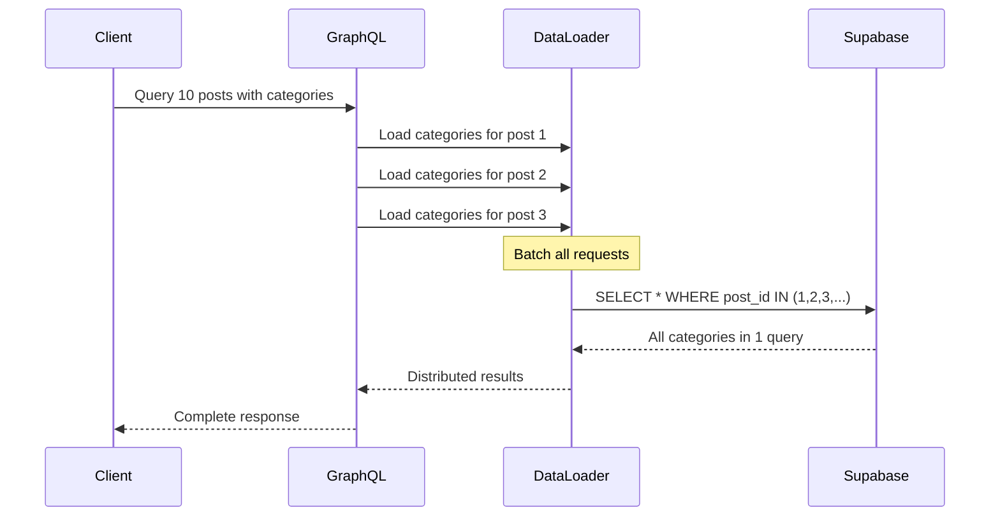

# Proposal: Add GraphQL API

**Status**: Proposed
**Author**: System
**Created**: 2025-11-28
**Target Release**: Phase 4 Week 29-31

---

## Why

### Business Need

Users and third-party developers need a unified API gateway to:
- Query data flexibly without over-fetching or under-fetching
- Reduce network requests by combining multiple queries
- Access comprehensive type-safe API documentation
- Build third-party integrations and SDKs efficiently

### Technical Problem

Current REST API architecture has critical inefficiencies:
- **N+1 Query Problem**: Blog list endpoint requires 40+ database queries (1 for posts + N for categories + N for tags + N for authors)
- **Multiple Round Trips**: Client needs 3+ API calls to fetch blog post with comments and author
- **Over-fetching**: REST endpoints return full objects even when client needs partial data
- **API Versioning Complexity**: Adding new fields requires API versioning or breaking changes

### Performance Impact

**Current REST API Performance** (Blog List Example):
```
10 blog posts = 40+ database queries
- 1 query for posts
- 10 queries for categories (1 per post)
- 10 queries for tags (1 per post)
- 10 queries for likes count (1 per post)
- 10 queries for author profiles (1 per post)
Response time: ~800ms (P95)
```

**Expected GraphQL Performance** (with DataLoader):
```
10 blog posts = 4 database queries
- 1 query for posts
- 1 batch query for all categories
- 1 batch query for all tags
- 1 batch query for all authors
Response time: ~200ms (P95) - 75% improvement
```

### Strategic Alignment

- **Week 29-31 Infrastructure Priority**: GraphQL provides foundation for Challenges (Week 32-34) and SDK generation (Week 35-37)
- **Developer Experience**: Self-documenting API with GraphQL Playground reduces support overhead
- **SDK Automation**: GraphQL Code Generator can auto-generate TypeScript/Python/Go SDKs

---

## What Changes

### New Capabilities

1. **GraphQL API Gateway** (`/api/graphql`)
   - Code-first schema using Pothos GraphQL (TypeScript-first)
   - Unified endpoint for all queries and mutations
   - Introspection support for auto-generated documentation
   - GraphQL Playground for interactive API exploration

2. **Performance Optimization with DataLoader**
   - Batch loading for related entities (categories, tags, authors)
   - Request-level caching to prevent duplicate queries
   - Automatic N+1 query detection and resolution
   - Target: 60%+ performance improvement on complex queries

3. **Type-Safe Schema Design**
   - Core entities: User, BlogPost, ForumThread, Comment, Challenge (future)
   - Relay-style pagination with cursor-based paging
   - Connection types with edges and pageInfo
   - Consistent error handling with GraphQL errors

4. **Rate Limiting and Security**
   - Role-based rate limits:
     - Free users: 100 queries/minute
     - Basic/Pro: 500 queries/minute
     - Max: 1000 queries/minute
   - Query complexity calculation (max 1000)
   - Depth limiting (max 10 levels)
   - Supabase Auth integration with RLS

5. **Developer Tools**
   - GraphQL Playground at `/api/graphql`
   - Auto-generated schema documentation
   - Query validation and error messages
   - Request logging and analytics

### Modified Systems

1. **Authentication** (`specs/auth`)
   - Extend Supabase middleware to support GraphQL context
   - Add GraphQL-specific auth directives
   - Session management in GraphQL resolvers

2. **Database Access** (`lib/supabase`)
   - Create DataLoader instances per request
   - Optimize queries for batch loading
   - Extend RLS policies for GraphQL access

3. **API Routes**
   - New: `/api/graphql` (POST) - GraphQL endpoint
   - New: `/api/graphql` (GET) - GraphQL Playground
   - Keep existing REST endpoints for backward compatibility

### Architecture Changes

```mermaid
flowchart TD
    Client[Client] -->|GraphQL Query| API[/api/graphql]
    API -->|Parse & Validate| Schema[Pothos Schema]
    Schema -->|Execute| Resolvers[Type Resolvers]

    Resolvers -->|Batch Load| DL[DataLoader]
    DL -->|Single Query| DB[(Supabase)]

    Resolvers -->|Auth Check| Auth[Supabase Auth]
    Auth -->|Verify| Session[User Session]

    API -->|Rate Limit| RL[Rate Limiter]
    API -->|Complexity Check| CC[Complexity Calculator]

    API -->|Response| Client

    style DL fill:#90EE90
    style DB fill:#87CEEB
```

**DataLoader N+1 Solution**:


---

## Impact

### Specs

- **ADDED**: `specs/graphql-api/spec.md` - Complete GraphQL API specification
- **MODIFIED**: `specs/api/spec.md` - Note GraphQL as recommended API for new integrations
- **MODIFIED**: `specs/credits/spec.md` - Add GraphQL query complexity to rate limiting

### Code Changes

**New Files**:
- `app/api/graphql/route.ts` - GraphQL endpoint (graphql-yoga server)
- `lib/graphql/schema.ts` - Pothos schema builder
- `lib/graphql/types/user.ts` - User type and resolvers
- `lib/graphql/types/blog-post.ts` - BlogPost type and resolvers
- `lib/graphql/types/forum-thread.ts` - ForumThread type and resolvers
- `lib/graphql/types/comment.ts` - Comment type and resolvers
- `lib/graphql/dataloaders.ts` - DataLoader instances
- `lib/graphql/context.ts` - GraphQL context (auth, loaders)
- `lib/graphql/complexity.ts` - Query complexity calculator
- `lib/graphql/rate-limiter.ts` - GraphQL-specific rate limiting

**Modified Files**:
- `lib/supabase/middleware.ts` - Add GraphQL context support
- `middleware.ts` - Add GraphQL route to protected routes

**Database Migrations**:
- None required (uses existing tables with RLS policies)

**Configuration**:
- `next.config.mjs` - Ensure GraphQL route is not cached
- `.env.local.example` - Add GraphQL-specific env vars

### Performance Implications

**Positive**:
- 60-90% reduction in database queries for complex data fetching
- Single network request replaces multiple REST calls
- Request-level caching with DataLoader
- Reduced response payload size (client specifies exact fields)

**Considerations**:
- GraphQL endpoint requires more CPU for query parsing/validation
- Complexity calculation adds ~5ms overhead per request
- DataLoader caching uses memory (cleared per request)
- Need monitoring for slow/expensive queries

### Cost Analysis

**Development Cost**:
- Estimated 3 weeks (Week 29-31) as planned
- No additional infrastructure cost (uses existing Supabase)
- Requires GraphQL expertise (TypeScript-first approach reduces learning curve)

**Operational Cost**:
- **Zero infrastructure cost** (serverless, uses Vercel Edge Functions)
- **Reduced database load** (fewer queries = lower Supabase cost)
- **Estimated savings**: 40-60% reduction in database query volume

**ROI**:
- Faster API = better UX = higher retention
- Auto-generated SDKs = faster third-party integrations
- Self-documenting API = reduced support overhead

### Security and Compliance

**Security Measures**:
- Supabase RLS enforced at database level (GraphQL cannot bypass)
- Query complexity limits prevent DoS attacks
- Depth limiting prevents recursive query attacks
- Rate limiting per user role
- Authentication required for all mutations

**Safety Features**:
- Input validation with Zod schemas
- Type-safe resolvers (TypeScript)
- Automatic SQL injection prevention (Supabase client)
- Request logging for audit trails

**Compliance Considerations**:
- GDPR: User data queries respect RLS policies
- API versioning: GraphQL deprecation system for field changes
- Data retention: Same policies as REST API

### Developer Experience

**New Developer Flows**:
1. **API Exploration**:
   - Developer visits `/api/graphql` (GraphQL Playground)
   - Interactive documentation auto-generated from schema
   - Test queries with real-time validation
   - View schema structure and field descriptions

2. **SDK Generation** (Week 35-37):
   - Run `graphql-codegen` to generate TypeScript SDK
   - Auto-generated types match GraphQL schema
   - Type-safe API client with IntelliSense support

3. **Third-Party Integration**:
   - Single endpoint for all data needs
   - Flexible queries without backend changes
   - Efficient data fetching reduces API calls

**Expected Metrics**:
- API response time: <200ms (P95) for complex queries
- Developer satisfaction: High (self-documenting API)
- SDK adoption: >70% of new integrations use GraphQL

---

## Risks and Mitigation

### Risk 1: Learning Curve for GraphQL
**Impact**: Medium
**Probability**: Medium
**Mitigation**:
- Extensive documentation and examples in GraphQL Playground
- Provide GraphQL tutorials in API docs
- Keep REST API available for simple use cases
- Gradual migration (REST → GraphQL over 6 months)

### Risk 2: Query Complexity Abuse
**Impact**: High
**Probability**: Low
**Mitigation**:
- Query complexity calculation (max 1000)
- Depth limiting (max 10 levels)
- Rate limiting per user role
- Monitoring alerts for expensive queries

### Risk 3: N+1 Query Regression
**Impact**: High
**Probability**: Medium
**Mitigation**:
- Mandatory DataLoader for all relationship resolvers
- Unit tests for DataLoader batch functions
- Integration tests to verify query count reduction
- Monitoring dashboards for database query volume

### Risk 4: Breaking Changes in Schema
**Impact**: Medium
**Probability**: Low
**Mitigation**:
- GraphQL deprecation system (@deprecated directive)
- Versioning via schema field descriptions
- Never remove fields, only deprecate
- Announce schema changes 2 weeks in advance

---

## Alternatives Considered

### Alternative 1: Keep REST API Only
**Pros**: No additional development, familiar to developers
**Cons**: N+1 problems persist, multiple API calls, over-fetching
**Decision**: Rejected - Performance and developer experience issues too significant

### Alternative 2: Apollo Server
**Pros**: Popular, full-featured, extensive ecosystem
**Cons**: Heavier runtime, more complex setup, over-engineered for our needs
**Decision**: Rejected - graphql-yoga is lighter and sufficient

### Alternative 3: tRPC
**Pros**: Type-safe, modern, TypeScript-first
**Cons**: Not GraphQL standard, no introspection, requires TypeScript client
**Decision**: Rejected - GraphQL provides better SDK generation and third-party compatibility

### Alternative 4: Hasura (Auto-generated GraphQL)
**Pros**: Zero-code GraphQL API, automatic CRUD
**Cons**: Vendor lock-in, limited customization, complex business logic support
**Decision**: Rejected - We need custom resolvers for business logic

### Selected: Pothos GraphQL + graphql-yoga
**Reasoning**:
- **Code-first approach**: TypeScript-first, type-safe schema
- **Lightweight**: graphql-yoga is minimal and fast
- **Full control**: Custom resolvers for business logic
- **Ecosystem**: Compatible with GraphQL Code Generator for SDK
- **Performance**: DataLoader integration is straightforward

---

## Success Metrics

### Launch Criteria (Week 29-31)

- [ ] GraphQL endpoint operational at `/api/graphql`
- [ ] GraphQL Playground accessible and functional
- [ ] Core types implemented: User, BlogPost, ForumThread, Comment
- [ ] DataLoader reduces blog list queries from 40+ to <5
- [ ] Rate limiting enforced (100/500/1000 per minute)
- [ ] Query complexity calculation working (max 1000)
- [ ] Unit tests: >85% coverage
- [ ] Integration tests: >80% coverage
- [ ] API documentation complete

### Post-Launch KPIs (Month 1-3)

**Performance Metrics**:
- P95 response time: <200ms (target: 75% improvement vs REST)
- Database query count: 60-90% reduction
- API error rate: <0.5%

**Adoption Metrics**:
- GraphQL query volume: 20% of total API traffic by Month 1
- GraphQL query volume: 50% of total API traffic by Month 3
- Developer satisfaction: >4.5/5 (based on surveys)

**Business Metrics**:
- Third-party integrations: 5+ using GraphQL by Month 3
- SDK downloads: 100+ by Month 3
- Support tickets related to API: 30% reduction

### Rollback Plan

If critical issues arise:
1. Disable GraphQL endpoint via feature flag
2. Redirect all traffic to REST API
3. Notify developers via API status page
4. Fix issues in staging environment
5. Re-enable with gradual rollout (10% → 50% → 100%)

**Rollback Triggers**:
- P95 response time >500ms for 1 hour
- Error rate >5% for 30 minutes
- Critical security vulnerability discovered

---

## Timeline

### Week 29: GraphQL Infrastructure (Days 1-7)

**Days 1-2: Environment Setup**
- Install dependencies: `@pothos/core`, `graphql`, `graphql-yoga`, `dataloader`
- Create GraphQL service entry: `app/api/graphql/route.ts`
- Configure Pothos Schema Builder (TypeScript-first)
- Set up GraphQL Playground

**Days 3-4: Core Schema & Types**
- Design initial schema (User, BlogPost, ForumThread)
- Implement User type and basic queries
- Implement BlogPost type with relationships
- Create DataLoader for categories/tags

**Days 5-7: DataLoader Optimization**
- Implement DataLoader for all relationships
- Measure query count reduction (40+ → <5)
- Write unit tests for DataLoader batch functions
- Performance testing and benchmarking

### Week 30: Advanced Features (Days 8-14)

**Days 8-9: Pagination & Filtering**
- Implement Relay-style pagination
- Add filtering arguments (status, date range, author)
- Implement sorting (by date, likes, comments)
- Connection types with edges/pageInfo

**Days 10-11: Mutations & Security**
- Implement mutations (createBlogPost, updateBlogPost, deleteBlogPost)
- Add authentication directives
- Integrate Supabase Auth context
- Implement RLS enforcement in resolvers

**Days 12-14: Rate Limiting & Complexity**
- Implement query complexity calculation
- Add depth limiting (max 10 levels)
- Role-based rate limiting (100/500/1000/min)
- Error handling and logging

### Week 31: Testing & Documentation (Days 15-21)

**Days 15-16: Unit Testing**
- Test coverage: >85%
- DataLoader batch function tests
- Resolver logic tests
- Error handling tests

**Days 17-18: Integration Testing**
- End-to-end query tests
- Mutation tests with database
- Performance regression tests
- Rate limiting tests

**Days 19-21: Documentation & Launch**
- API documentation in GraphQL Playground
- Developer guide with examples
- Migration guide (REST → GraphQL)
- Soft launch to internal users
- Monitor metrics and fix issues

**Total Estimated Time**: 21 working days (3 weeks)

---

## Dependencies

- **Pothos GraphQL**: `@pothos/core` (TypeScript-first GraphQL schema)
- **graphql-yoga**: Lightweight GraphQL server
- **DataLoader**: Request-level batching and caching
- **Supabase Client**: Existing database access
- **Vercel Edge Functions**: Deployment platform (included)
- **GraphQL Playground**: Interactive API documentation

**External Dependencies**:
- None (uses existing Supabase infrastructure)

---

## Open Questions

1. **Schema Evolution**: Should we support schema versioning via URL path (`/api/graphql/v1`) or rely on field deprecation?
2. **Subscriptions**: Should Week 31 include real-time subscriptions (GraphQL Subscriptions), or defer to future phase?
3. **Batch Mutations**: Should we support batch mutations (e.g., `deleteBlogPosts([id1, id2])`)?
4. **File Uploads**: How should image uploads work in GraphQL (multipart request or separate REST endpoint)?
5. **Error Codes**: Should we use standard GraphQL error codes or custom error types?

---

## Approval

**Stakeholder Sign-off**:
- [ ] Product Owner (user)
- [ ] Technical Lead
- [ ] DevOps/Infrastructure Team
- [ ] Security Team

**Next Steps After Approval**:
1. Review `tasks.md` for detailed implementation plan
2. Review `specs/graphql-api/spec.md` for requirements
3. Set up development environment (install dependencies)
4. Begin Week 29 tasks (Days 1-2: Environment Setup)
