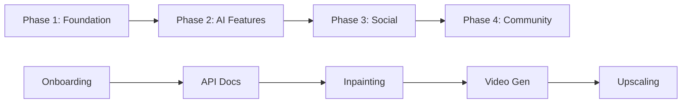

# Design Document: Project Roadmap Structure

**Change ID**: `add-project-roadmap`
**Author**: System
**Created**: 2025-01-05
**Status**: Proposed

---

## Context

### Background

The Nano Banana project is undergoing active development with a comprehensive 37-week plan spanning 4 major phases. Currently:

1. **Complete Phase 0-4 Plan Exists**: The 37-week roadmap was provided by the user, including:
   - Phase 1 (Week 1-5): Foundation (legal, tools, mobile)
   - Phase 2 (Week 6-15): Core AI Features (Inpainting, Outpainting, **Video Generation**, Upscaling, Variations, Referral)
   - Phase 3 (Week 16-24): Social Features (blog, profiles, comments, leaderboard)
   - Phase 4 (Week 25-37): Community Ecosystem (forum, challenges, GraphQL, SDK)

2. **Detailed Implementation Plan Exists for Video Generation**: The `add-veo-video-generation` change contains Step 1-6 implementation details (15 days, Days 1-15).

3. **Problem**: These two planning levels are **disconnected**:
   - No document shows the full 37-week timeline
   - Video generation Step 1-6 exists in isolation
   - Phase (project-level) vs Step (feature-level) terminology creates confusion

### Stakeholders

- **Product Owner**: Needs high-level visibility into project timeline
- **Technical Lead**: Needs to coordinate dependencies across features
- **Development Team**: Needs clear understanding of Phase vs Step
- **External Contributors**: Need to understand project scope and current position

### Constraints

- Must use OpenSpec workflow (proposal → tasks → implementation)
- Must follow existing project structure conventions
- Must not modify existing video generation tasks.md content (only add header)
- Must be easily maintainable (documentation-as-code)

---

## Goals

### Primary Goals

1. **Single Source of Truth**: Create PROJECTROADMAP.md as the canonical 37-week timeline
2. **Clear Terminology**: Eliminate Phase vs Step confusion
3. **Bidirectional Navigation**: Enable easy traversal between global roadmap and detailed tasks
4. **Visual Timeline**: Provide Week × Feature matrix for quick understanding

### Non-Goals

1. **Not Project Management Tool**: This is not replacing Jira/Notion, just documentation
2. **Not Detailed Implementation**: Implementation details belong in feature-specific tasks.md
3. **Not Living Document**: Updates happen at phase boundaries, not daily
4. **Not Code Changes**: This is pure documentation, no functional code changes

---

## High-Level Design

### Document Hierarchy

```
┌─────────────────────────────────────────┐
│  PROJECTROADMAP.md (Root)               │  ← Global 37-week view
│  - Phase 0-4 overview                   │
│  - Week × Feature matrix                │
│  - Dependencies & risks                 │
└──────────────┬──────────────────────────┘
               │
               ├─→ Phase 2, Week 11-13: Video Generation
               │   │
               │   └─→ openspec/changes/add-veo-video-generation/tasks.md
               │       - Step 1: Infrastructure (Days 1-3)
               │       - Step 2: API Integration (Days 4-6)
               │       - Step 3: Async Processing (Days 7-9)
               │       - Step 4: Frontend (Days 10-12)
               │       - Step 5: Testing (Days 13-14)
               │       - Step 6: Optimization (Optional)
               │
               ├─→ Phase 2, Week 8-10: Inpainting + Outpainting
               │   (Future: similar tasks.md structure)
               │
               └─→ Phase 2, Week 14-15: Upscaling + Variations + Referral
                   (Future: similar tasks.md structure)
```

### Terminology Definition

| Term | Scope | Timeline Unit | Example |
|------|-------|--------------|---------|
| **Phase** | Project-level stage | Weeks (1-37) | Phase 2: Core AI Features (Week 6-15) |
| **Step** | Feature-level implementation | Days (within feature) | Video Generation Step 1-6 (Days 1-15) |
| **Week** | Phase timeline unit | 7 days | Week 11, Week 12, Week 13 |
| **Day** | Step timeline unit | Within feature duration | Day 1-3 (Infrastructure), Day 4-6 (API) |

### File Location Decision

**Decision**: Place PROJECTROADMAP.md in **project root directory**

**Reasoning**:

1. **Discoverability**: Same level as README.md, immediately visible
2. **Authority**: Root-level documents carry project-wide significance
3. **Convention**: Many projects use root-level ROADMAP.md or CHANGELOG.md
4. **Link Length**: Shorter relative paths from root (`./PROJECTROADMAP.md` vs `./docs/roadmap/PROJECTROADMAP.md`)

**Alternatives Considered**:

- ❌ `docs/PROJECTROADMAP.md`: Adds navigation hierarchy, less discoverable
- ❌ `openspec/PROJECTROADMAP.md`: Implies it's part of OpenSpec tooling (it's not)
- ❌ Merge into `README.md`: README becomes too long, mixed purposes
- ✅ **Root level**: Chosen for discoverability and authority

---

## Detailed Design

### PROJECTROADMAP.md Structure

```markdown
# Nano Banana Project Roadmap

## 📋 Executive Summary
- Project vision
- Total timeline: 37 weeks (9 months)
- Current phase
- Last updated

## 📖 Glossary
- Phase: [definition]
- Step: [definition]
- Week: [definition]
- Day: [definition]

## 🎯 Phase 0: Planning & Setup (Week 0)
[Content]

## 🏗️ Phase 1: Foundation (Week 1-5)
### Week 1-2: Legal Compliance
[Content]

### Week 3-4: Tool Pages
[Content]

### Week 5: Mobile Optimization
[Content]

**Deliverables**:
- [ ] Item 1
- [ ] Item 2

**Success Criteria**:
- Metric 1
- Metric 2

## 🤖 Phase 2: Core AI Features (Week 6-15)

### Week 6-7: Onboarding + API Documentation
[Content]

### Week 8-10: Inpainting + Outpainting
[Content]
→ See: [Inpainting Tasks](link-when-created)

### Week 11-13: 🎬 Video Generation
**Timeline**: 15 days (Days 1-15)
**Implementation**: Step 1-6
→ See: [Video Generation Tasks](openspec/changes/add-veo-video-generation/tasks.md)

**Brief Overview**:
- Step 1-2: Infrastructure + API Integration (Days 1-6)
- Step 3-4: Async Processing + Frontend (Days 7-12)
- Step 5-6: Testing + Optimization (Days 13-15)

**Key Features**:
- Text-to-video generation
- Google Veo 3.1 API integration
- Duration: 4s, 6s, 8s videos
- Resolution: 720p, 1080p
- Pricing: 10 credits/second

### Week 14-15: Upscaling + Variations + Referral System
[Content]

**Phase 2 Deliverables**:
- [ ] Item 1

**Phase 2 Success Criteria**:
- Metric 1

## 👥 Phase 3: Social Features (Week 16-24)
[Content]

## 🌐 Phase 4: Community Ecosystem (Week 25-37)
[Content]

## 📅 Timeline Matrix

| Week | Video Gen | Inpainting | Outpainting | Upscaling | Variations | Referral | Blog | Forum |
|------|-----------|-----------|-------------|-----------|-----------|---------|------|-------|
| 1    | -         | -         | -           | -         | -         | -       | -    | -     |
| ...  | ...       | ...       | ...         | ...       | ...       | ...     | ...  | ...   |
| 8    | -         | Step 1-4  | -           | -         | -         | -       | -    | -     |
| 9    | -         | Step 5-8  | -           | -         | -         | -       | -    | -     |
| 10   | -         | Complete  | Step 1-6    | -         | -         | -       | -    | -     |
| 11   | **Step 1-2** | -      | Complete    | -         | -         | -       | -    | -     |
| 12   | **Step 3-4** | -      | -           | -         | -         | -       | -    | -     |
| 13   | **Step 5-6** | -      | -           | -         | -         | -       | -    | -     |
| 14   | Complete  | -         | -           | Step 1-4  | Step 1-3  | -       | -    | -     |
| ...  | ...       | ...       | ...         | ...       | ...       | ...     | ...  | ...   |

## 🔗 Dependencies



## ⚠️ Risk Register

| Risk | Impact | Probability | Mitigation | Owner |
|------|--------|-------------|-----------|-------|
| Phase 2 features take longer than 10 weeks | High | Medium | Buffer weeks 14-15, prioritize core features | Tech Lead |
| Video generation API costs exceed budget | Medium | Low | Monitor usage, adjust pricing model | Product |
| Roadmap becomes outdated | Medium | High | Update at phase end, quarterly review | PM |

## 📊 Progress Tracking

**Current Phase**: Phase 2 (Week 11-13 in progress)
**Completed Phases**: 1/4 (25%)
**On Track**: ✅ Yes

Last Updated: 2025-01-05
Next Review: 2025-02-01 (Phase 2 completion)
```

### Video Generation tasks.md Header Addition

**Location**: `/openspec/changes/add-veo-video-generation/tasks.md`

**Add at Line 1** (before existing content):

```markdown
# Video Generation Implementation Tasks

**Project Context**: This document contains implementation steps for the **Video Generation** feature,
which is part of **Nano Banana Phase 2 (Week 11-13)**.

**Global Roadmap**: See [PROJECTROADMAP.md](../../../PROJECTROADMAP.md) for complete project timeline

**Phase**: Phase 2 - Core AI Features Development
**Timeline**: Week 11-13 (15 days, Days 1-15)
**Position**: After Inpainting/Outpainting (Week 8-10), Before Upscaling/Variations (Week 14-15)

---

[EXISTING CONTENT STARTS HERE - DO NOT MODIFY]
```

---

## API and Data Model

**Not Applicable** (documentation-only change)

---

## Security Considerations

### Information Disclosure

- **Risk**: Roadmap may reveal competitive information
- **Mitigation**: Roadmap is high-level, no proprietary algorithms or trade secrets disclosed
- **Decision**: Keep roadmap in public repository (standard open-source practice)

### Access Control

- **Risk**: Unauthorized edits to roadmap
- **Mitigation**: Standard Git permissions, PR review process
- **Decision**: Same access controls as other project documentation

---

## Performance and Scalability

**Not Applicable** (documentation-only change, no runtime impact)

---

## Migration Plan

### Phase 1: Create PROJECTROADMAP.md

1. Create file in project root
2. Populate all sections following tasks.md checklist
3. Validate Markdown formatting

### Phase 2: Update Video Generation tasks.md

1. Read current tasks.md
2. Insert header section at line 1
3. Verify existing content unchanged

### Phase 3: Validation

1. Run `openspec validate add-project-roadmap --strict`
2. Test all links
3. Proofread content

### Rollback

**Easy Rollback**: Documentation-only change, no code dependencies

- Delete PROJECTROADMAP.md
- Remove header from video generation tasks.md
- Archive OpenSpec change

---

## Testing Strategy

### Manual Testing

- [ ] Open PROJECTROADMAP.md in GitHub and verify rendering
- [ ] Click all links and verify they navigate correctly
- [ ] Check Mermaid diagrams render properly
- [ ] Verify table formatting is correct

### Validation Testing

- [ ] `openspec validate add-project-roadmap --strict` passes
- [ ] Markdown linter reports no errors
- [ ] No broken links

### Review Testing

- [ ] Product owner review for content accuracy
- [ ] Technical lead review for technical correctness
- [ ] Documentation reviewer for clarity and grammar

---

## Monitoring and Maintenance

### Update Triggers

1. **Phase Completion**: Update progress tracking and mark deliverables complete
2. **Feature Addition**: Add new features to Phase 2+ timeline
3. **Schedule Change**: Adjust week numbers if timeline shifts
4. **Risk Change**: Update risk register when new risks emerge

### Maintenance Schedule

- **Weekly**: Progress tracking update (mark completed items)
- **Phase End**: Full phase review and deliverables validation
- **Quarterly**: Comprehensive roadmap review and update

### Ownership

- **Owner**: Product Manager / Technical Lead
- **Reviewers**: All team leads
- **Update Process**: PR with review before merge

---

## Open Questions

### Q1: Should we include cost analysis in PROJECTROADMAP.md?

**Context**: User's original roadmap included detailed cost breakdown

**Options**:
- A. Include full cost analysis (API costs, storage costs, revenue projections)
- B. Link to separate cost analysis document
- C. Omit cost details (keep roadmap technical-focused)

**Recommendation**: **Option B** (link to separate document)
- Reasoning: Cost info is sensitive and changes frequently, better in separate doc
- Action: Create `docs/cost-analysis.md` and link from PROJECTROADMAP.md

### Q2: Should we create tasks.md for other Phase 2 features now?

**Context**: Inpainting, Outpainting, Upscaling also need detailed implementation plans

**Options**:
- A. Create all tasks.md now (comprehensive but large scope)
- B. Create on-demand when starting each feature (just-in-time)
- C. Create skeletons now, populate later

**Recommendation**: **Option B** (just-in-time)
- Reasoning: Requirements may change, avoid premature planning
- Action: Use video generation tasks.md as template when needed

### Q3: What's the update cadence for PROJECTROADMAP.md?

**Context**: Need to balance freshness vs maintenance burden

**Options**:
- A. Weekly updates (high maintenance, always fresh)
- B. Phase-end updates (low maintenance, may be stale)
- C. Milestone updates (balanced)

**Recommendation**: **Option C** (milestone updates)
- Reasoning: Update at major milestones (phase end, feature complete, major pivot)
- Action: Document update schedule in PROJECTROADMAP.md metadata

---

## Decision Log

### Decision 1: File Location

- **Date**: 2025-01-05
- **Decision**: Place PROJECTROADMAP.md in project root
- **Rationale**: Discoverability and authority
- **Alternatives**: docs/ directory, openspec/ directory
- **Status**: Approved

### Decision 2: Terminology

- **Date**: 2025-01-05
- **Decision**: Use "Phase" for project stages, "Step" for feature implementation
- **Rationale**: Clear distinction between levels of planning
- **Alternatives**: Use "Stage" and "Phase", use "Milestone" and "Task"
- **Status**: Approved

### Decision 3: Link Strategy

- **Date**: 2025-01-05
- **Decision**: Bidirectional links (PROJECTROADMAP ↔ tasks.md)
- **Rationale**: Enable navigation in both directions
- **Alternatives**: One-way links, no links (separate documents)
- **Status**: Approved

### Decision 4: Update Cadence

- **Date**: 2025-01-05
- **Decision**: Update at milestones (phase end, major feature complete)
- **Rationale**: Balance freshness and maintenance
- **Alternatives**: Weekly updates, only on request
- **Status**: Approved (pending user confirmation)

---

## Appendix: Example Content Snippets

### Example: Phase Section

```markdown
## 🤖 Phase 2: Core AI Features (Week 6-15)

**Duration**: 10 weeks
**Goal**: Implement all core AI editing capabilities
**Success Criteria**: All 6 AI features deployed and generating revenue

### Overview

Phase 2 delivers the product's core value proposition: AI-powered image editing tools.
This phase builds on the foundation from Phase 1 and enables revenue generation.

### Features

1. **Onboarding + API Docs** (Week 6-7)
2. **Inpainting + Outpainting** (Week 8-10)
3. **Video Generation** (Week 11-13) ← Most complex feature
4. **Upscaling + Variations + Referral** (Week 14-15)

### Dependencies

- **From Phase 1**: User authentication, payment system, credit system
- **External**: Google Veo 3.1 API access, Supabase storage quota

### Risks

- API cost overruns → Mitigation: Monitor usage, adjust pricing
- Feature scope creep → Mitigation: Strict scope control, defer enhancements to Phase 3
```

---

## References

- [User's Original 37-Week Roadmap](../conversation-history/roadmap-2025-01-05.md) (if exported)
- [Video Generation Proposal](../add-veo-video-generation/proposal.md)
- [OpenSpec AGENTS.md](../../AGENTS.md)
- [Project CLAUDE.md](../../../CLAUDE.md)
