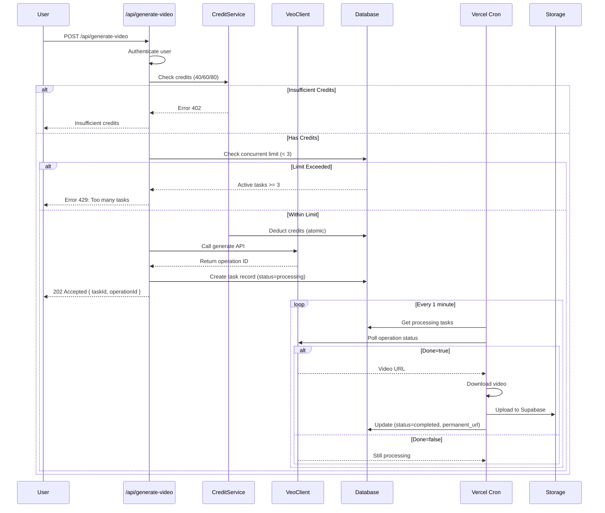
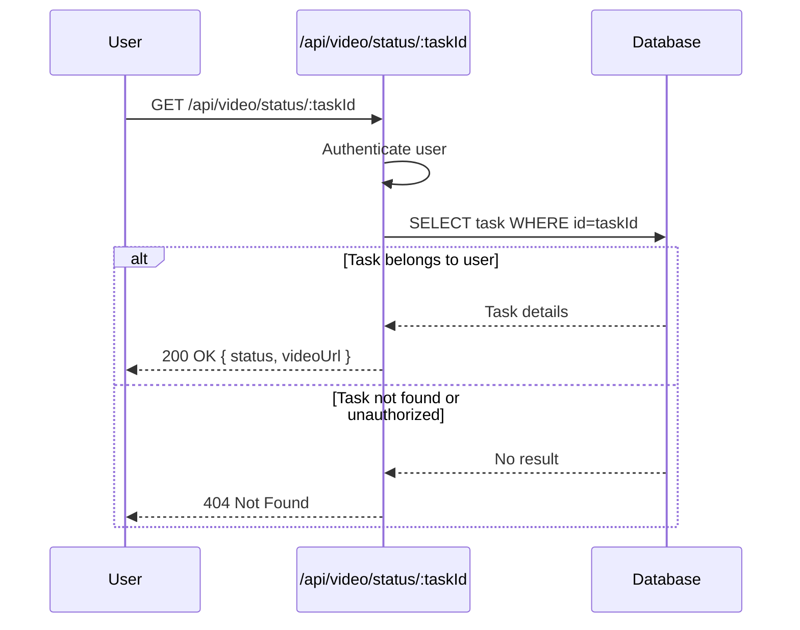
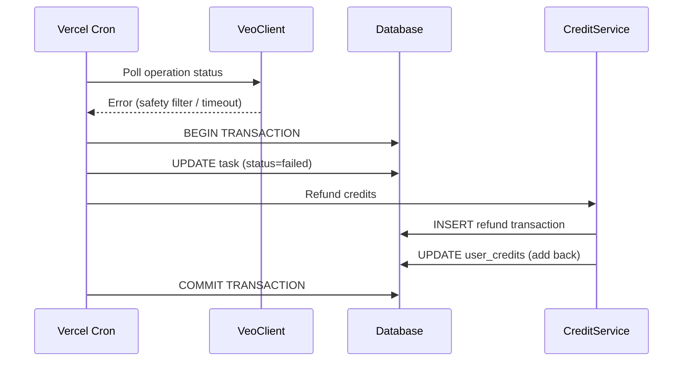

# Design: Video Generation Architecture

**Status**: Draft
**Version**: 1.0.0
**Last Updated**: 2025-01-05

---

## Overview

This document details the technical architecture decisions for implementing Google Veo 3.1 video generation in the Nano Banana platform.

---

## Architecture Diagram

```mermaid
flowchart TD
    subgraph "Client Layer"
        UI[Web UI]
        MobileUI[Mobile UI]
    end

    subgraph "API Layer"
        GenAPI[/api/generate-video]
        StatusAPI[/api/video/status/:taskId]
        HistoryAPI[/api/video/history]
    end

    subgraph "Service Layer"
        VideoService[VideoService]
        CreditService[CreditService]
        ConfigService[ConfigService]
        VeoClient[VeoClient]
    end

    subgraph "Background Jobs"
        Poller[Video Poller<br/>Vercel Cron]
        Downloader[Video Downloader]
    end

    subgraph "External Services"
        VeoAPI[Google Veo 3.1 API]
        Storage[Supabase Storage]
    end

    subgraph "Data Layer"
        DB[(Supabase PostgreSQL)]
        Cache[(Redis/Upstash Cache)]
    end

    UI --> GenAPI
    MobileUI --> GenAPI
    UI --> StatusAPI
    UI --> HistoryAPI

    GenAPI --> VideoService
    GenAPI --> CreditService
    GenAPI --> ConfigService

    StatusAPI --> VideoService
    HistoryAPI --> VideoService

    VideoService --> VeoClient
    VideoService --> DB
    CreditService --> DB

    ConfigService --> Cache
    ConfigService --> DB

    VeoClient --> VeoAPI

    Poller -->|Every 10s| VeoAPI
    Poller --> Downloader
    Downloader --> VeoAPI
    Downloader --> Storage
    Downloader --> DB

    style VeoAPI fill:#4285f4,color:#fff
    style Storage fill:#3ecf8e,color:#fff
    style DB fill:#3ecf8e,color:#fff
    style Cache fill:#dc382d,color:#fff
```

---

## Key Design Decisions

### Decision 1: Asynchronous Processing Model

**Context**: Video generation takes 11 seconds to 6 minutes, which exceeds typical API timeout limits (30 seconds for Edge Functions, 10 seconds for serverless functions).

**Options Considered**:

#### Option A: Synchronous API with Extended Timeout ❌
- **Pros**: Simple implementation, no polling needed
- **Cons**:
  - Exceeds Vercel Edge Function 30-second limit
  - Poor user experience (long waiting time)
  - Connection timeouts likely
  - Inefficient resource usage

#### Option B: Server-Sent Events (SSE) ❌
- **Pros**: Real-time progress updates, no client polling
- **Cons**:
  - Requires long-lived connections (30s+ timeout still an issue)
  - Complex state management
  - Limited browser support on mobile

#### Option C: WebSocket ❌
- **Pros**: Bidirectional communication, real-time updates
- **Cons**:
  - Infrastructure complexity (requires separate WebSocket server)
  - Vercel does not natively support WebSocket on Edge Functions
  - Additional cost and maintenance

#### Option D: Asynchronous with Background Polling ✅ (Selected)
- **Pros**:
  - Works within Vercel's platform constraints
  - Decouples request from processing
  - User can close browser and return later
  - Scalable and cost-effective
- **Cons**:
  - Requires background job infrastructure (Vercel Cron)
  - User must manually refresh or poll for status
  - Slightly more complex implementation

**Decision**: Use asynchronous model with Vercel Cron Jobs for polling.

**Rationale**:
- Vercel Cron Jobs are free on Pro plan
- Polling every 10 seconds is acceptable latency
- User experience can be enhanced with status endpoint
- Future: Can add push notifications or email alerts

---

### Decision 2: Video Storage Strategy

**Context**: Google stores generated videos for only 2 days, after which they are automatically deleted.

**Options Considered**:

#### Option A: Store Only Google URLs ❌
- **Pros**: No storage cost, simple implementation
- **Cons**:
  - Videos become inaccessible after 2 days
  - Poor user experience (broken links)
  - No long-term value for users

#### Option B: Automatic Download + Supabase Storage ✅ (Selected)
- **Pros**:
  - Permanent storage (videos never expire)
  - Full control over video files
  - Can implement additional features (thumbnails, transcoding)
  - Better user experience
- **Cons**:
  - Storage costs (~$0.021/GB/month)
  - Additional download step
  - Requires error handling for download failures

**Decision**: Automatically download videos to Supabase Storage immediately after generation completes.

**Rationale**:
- Storage cost is minimal ($0.021/GB/month ≈ $0.0002 per 10MB video)
- User expects videos to be permanently accessible
- Enables future features (video library, sharing, editing)
- Risk mitigation: Automatic retry mechanism for download failures

**Implementation**:
```typescript
// Download flow
async function downloadAndStoreVideo(operationId: string, googleUrl: string) {
  const MAX_RETRIES = 3;
  const RETRY_DELAY_MS = [1000, 2000, 4000]; // Exponential backoff

  for (let attempt = 0; attempt < MAX_RETRIES; attempt++) {
    try {
      // 1. Download from Google
      const response = await fetch(googleUrl, { timeout: 60000 });
      if (!response.ok) throw new Error(`HTTP ${response.status}`);

      const videoBuffer = await response.arrayBuffer();

      // 2. Verify file integrity
      if (videoBuffer.byteLength < 1000) {
        throw new Error('Downloaded file too small, likely corrupted');
      }

      // 3. Upload to Supabase Storage
      const fileName = `${operationId}.mp4`;
      const filePath = `${userId}/videos/${fileName}`;

      const { data, error } = await supabase.storage
        .from('video-generations')
        .upload(filePath, videoBuffer, {
          contentType: 'video/mp4',
          cacheControl: '31536000', // 1 year
          upsert: false
        });

      if (error) throw error;

      // 4. Get permanent public URL
      const { data: { publicUrl } } = supabase.storage
        .from('video-generations')
        .getPublicUrl(filePath);

      // 5. Update database
      await updateVideoTask(operationId, {
        permanent_video_url: publicUrl,
        file_size_bytes: videoBuffer.byteLength,
        downloaded_at: new Date(),
        status: 'completed'
      });

      return publicUrl;

    } catch (error) {
      console.error(`Download attempt ${attempt + 1} failed:`, error);

      if (attempt < MAX_RETRIES - 1) {
        await sleep(RETRY_DELAY_MS[attempt]);
      } else {
        // All retries failed
        await handleDownloadFailure(operationId, error);
        throw error;
      }
    }
  }
}
```

---

### Decision 3: Background Job Architecture

**Context**: Need a mechanism to continuously poll Veo 3.1 API for operation status updates.

**Options Considered**:

#### Option A: Client-Side Polling ❌
- **Pros**: No server-side infrastructure needed
- **Cons**:
  - User must keep browser open
  - Network inefficiency (many redundant requests)
  - No processing when user closes browser
  - Poor mobile experience

#### Option B: Vercel Cron Jobs ✅ (Selected)
- **Pros**:
  - Free on Pro plan
  - Simple configuration (vercel.json)
  - Reliable execution
  - No additional infrastructure
- **Cons**:
  - Minimum interval is 1 minute (but we can work around this)
  - Limited execution time (10 seconds for Hobby, 300 seconds for Pro)

#### Option C: External Job Queue (BullMQ + Redis) ❌
- **Pros**:
  - Fine-grained control over polling intervals
  - Advanced retry logic
  - Job prioritization
- **Cons**:
  - Additional infrastructure cost (Redis)
  - More complex setup and maintenance
  - Overkill for current scale

#### Option D: Supabase Edge Functions ❌
- **Pros**:
  - Integrated with existing Supabase setup
  - Low latency
- **Cons**:
  - Less mature than Vercel Cron
  - Additional cost per invocation
  - Requires separate deployment

**Decision**: Use Vercel Cron Jobs for polling mechanism.

**Rationale**:
- Free on Vercel Pro plan (project already uses Vercel)
- Sufficient for current scale (100-500 videos/month)
- Simple implementation and deployment
- Can migrate to more sophisticated solution if needed

**Implementation**:

**vercel.json**:
```json
{
  "crons": [
    {
      "path": "/api/cron/poll-video-operations",
      "schedule": "*/1 * * * *"
    }
  ]
}
```

**Cron Handler** (`/api/cron/poll-video-operations/route.ts`):
```typescript
export async function GET(request: Request) {
  // Verify cron secret
  const authHeader = request.headers.get('authorization');
  if (authHeader !== `Bearer ${process.env.CRON_SECRET}`) {
    return new Response('Unauthorized', { status: 401 });
  }

  // Get all processing tasks
  const processingTasks = await getProcessingVideoTasks();

  // Poll each task (limit to 10 per execution to avoid timeout)
  const tasksToCheck = processingTasks.slice(0, 10);

  for (const task of tasksToCheck) {
    try {
      await checkAndUpdateVideoStatus(task);
    } catch (error) {
      console.error(`Error checking task ${task.id}:`, error);
      // Continue with other tasks
    }
  }

  return Response.json({
    success: true,
    checkedTasks: tasksToCheck.length,
    remainingTasks: Math.max(0, processingTasks.length - 10)
  });
}
```

**Workaround for 1-minute interval**:
- Vercel Cron runs every 1 minute
- Each execution polls all `processing` tasks once
- Effective polling interval: 1 minute (acceptable given 11s-6min generation time)
- For faster updates, client can call `/api/video/status/:taskId` (no cost)

---

### Decision 4: Credit Deduction Timing

**Context**: When should credits be deducted - before generation starts or after completion?

**Options Considered**:

#### Option A: Deduct After Completion ❌
- **Pros**: Only charge for successful generations
- **Cons**:
  - User could initiate many videos with insufficient credits
  - Race condition: balance might change during generation
  - Complex accounting (pending charges)

#### Option B: Deduct Before Generation ✅ (Selected)
- **Pros**:
  - Simple transactional integrity
  - Prevents abuse (users can't spam without credits)
  - Clear accounting (charge = commitment)
- **Cons**:
  - Must refund on failure
  - Temporary credit lock during processing

**Decision**: Deduct credits immediately when generation starts, refund on failure.

**Rationale**:
- Prevents users from initiating more videos than they can afford
- Simpler account balance tracking
- Industry standard (AWS, GCP all charge upfront)
- Refund process is straightforward with transaction log

**Implementation**:
```typescript
// Credit deduction flow
async function initiateVideoGeneration(userId: string, params: VideoParams) {
  // 1. Calculate cost
  const creditCost = getCreditCost(params.duration);

  // 2. Atomic deduction (within transaction)
  await db.transaction(async (tx) => {
    // Check balance
    const { available_credits } = await tx
      .select()
      .from('user_credits')
      .where('user_id', userId)
      .forUpdate(); // Lock row

    if (available_credits < creditCost) {
      throw new InsufficientCreditsError();
    }

    // Deduct credits
    await tx
      .update('user_credits')
      .set({ available_credits: available_credits - creditCost })
      .where('user_id', userId);

    // Record transaction
    await tx.insert('credit_transactions').values({
      user_id: userId,
      transaction_type: `video_${params.duration}s_generation`,
      amount: -creditCost,
      balance_after: available_credits - creditCost,
      description: `Generated ${params.duration}s video: ${params.prompt.slice(0, 50)}...`
    });

    // Create video task
    const task = await tx.insert('video_generation_history').values({
      user_id: userId,
      operation_id: operationId,
      status: 'processing',
      credit_cost: creditCost,
      ...params
    });

    return task;
  });
}

// Refund flow (on failure)
async function refundVideoGeneration(taskId: string) {
  await db.transaction(async (tx) => {
    // Get task details
    const task = await tx
      .select()
      .from('video_generation_history')
      .where('id', taskId)
      .single();

    // Add credits back
    await tx
      .update('user_credits')
      .set({ available_credits: available_credits + task.credit_cost })
      .where('user_id', task.user_id);

    // Record refund transaction
    await tx.insert('credit_transactions').values({
      user_id: task.user_id,
      transaction_type: 'refund_video_generation',
      amount: task.credit_cost,
      description: `Refund for failed video generation (Task ${taskId})`
    });

    // Update task status
    await tx
      .update('video_generation_history')
      .set({ status: 'failed' })
      .where('id', taskId);
  });
}
```

---

### Decision 5: Concurrent Task Limiting

**Context**: Need to prevent users from overwhelming the system with too many simultaneous video generations.

**Options Considered**:

#### Option A: No Limit ❌
- **Pros**: Maximum user flexibility
- **Cons**:
  - Resource exhaustion risk
  - Potential abuse
  - High API costs from parallel requests

#### Option B: Database-Level Constraint ❌
- **Pros**: Guaranteed enforcement at data layer
- **Cons**:
  - Complex to query "current active tasks"
  - Performance overhead
  - Hard to make configurable

#### Option C: Application-Level Check ✅ (Selected)
- **Pros**:
  - Flexible limit configuration
  - Easy to query and display to user
  - Can implement per-user limits (future)
- **Cons**:
  - Not database-guaranteed (risk of race condition)
  - Requires careful transaction handling

**Decision**: Application-level check with transaction safety, limit of 3 concurrent tasks per user.

**Rationale**:
- 3 concurrent videos is reasonable for individual users
- Prevents abuse while allowing legitimate multi-video workflows
- Configurable via `system_configs` for easy adjustment
- Can implement per-plan limits in future (e.g., Pro users get 5 concurrent)

**Implementation**:
```typescript
async function checkConcurrentLimit(userId: string): Promise<boolean> {
  // Get config (cached)
  const config = await getConfig('video_concurrent_limit');
  const maxConcurrent = config.max_concurrent_tasks || 3;

  // Count active tasks
  const activeTasks = await db
    .select({ count: count() })
    .from('video_generation_history')
    .where('user_id', userId)
    .where('status', 'in', ['processing', 'downloading'])
    .single();

  if (activeTasks.count >= maxConcurrent) {
    throw new ConcurrentLimitError({
      current: activeTasks.count,
      limit: maxConcurrent,
      message: `You have ${activeTasks.count} active video generations. Please wait for one to complete.`
    });
  }

  return true;
}

// List active tasks (for error response)
async function getActiveVideoTasks(userId: string) {
  return db
    .select({
      task_id: 'id',
      status: 'status',
      prompt: 'prompt',
      duration: 'duration',
      created_at: 'created_at'
    })
    .from('video_generation_history')
    .where('user_id', userId)
    .where('status', 'in', ['processing', 'downloading'])
    .orderBy('created_at', 'desc');
}
```

---

## API Integration

### Veo 3.1 API Client

**Design Pattern**: Wrapper client for type safety and error handling

```typescript
// lib/veo-client.ts
import { GoogleGenerativeAI } from '@google/generative-ai';

export interface VeoGenerateRequest {
  prompt: string;
  negativePrompt?: string;
  aspectRatio: '16:9' | '9:16';
  resolution: '720p' | '1080p';
  duration: 4 | 6 | 8;
}

export interface VeoOperation {
  name: string; // operation ID
  done: boolean;
  response?: {
    generatedVideo: {
      uri: string;
      mimeType: string;
    };
  };
  error?: {
    code: number;
    message: string;
  };
}

export class VeoClient {
  private client: GoogleGenerativeAI;
  private model = 'veo-3.1-generate-preview';

  constructor(apiKey: string) {
    this.client = new GoogleGenerativeAI(apiKey);
  }

  /**
   * Start a video generation operation
   */
  async generate(request: VeoGenerateRequest): Promise<VeoOperation> {
    const endpoint = `https://generativelanguage.googleapis.com/v1beta/models/${this.model}:predictLongRunning`;

    const body = {
      prompt: request.prompt,
      ...(request.negativePrompt && { negativePrompt: request.negativePrompt }),
      aspectRatio: request.aspectRatio,
      resolution: request.resolution,
      duration: request.duration
    };

    const response = await fetch(endpoint, {
      method: 'POST',
      headers: {
        'Content-Type': 'application/json',
        'x-goog-api-key': process.env.GOOGLE_AI_API_KEY!
      },
      body: JSON.stringify(body)
    });

    if (!response.ok) {
      const error = await response.json();
      throw new VeoAPIError(response.status, error);
    }

    return response.json();
  }

  /**
   * Check status of a video generation operation
   */
  async getOperation(operationId: string): Promise<VeoOperation> {
    const endpoint = `https://generativelanguage.googleapis.com/v1beta/${operationId}`;

    const response = await fetch(endpoint, {
      method: 'GET',
      headers: {
        'x-goog-api-key': process.env.GOOGLE_AI_API_KEY!
      }
    });

    if (!response.ok) {
      const error = await response.json();
      throw new VeoAPIError(response.status, error);
    }

    return response.json();
  }
}

export class VeoAPIError extends Error {
  constructor(
    public statusCode: number,
    public details: any
  ) {
    super(`Veo API Error: ${statusCode} - ${JSON.stringify(details)}`);
    this.name = 'VeoAPIError';
  }
}
```

---

## Data Flow

### 1. Video Generation Request Flow



### 2. Status Check Flow



### 3. Refund Flow (on Failure)



---

## Database Optimization

### Indexes

```sql
-- Video generation history (primary access patterns)
CREATE INDEX idx_video_user_status ON video_generation_history(user_id, status);
CREATE INDEX idx_video_status ON video_generation_history(status) WHERE status IN ('processing', 'downloading');
CREATE INDEX idx_video_created_desc ON video_generation_history(created_at DESC);
CREATE INDEX idx_video_operation_id ON video_generation_history(operation_id); -- Unique constraint already creates index

-- Credit transactions (audit and history)
CREATE INDEX idx_transaction_user_type ON credit_transactions(user_id, transaction_type);
CREATE INDEX idx_transaction_created ON credit_transactions(created_at DESC);
```

### Query Patterns

**Get active tasks for concurrent limit check**:
```sql
SELECT COUNT(*) as active_count
FROM video_generation_history
WHERE user_id = $1
  AND status IN ('processing', 'downloading');
```
- Uses index: `idx_video_user_status`
- Performance: <10ms for single user

**Get tasks to poll (Cron job)**:
```sql
SELECT id, user_id, operation_id, created_at
FROM video_generation_history
WHERE status = 'processing'
  AND created_at > NOW() - INTERVAL '15 minutes'
ORDER BY created_at ASC
LIMIT 10;
```
- Uses index: `idx_video_status`
- Performance: <10ms for typical workload

**Get user video history**:
```sql
SELECT id, prompt, duration, resolution, status, permanent_video_url, created_at
FROM video_generation_history
WHERE user_id = $1
ORDER BY created_at DESC
LIMIT 20 OFFSET $2;
```
- Uses index: `idx_video_user_status` (partial) or `idx_video_created_desc`
- Performance: <20ms for pagination

---

## Error Handling Strategy

### Error Categories

| Category | Examples | Action | Retry | Refund |
|----------|----------|--------|-------|--------|
| **Client Error** | Invalid params, insufficient credits | Return 4xx immediately | No | No |
| **Veo API Error** | Safety filter block, content policy | Return error to user | No | Yes |
| **Timeout** | Generation >15 minutes | Mark failed | No | Yes |
| **Download Error** | Network failure, corrupted file | Retry 3 times | Yes | Yes (if all retries fail) |
| **Storage Error** | Quota exceeded, permission denied | Alert admin | No | Yes |
| **System Error** | Database down, unexpected exception | Log, alert, retry | Yes | TBD |

### Error Response Format

```typescript
interface ErrorResponse {
  error: string;           // Error code (e.g., "INSUFFICIENT_CREDITS")
  message: string;         // Human-readable message
  details?: any;           // Additional context (optional)
  retryable?: boolean;     // Can user retry?
  suggestedAction?: string; // What user should do
}
```

**Examples**:

```json
// Insufficient credits
{
  "error": "INSUFFICIENT_CREDITS",
  "message": "You need 40 credits but have only 30 credits",
  "details": {
    "required": 40,
    "available": 30,
    "deficit": 10
  },
  "retryable": false,
  "suggestedAction": "Purchase more credits"
}

// Safety filter
{
  "error": "SAFETY_FILTER_BLOCKED",
  "message": "Your video was blocked due to content policy violation",
  "details": {
    "category": "violence",
    "confidence": "high"
  },
  "retryable": true,
  "suggestedAction": "Modify your prompt to avoid violent content"
}

// Timeout
{
  "error": "GENERATION_TIMEOUT",
  "message": "Video generation exceeded 15-minute timeout",
  "details": {
    "duration_minutes": 15.2
  },
  "retryable": true,
  "suggestedAction": "Try generating again or simplify your prompt"
}
```

---

## Configuration Management

### System Configs Structure

All video-related configurations stored in `system_configs` table:

```typescript
interface VideoConfig {
  // Credit costs
  video_generation_credit_cost: {
    "4s": number;  // 40
    "6s": number;  // 60
    "8s": number;  // 80
  };

  // Concurrent limits
  video_concurrent_limit: {
    max_concurrent_tasks: number;  // 3
  };

  // Feature flag
  video_generation_enabled: {
    enabled: boolean;
    message?: string;  // Maintenance message
  };

  // Advanced settings (future)
  video_generation_advanced?: {
    timeout_minutes: number;        // 15
    max_retries: number;            // 3
    download_timeout_seconds: number; // 60
    polling_interval_seconds: number; // 60 (Cron limitation)
  };
}
```

### Config Caching Strategy

- **Level 1**: Redis/Upstash cache (10-minute TTL)
- **Level 2**: Database (source of truth)
- **Cache Invalidation**: Admin config update triggers cache clear

```typescript
// lib/config-cache.ts
export async function getVideoConfig(key: string): Promise<any> {
  // Try cache first
  const cached = await redis.get(`config:${key}`);
  if (cached) return JSON.parse(cached);

  // Fetch from database
  const config = await db
    .select('config_value')
    .from('system_configs')
    .where('config_key', key)
    .where('is_active', true)
    .single();

  // Store in cache
  await redis.setex(`config:${key}`, 600, JSON.stringify(config.config_value));

  return config.config_value;
}
```

---

## Security Considerations

### API Key Protection

- **Storage**: Environment variable `GOOGLE_AI_API_KEY`
- **Access**: Server-side only (never exposed to client)
- **Rotation**: Plan for key rotation without downtime

### Rate Limiting

**Current**:
- Concurrent task limit: 3 per user (application-level)

**Future** (Phase 2):
- Per-user global rate limit: 100 requests/minute
- Per-IP rate limit: 200 requests/minute
- Admin can set custom limits per user

### Content Security

- **Input Validation**: Prompt length ≤ 1024 tokens, sanitize special characters
- **Output Validation**: Verify MP4 format, check file size (reasonable limits)
- **Safety Filters**: Google's built-in filters (automatic)
- **Audit Logging**: All generations logged with user_id, prompt, timestamp

### Data Privacy

- **User Isolation**: Users can only access their own videos
- **Admin Access**: Admin can view all videos for moderation (logged)
- **GDPR Compliance**: User can request deletion of all video data
- **Storage Encryption**: Supabase Storage uses AES-256 encryption at rest

---

## Performance Optimization

### Expected Load

| Scenario | Videos/Month | Peak Concurrent | DB Queries/Sec | Storage (GB/Month) |
|----------|--------------|-----------------|----------------|-------------------|
| Low      | 100          | 3               | 5              | 1                 |
| Medium   | 500          | 10              | 15             | 5                 |
| High     | 2,000        | 30              | 50             | 20                |

### Optimization Strategies

1. **Database Query Optimization**
   - Use indexes for all frequent queries
   - Avoid N+1 queries (batch fetching)
   - Use database transactions for atomic operations

2. **API Response Time**
   - Target: <200ms for POST /api/generate-video
   - Target: <100ms for GET /api/video/status
   - Use connection pooling for database

3. **Background Job Efficiency**
   - Cron polls max 10 tasks per execution (avoid timeout)
   - Use batch updates where possible
   - Implement exponential backoff for retries

4. **Storage Optimization**
   - Store videos in compressed MP4 format
   - Consider CDN for frequently accessed videos (future)
   - Implement video cleanup policy (delete after 1 year of inactivity)

---

## Monitoring and Alerting

### Metrics to Track

**Business Metrics** (Vercel Analytics):
- Total videos generated (daily/weekly/monthly)
- Average credit cost per video
- Revenue from video generation
- User retention (% generating videos weekly)

**Technical Metrics** (Custom Dashboard):
- API response time (P50, P95, P99)
- Generation success rate (%)
- Average generation time (seconds)
- Download success rate (%)
- Storage usage (GB)
- Concurrent task count (current/peak)

**Error Metrics**:
- Timeout rate (%)
- Safety filter block rate (%)
- Download failure rate (%)
- Refund rate (%)

### Alerts

**Critical** (PagerDuty):
- Download failure rate > 5% (5-minute window)
- Storage quota > 90%
- Database connection errors

**Warning** (Slack):
- Generation timeout rate > 5%
- Average generation time > 4 minutes
- Refund rate > 15%

**Info** (Email digest):
- Daily/weekly generation summary
- Storage usage trends
- Top users by video count

---

## Testing Strategy

### Unit Tests

- `VeoClient`: Mock API responses, test error handling
- `VideoService`: Test credit deduction, concurrent limit, refund logic
- `ConfigService`: Test caching, invalidation

### Integration Tests

- End-to-end video generation flow (mock Veo API)
- Credit transaction integrity (atomic operations)
- Concurrent request handling (race conditions)
- Download and storage (mock Supabase)

### Manual Testing Checklist

- [ ] Generate 4s/6s/8s videos successfully
- [ ] Test safety filter block (prompt with violence)
- [ ] Test timeout scenario (mock long operation)
- [ ] Test insufficient credits error
- [ ] Test concurrent limit (create 4 videos simultaneously)
- [ ] Verify refund on failure
- [ ] Verify video accessible after 2 days (storage persistence)
- [ ] Test status endpoint polling
- [ ] Test history endpoint pagination

### Performance Tests

- Load test: 50 concurrent video generations
- Stress test: 100 videos in 1 minute
- Database query performance (all queries <50ms)

---

## Deployment Plan

### Phase 1: Infrastructure Setup

1. Create `video-generations` bucket in Supabase Storage
2. Run database migrations (tables, indexes, constraints)
3. Add system configs to database
4. Deploy Vercel Cron configuration
5. Set up monitoring dashboard

### Phase 2: API Deployment

1. Deploy API routes (`/api/generate-video`, `/api/video/status`, `/api/video/history`)
2. Deploy background job (`/api/cron/poll-video-operations`)
3. Smoke test with 5 test videos
4. Monitor error rates for 24 hours

### Phase 3: Frontend Integration

1. Deploy video generation UI
2. Deploy status tracking UI
3. Deploy video history page
4. Enable feature for beta users (10% rollout)

### Phase 4: Full Launch

1. Monitor metrics for 1 week with beta users
2. Fix any issues discovered
3. Enable for all users (100% rollout)
4. Announce feature in product update

---

## Rollback Plan

### Scenario 1: Critical API Error

**Trigger**: API error rate > 20%

**Action**:
1. Set `video_generation_enabled = false` in system_configs
2. Display maintenance message to users
3. Investigate root cause
4. Deploy fix to staging
5. Re-enable for 10% users, monitor
6. Gradual rollout: 10% → 50% → 100%

### Scenario 2: Storage Quota Exceeded

**Trigger**: Storage usage > 95%

**Action**:
1. Temporarily disable new video generations
2. Purchase additional storage quota
3. Implement video cleanup policy (delete old videos)
4. Re-enable feature

### Scenario 3: Download Failure Rate High

**Trigger**: Download failure rate > 10%

**Action**:
1. Increase retry count to 5
2. Increase retry delay to [2s, 4s, 8s, 16s, 32s]
3. Add alerting for persistent failures
4. Investigate Google Storage reliability

---

## Future Enhancements

### Phase 2 Features (3-6 months)

1. **Video Extension**
   - Extend existing videos up to 7 seconds
   - Support up to 20 extensions
   - Credit cost: 10 credits per second extended

2. **Reference Images**
   - Upload up to 3 reference images
   - Guide video content style and composition

3. **Frame Guidance**
   - Specify first and last frames
   - Generate interpolated video between frames

4. **Custom Audio**
   - Upload custom audio track
   - Replace generated audio

### Phase 3 Features (6-12 months)

1. **Batch Generation**
   - Generate multiple videos from CSV/JSON
   - Scheduled batch jobs

2. **Template Library**
   - Pre-defined prompt templates
   - Category-based browsing (marketing, education, entertainment)

3. **Video Editing**
   - Basic trimming and cropping
   - Apply filters and effects
   - Add text overlays

4. **Social Media Optimization**
   - Export for TikTok (9:16, 60s max)
   - Export for Instagram Reels (9:16, 90s max)
   - Export for YouTube Shorts (9:16, 60s max)

5. **Advanced Analytics**
   - Video view counts
   - Engagement metrics
   - A/B testing for prompts

---

## Open Questions

1. **API Quota**: What is the daily/monthly quota for Veo 3.1 API with our Google AI API key?
2. **Batch Discounts**: Does Google offer volume discounts for high usage?
3. **Regional Availability**: Are there regional restrictions beyond EU/UK/CH/MENA?
4. **SynthID Detection**: Can we provide an API to detect SynthID watermarks?
5. **Custom Models**: Can we fine-tune Veo 3.1 for specific use cases (future)?

---

## References

- [Google Veo 3.1 API Documentation](https://ai.google.dev/gemini-api/docs/video?hl=zh-cn)
- [Vercel Cron Jobs Documentation](https://vercel.com/docs/cron-jobs)
- [Supabase Storage Documentation](https://supabase.com/docs/guides/storage)
- [Next.js API Routes](https://nextjs.org/docs/app/building-your-application/routing/route-handlers)
- [OpenSpec Credits Specification](../../../credits.md)
